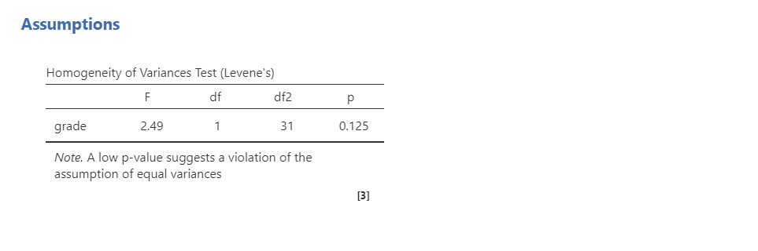
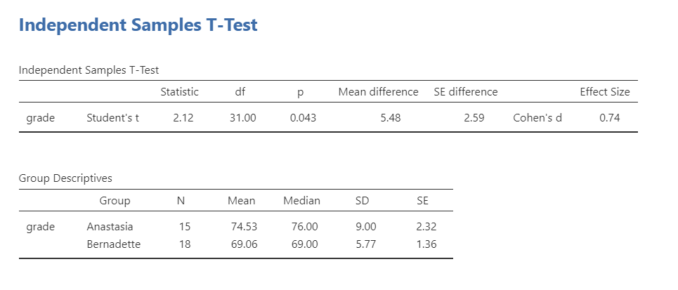

# (PART) t-tests {.unnumbered}

# Independent t-test

```{r ind-t_setup, echo = FALSE, message=FALSE}
library(tidyverse)
library(webex)
options(knitr.graphics.auto_pdf = TRUE)
```

## What is the t-test?

The t-test looks at difference in means between two things (e.g., groups, time, observations). There are three different types of t-tests:

1.  The **one-sample t-test** tests how sample mean relates to the population mean.

2.  The **independent t-test** has *independent* groups. The participants or things in group 1 are *not* the same as the participants or things in group 2.

3.  The **dependent t-test** has *dependent* or *paired* data. The dependent variable is measured at two different times or for two different conditions for all participants or things.

This chapter will focus on the independent t-test and the next chapter will discuss the dependent t-test.

## What is the independent t-test?

The independent t-test is used to test the difference in our dependent variable between two different groups of observations. Our grouping variable is our independent variable. In other words, we use the independent t-test when we have a research question with a **continuous dependent variable** and a **categorical independent variable with two categories in which different participants are in each category**.

The independent t-test is also called the independent samples t-test and the Student's t-test. I will use these terms interchangeably.

There are three different types of alternative hypotheses we could have for the independent t-test:

1.  **Two-tailed**

    -   $H_1$: Group 1 has a different mean than Group 2.
    -   $H_0$: There is no difference in means between the two groups.

2.  **One-tailed**

    -   $H_1$: Group 1 has a greater mean than Group 2.
    -   $H_0$: The mean for Group 1 is less than or equal to the mean for Group 2.

3.  **One-tailed**

    -   $H_1$: Group 1 has a smaller mean than Group 2.
    -   $H_0$: The mean for Group 1 is greater than or equal to the mean for Group 2.

## Data set-up

To conduct the independent t-test, we first need to ensure our data is set-up properly in our dataset. This requires having two columns: one with our continuous dependent variable and one indicating which group the participant is in. Each row is a unique participant or unit of analysis. Here's what example data may look like if we were testing for differences in a test score by students in my fall or spring semesters of this course:

| ID  | Semester | TestScore |
|:----|:---------|----------:|
| 1   | Fall     |        86 |
| 2   | Fall     |        80 |
| 3   | Fall     |        75 |
| 4   | Fall     |        79 |
| 5   | Fall     |        82 |
| 6   | Spring   |        84 |
| 7   | Spring   |        90 |
| 8   | Spring   |        72 |
| 9   | Spring   |        75 |
| 10  | Spring   |        81 |

: Example data for the independent t-test

In the example data above, what is your **independent variable**? `r mcq(c("ID", answer = "Semester", "TestScore"))`

In the example data above, what is your **dependent variable**? `r mcq(c("ID", "Semester", answer = "TestScore"))`

## The math behind the independent t-test

```{block, type = "info"}
If the math below makes your eyes glaze over, you can skip it. This is presented for those who find it useful to understand the math behind the statistics to help understand what's happening.
```

The basic math of the independent t-test the mean difference divided by the pooled standard error.

$t = \frac{\bar{X}_1 - \bar{X}_2}{SE({\bar{X}_1 - \bar{X}_2})}$

The denominator of the equation is more difficult to calculate and depends on whether the sample size between groups is equal.

## Assumptions

As a parametric test, the independent t-test has the same assumptions as other parametric tests:

1.  The dependent variable is **normally distributed**

2.  Variances in the two groups are roughly equal (i.e., **homogeneity of variances**)

3.  The dependent variable is **interval or ratio** (i.e., continuous)

4.  Scores are **independent** between groups

We cannot [test]{.ul} the third and fourth assumptions; rather, those are based on knowing your data.

However, we can and should test for the first two assumptions. Fortunately, the independent samples t-test in jamovi has two check boxes under "Assumption Checks" that lets us test for both assumptions.

## Performing the independent t-test in jamovi

Let's run an example with data from lsj-data. Open data from your Data Library in "lsj-data". Select and open "Harpo". This dataset is hypothetical data of 33 students taking Dr. Harpo's statistics lectures. We have two tutors for the class, Anastasia (*n* = 15) and Bernadette (*n* = 18). Our research question is "Which tutor results in better student grades?" We don't have a hypothesis that one does better than the other.

1.  To perform an independent t-test in jamovi, go to the Analyses tab, click the T-Tests button, and choose "Independent Samples T-Test".

2.  Move your dependent variable `grade` to the Dependent Variables box and your independent variable `tutor` to the Grouping Variable box.

3.  Under Tests, select `Student's`

4.  Under Hypothesis, because we have a two-sided hypothesis select a two-sided hypothesis (Group 1 does not equal Group 2).

5.  Under Additional Statistics, select `Mean difference`, `Effect size`, and `Descriptives`.

6.  Under Assumption Checks, select all three options: `Homogeneity test`, `Normality test`, and `Q-Q plot`.

When you are done, your setup should look like this

```{r echo = FALSE, fig.cap = "Independent t-test setup in jamovi", out.width = "80%"}
knitr::include_graphics("images/02-independent_t-test/independent_t-test_setup.png")
```

## Checking assumptions in jamovi

### Testing normality

We test for normality using the Shapiro-Wilk test and the Q-Q plot. The Shapiro-Wilk test was not statistically significant (W = .98, *p* = .827); therefore, this indicates the data is normally distributed. Furthermore, the lines are fairly close to the diagonal line in the Q-Q plot. We can conclude that we satisfy the assumption of normality.

```{r echo = FALSE, fig.cap = "Testing normality in jamovi"}
knitr::include_graphics("images/02-independent_t-test/independent_t-test_normality.png")
```

Remember that we also test for normality by **looking at our data** (e.g., a histogram) and by examining **skew and kurtosis**. However, you will need to view them using Exploration --\> Descriptives, not in the t-tests menu.

### Testing homogeneity of variance

We test for homogeneity of variance using the Levene's test. The Levene's test was not statistically significant (*F* [1, 31] = 2.49, *p* = .125); therefore, this indicates our data satisfies the assumption of homogeneity of variance. However, I would add a caveat that we have a small sample of data (*n* = 15 for Anastasia and *n* = 18 for Bernadette) and the standard deviations are quite different from one another (SD = 9.00 vs 5.77, respectively). We should have tried to collect more data.

```{r echo = FALSE, fig.cap = "Testing homogeneity of variance in jamovi"}

```

## Interpreting results

Once we are satisfied we have satisfied the assumptions for the independent t-test, we can interpret our results.

```{r echo = FALSE, fig.cap = "Independent t-test results in jamovi"}

```

Our p-value is less than .05, so our results are statistically significant. Like most of the statistics we'll come across, the large the t-statistic (or F-statistic, or chi-square statistic...), the smaller the p-value.

We can write up our results in APA something like this:

> Anastasia's students (*M* = 74.53, *SD* = 9.00, *n* = 15) had significantly higher grades than Bernadette's students (*M* = 69.06, *SD* = 5.77, *n* = 18), *t* (31) = 2.12, *p* = .043, *d* = .74.

Sometimes, people like to put the statistics inside a parentheses. In that case, you need to change the parentheses around the degrees of freedom as brackets. Here's another example write-up of the results in APA style:

> I tested the difference in grades between Anastasia's students (*M* = 74.53, *SD* = 9.00, *n* = 15) and Bernadette's students (*M* = 69.06, *SD* = 5.77, *n* = 18). An independent samples t-test showed that the 5.48 mean difference between the tutor's student was statistically significant (*t* [31] = 2.12, *p* = .043, *d* = .74).

## Additional information about the independent t-test

### Positive and negative t values

Students often worry about positive or negative t-statistic values and are unsure how to interpret it. Positive or negative t-statistic values simply occur based on which group is listed first. Our t-statistic above is positive because we tested the difference between Anastasia and Bernadette: (Anastasia - Bernadette) = (74.53 - 69.06) = (5.48).

However, if we flipped it and tested the difference between Bernadette and Anastasia, our mean difference would be -5.48 and our t-statistic would be -2.12.

All that is to say, *your positive or negative t-statistic is arbitrary*. So do not fret!

However, it is important the sign of your t-statistic matches what you report. For example, notice the difference:

> 1.  Anastasia's students had **higher** grades than Bernadette's, *t* (31) = **2.12**, *p* = .043, *d* = .74.
> 2.  Bernadette's students had **lower** grades than Anastasia's, *t* (31) = **-2.12**, *p* = .043, *d* = .74.

One last note: this positive or negative t-statistic is only relevant for the independent and dependent t-test. You will not get negative values for the F-statistic or chi-square tests!

### What if I violated assumptions?

The great news is that jamovi includes the Welch's t-statistic and the non-parametric version of the independent t-test (Mann-Whitney U)!

The Welch's t-test has three main differences from the independent samples t-test: (a) the standard error (SE) is not a pooled estimate, (b) the degrees of freedom are calculated very different (not *N* - 2), and (c) it does not have an assumption of homogeneity of variance. Note that Welch's t-test is not a non-parametric test because it still has the assumption of a normal distribution.

The Mann-Whitney U is not calculated based on the mean but rather the median and compares ranks of values across the two groups: it has no assumptions about the distribution of data or homogeneity of variances.

Here's what statistic you should choose based on satisfying assumptions:

|                                            | **Normality: satisfied**   | **Normality: not satisfied** |
|--------------------------------------------|----------------------------|------------------------------|
| **Homogeneity of Variance: satisfied**     | independent samples t-test | Mann-Whitney U               |
| **Homogeneity of Variance: not satisfied** | Welch's t-test             | Mann-Whitney U               |

Here is what the output for all three tests look like:

```{r echo = FALSE, fig.cap = "All independent t-test results in jamovi"}
knitr::include_graphics("images/02-independent_t-test/independent_t-test_full-results.png")
```

#### Welch's t-test in jamovi

To conduct this in jamovi, under Tests select `Welch's`. You will interpret the results similarly to the independent t-test:

> Using a Welch's t-test, there was not a statistically significant difference in grades between Anastasia's students (*M* = 74.53, *SD* = 9.00, *n* = 15) and Bernadette's students (*M* = 69.06, *SD* = 5.77, *n* = 18), *t* (23.02) = 2.03, *p* = .054, *d* = .72.

Why is it no longer statistically significant? Which result should you trust? In reality, the difference in *p*-values is likely due to chance. However, the independent t-test and Welch's test have different strengths and weaknesses. If the two populations really do have equal variances, then the independent t-test is slightly more powerful (lower Type II error rate) than the Welch's test. However, if they *don't* have the same variances, then the assumptions of the independent t-test are violated and you may not be able to trust the results; you may end up with a higher Type I error rate. So it's a trade-off.

Which should you use? I tend to prefer always using Welch's t-test because if the variances are equal, then there will be practically no difference between the independent and Welch's t-test. But if the variances are not equal, then Welch's t-test will outperform the independent t-test. For that reason, defaulting to the Welch's t-test makes most sense to me.

#### Mann-Whitney U test

If you do not satisfy the assumption of normality (regardless of whether you satisfy the assumption of homogeneity of variance), you should either try to transform your data to be normally distributed or you will need to use a non-parametric test. In this case, if you originally wanted to perform an independent t-test, the non-parametric equivalent test is the Mann-Whitney U test.

I will not go into specifics, but the idea behind the Mann-Whitney U test is that you take all the values (regardless of group) and rank them. You then sum the ranks across groups and calculate your U statistic and p-value. You interpret the p-value like you normally would, but there are differences in how we report the results because this statistic is based on the *median* not the *mean*.

> Using the Mann-Whitney U test, there was a statistically significant difference in grades between Anastasia's students (*Mdn* = 76, *n* = 15) and Bernadette's students (*Mdn* = 69, *n* = 18), *t* (23.02) = 2.03, *p* = .054, *d* = .72.

## Your turn!

Open the `Sample_Dataset_2014.xlsx` file that we will be using for all Your Turn exercises. You can find the dataset here: [Sample_Dataset_2014.xlsx Download](https://github.com/danawanzer/stats-with-jamovi/blob/master/data/Sample_Dataset_2014.xlsx)

Perform independent t-tests based on the following research questions. Think critically about whether you should be using a one-tailed or two-tailed hypothesis and check your assumptions so you know which test to use!

To get the most out of these exercises, try to first find out the answer on your own and then use the drop-down menus to check your answer.

1.  **Does height differ by gender (Gender: male = 0, female = 1)?**

    -   Should you use a one-tailed or two-tailed hypothesis? `r mcq(c("one-tailed", answer = "two-tailed"))`

    -   Which statistic should you use based on your assumptions? `r mcq(c("independent t-test", "Welch's t-test", answer = "Mann Whitney U"))`

    -   Does height differ by gender? `r mcq(c(answer = "yes", "no"))`

2.  **Do athletes (Athlete: athletes = 1, non-athlete = 0) have faster sprint times than non-athletes?**

    -   Should you use a one-tailed or two-tailed hypothesis? `r mcq(c(answer = "one-tailed", "two-tailed"))`

    -   Which statistic should you use based on your assumptions? `r mcq(c("independent t-test", "Welch's t-test", answer = "Mann Whitney U"))`

    -   Do athletes have faster sprint times than non-athletes? `r mcq(c(answer = "yes", "no"))`

3.  **Do students who live on campus (LiveOnCampus: on campus = 1, off campus = 0) have higher English scores than students who live off campus?**

    -   Should you use a one-tailed or two-tailed hypothesis? `r mcq(c(answer = "one-tailed", "two-tailed"))`

    -   Which statistic should you use based on your assumptions? `r mcq(c("independent t-test", answer = "Welch's t-test", "Mann Whitney U"))`

    -   Does students who live on campus have higher English scores? `r mcq(c("yes", answer = "no"))`

4.  **Does athletic status relate to math scores?**

    -   Should you use a one-tailed or two-tailed hypothesis? `r mcq(c("one-tailed", answer = "two-tailed"))`

    -   Which statistic should you use based on your assumptions? `r mcq(c(answer = "independent t-test", "Welch's t-test", "Mann Whitney U"))`

    -   Does athletic status relate to math scores? `r mcq(c(answer = "yes", "no"))`
