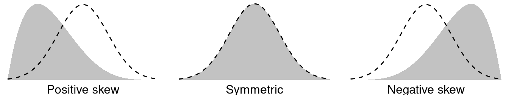
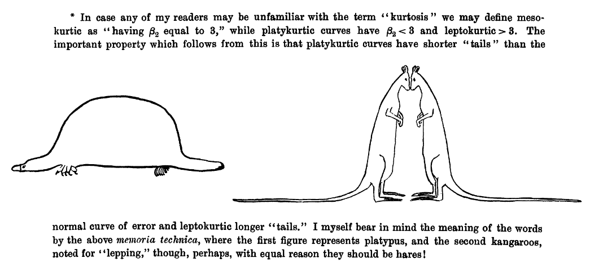
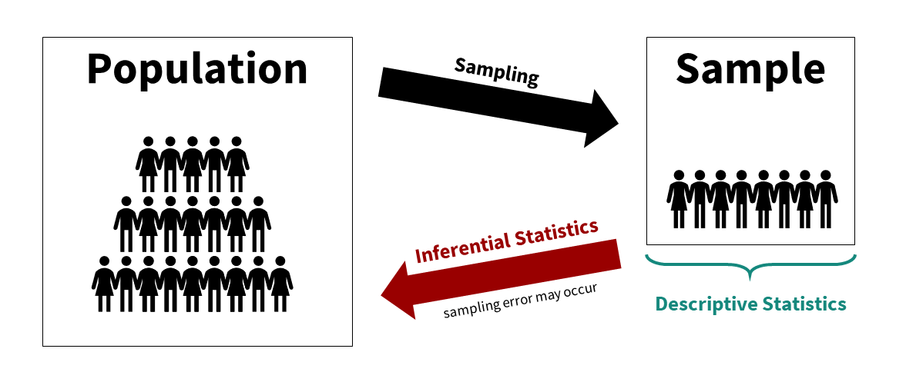

# 2. Statistics foundations

```{r intro-setup, echo = FALSE, message=FALSE}
library(tidyverse)
```

You have learned about both quantitative and qualitative methods. We will be focusing primarily on quantitative methods in this class and in this textbook. By quantitative methods, I mean methods that predominantly collect data that deals with numbers. We can then analyze that data using statistical procedures, which we will shorthand to "statistics." Understanding what we mean by statistics is the purpose of this chapter.

```{r echo = FALSE, message = FALSE, warning = FALSE}
library(vembedr)
embed_url("https://www.youtube.com/watch?v=QirHpjLkHmc")
```

### Central tendency and dispersion

There are multiple **measures of central tendency** (these are *all* averages so you must be careful when you say that word to explain which type you mean!):

-   **Mean**: the sum of all points divided by the total number of points; susceptible to outliers

-   **Median**: the middlemost value; less susceptible to outliers and best used when the data is skewed

-   **Mode**: most frequent score

    -   **Multimodal** or **bimodal**: when two or more values are the most frequent score

Note that depending on the shape of the distribution, the mean, median, and mode may not be the same value. If we have a **normal distribution** then they will be the exact same! However, if we have a positively skewed distribution, the mean and median will be pulled towards the positively skewed data, as shown in this figure by [Peter Prevos](https://lucidmanager.org/r4h2o/stats.html).


There are also multiple **measures of dispersion** that describe the spread of our data:

-   **Range**: the difference between the maximum and minimum value (e.g., if the minimum score is 17 and the maximum is 49, then the range is 32)

-   **Quartile**: when a dataset is divided into four equal parts, the first quartile (Q1) is at the 25th percentile, the second quartile (Q2) is at the 50th percentile, and the third quartile (Q3) is at the 75th percentile.

    -   **Interquartile range**: the middle 50% (Q1 to Q3)

-   **Variance**: the sum of the squared deviations from the mean. This means first (a) calculating the mean, (b) subtracting each score from the mean (aka deviations from the mean), (c) squaring each of those deviations values, and (d) summing all those squared deviations. This is represented by the equation $\frac{\sum (X-\mu)^2}{N}$

-   **Standard deviation**: is the square of the variance. This is represented by the equation $\sqrt{\frac{\sum (X-\mu)^2}{N}}$ however that equation is only used if we are examining the whole population. If we only have a sample, we replace the denominator `N` with `N-1`.

We also have two main **measures of shape** that describe the shape of the distribution of our data:

-   **Skew**: in a non-normal distribution, it is when one tail of the distribution is longer than another. Present in asymmetric distributions

    -   **Negative skew**: when the tail points to the negative end of the spectrum; in other words, most of the values are on the right side of the distribution

    -   **Positive skew**: when the tail points to the positive end of the spectrum; in other words, most of the values are on the left side of the distribution

[](https://lucidmanager.org/r4h2o/stats.html)

-   **Kurtosis**: the weight of the tails relative to a normal distribution. There are some fancy terms related to kurtosis that you may hear about, but honestly I don't hear them used very frequently by researchers.

    -   **Leptokurtic**: light tails; values are more concentrated around the mean
    -   **Platykurtic**: heavy tails; values are less concentrated around the mean

[](https://www.jstor.org/stable/2332181?origin=crossref)

There are other terms we use to describe data:

-   **Frequency distribution**: overview of the times each value occurs in a dataset; often portrayed visually like with a histogram

-   **Histogram**: a visual depiction of the frequency distribution using bars to depict a range of the distribution

-   **Normal distribution**: a special distribution in which the data are symmetrical on both sides of the mean; under a normal distribution, the mean is also equal to the median

### Levels of measurement

This should be refresher material for you, but it is extremely important you are familiar with the four levels of measurement.


**Categorical**: variables that have *categories* to the levels, but cannot be analyzed with a mean because the levels are not proportionate. There are two types of categorical variables:

-   **Nominal**: a categorical variable in which each level of the variable is named but there is no order to them (e.g., breeds of dogs)

    -   **Binary**, **dummy-coded**, or **dichotomous**: a nominal variable with only two levels (general 0 or 1). This is a special type of nominal variable.

-   **Ordinal**: a categorical variable in which each level of the variable is named and there is an order to them (e.g., ranks)

**Continuous**: variables with proportionate intervals between the levels meaning they can be analyzed with a mean, SD, variance. There are two types of continuous variables (although for the purpose of this course we will simply call them continuous variables):

-   **Interval**: a continuous variable that has intervals that are directly proportionate (e.g., the distance between 2-3 is the same as the distance between 5-6)

-   **Ratio**: a continuous variable like an internal variable but can accommodate an absolute zero, meaning a zero is actually possible (e.g., weight, temperature in Kelvin, reaction time)

#### Examples of levels of measurement

Confused still on the levels of measurement? Maybe this will help! Notice that studying can be measured at different levels. Depending on the nature of the question and response options, it might be nominal, ordinal, or continuous! Here's an example of data at the continuous, ordinal, and nominal level.

| Name               | Study_Continuous        | Study_Ordinal                        | Study_Nominal                         |
|--------------------|-------------------------|--------------------------------------|---------------------------------------|
| *Name (Character)* | *Hours studied per day* | *Likert scale of amount of studying* | *Whether or not they study every day* |
| Jesus              | 5.0                     | A great deal                         | Yes                                   |
| Nicky              | 4.5                     | A great deal                         | Yes                                   |
| Bradford           | 3.2                     | A moderate amount                    | Yes                                   |
| Sylvia             | 1.7                     | A small amount                       | Yes                                   |
| Martha             | 0.2                     | Rarely                               | Yes                                   |
| Lillian            | 0.0                     | Never                                | No                                    |
| Trayvon            | 0.0                     | Never                                | No                                    |

We can make any continuous variable into an ordinal and nominal variable and any ordinal variable into a nominal variable. But if we have a nominal variable we cannot make it ordinal, nor can we make an ordinal variable continuous. In other words, continuous variables *contain more information*. Often, we want to avoid losing information and *always* keep the variable at the highest level of measurement. Continuous has more information than ordinal has more information than nominal.

Another way to put it: never do a median split and avoid "collapsing" categories when you can. You're losing information from your data by doing so.

Also, just because we put numbers to something does not necessarily make it continuous! Be careful and think critically.

[](https://xkcd.com/2610/)

## Descriptive vs inferential statistics

There are basically two different types of statistics:

1.  **Descriptive statistics** are used to summarize, organize, and overall *describe* our sample data. Typically, we do so using measures of central tendency (e.g., mean, median, mode), measures of dispersion (e.g., range, standard deviation, variance), and shape (e.g., skew, kurtosis). We may also visualize the data using tables or graphs.

2.  **Inferential statistics** are what we use when we collect data about a sample and see how well that sample *infers* things about the population from which the sample comes from. Typically, we do so with statistical tests like the t-test, ANOVA, correlation, chi-square, regression, and more.

We can visualize the relationship between the population, sample, descriptive statistics, and inferential statistics (see figure below). We are typically interested in a **population** of interest but may not be able to collect data from the entire population because of budget, time, access, or other constraints. We therefore **sample** from the population; ideally, we do so randomly, but there are other types of sampling methods available. We then use **descriptive statistics** to describe our sample data and **inferential statistics** to make generalizations about the population from which they were selected.



### An example

This has been pretty abstract so far. Let's go through a fairly simple research study to walk through all of this.

Imagine we're conducting an experimental study examining whether watching Schitt's Creek--a very good show--versus watching video lessons on studying techniques--useful, but boring--improved test performance in UW-Stout students.

Our population of interest is therefore all UW-Stout students, roughly 9,500 students total. We cannot include them all in our study; it wouldn't be feasible for us to collect all that data and probably not possible to get the university to get on board with the study of the entire student body. Therefore, we smartly decide to only collect data from a sample of the student body.

Who might our sample be? Ideally, we'd gather a random sample of the 9,500 students. However, to do that we'd likely need to still get university approval and get a list of a portion of student emails for recruitment purposes (oversampling because our response rate is unlikely to be 100%). I just want to do this study to show what descriptive and inferential statistics are, so I just use students in my two sections of introduction to psychology classes (around 80 students total) as my population. This is definitely not a random sample, but a fine study for our illustrative purposes.

We conduct our study--let's assume we're fabulous researchers and it worked out perfectly. We randomly assign half our students to watch Schitt's Creek as part of their studying, and the other half watch video lessons on studying techniques. They have an exam a week later and we measure their accuracy on that exam. We then want to know: which group performed better on the exam?

First, let's describe the sample. We would likely visualize our results, perhaps as a histogram of all test scores, maybe separated by which group they were in. This would help us look at whether our data is normally distributed (more on this in a subsequent chapter on assumption checking). We would get the descriptive statistics: probably the mean, maybe the median if our data is skewed, the standard deviation and variance, and the range. If we wrote up our results and didn't share a visualization, this information would give a good sense of our data to our readers.

But what we really want to know is: which group performed better on the test? For that, we need our mean, standard deviations, and sample sizes for both groups. We then plug the numbers into the equation for this particular inferential statistic (in this case, an independent t-test, but we'll learn about that later) or--even better--we perform the statistic in our statistical software (jamovi). It spits out our statistical value and our p-value and we can then infer what the results mean for our population and answers our research question.[^02.0-statistics-foundations-1]

[^02.0-statistics-foundations-1]: You might be wondering: well, what were the results? Which group performed better? As much as I love Schitt's Creek, most students don't know how to study well, and so the students who watched the video lessons on studying techniques far outperformed the students who watched Schitt's Creek.

    Interested in better techniques for studying? Check out [The Learning Scientists](https://www.learningscientists.org/blog/category/For+Students). This [article](https://www.learningscientists.org/blog/2020/1/9-1)does a good job of summarizing the research on effective study practices.
