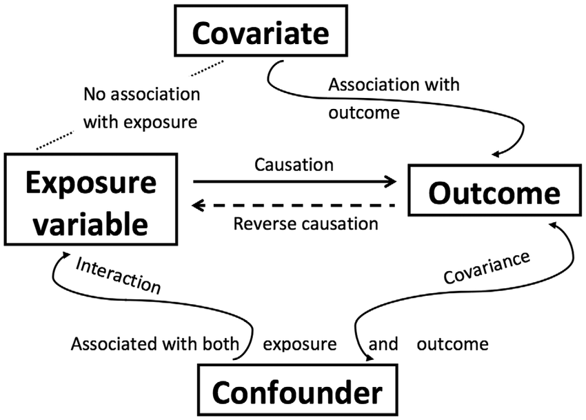
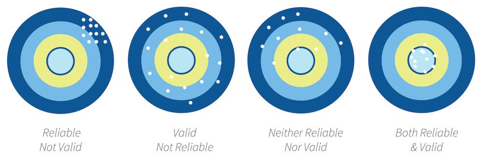

## Design & Methods Key Terms

```{r intro-setup, echo = FALSE, message=FALSE}
library(tidyverse)
```

The following covers some terminology that will be helpful to keep in mind throughout the semester.

### Study design terms

Some terms you should be familiar with:

-   **Between-group/subject design**: in a study, participants are only exposed to a single condition. In other words, there are different people in each condition.

-   **Correlational research**: a study in which causality cannot be claimed; correlation does not infer causation! It is, however, one of three necessary conditions to infer causality. It is a *necessary* but *insufficient alone* condition.

-   **Cross-sectional research**: also called non-experimental research; the IV is not manipulated and there is no random assignment. Furthermore, data is only collected at one time point (as opposed to longitudinal research)

-   **Experimental research**: the IV is manipulated and there is random assignment

-   **Falsification**: A key way we separate science from pseudo-science is that we attempt to *falsify* our hypotheses as opposed to try *verify* our hypotheses. Null hypothesis significance testing (NHST) is about falsifying the null hypothesis; we can never truly verify our alternative hypothesis.

-   **Hypothesis**: What we think the answer to our research question is (often our alternative hypothesis). The alternative and null hypotheses must be mutually exclusive (a result can't satisfy both) and exhaustive (all possible results are specified)

    -   **Alternative hypothesis**: Often that the IV had **an** effect on the DV; can be specified as a two-tailed (an effect) or one-tailed (greater/less than) hypothesis

    -   **Null hypothesis**: The null hypothesis is the opposite of the alternative hypothesis and encompasses all the rest of the possibilities. A special type of null hypothesis is the *nill* hypothesis which is that there is *no* effect on the DV.

-   **Qualitative methods**: Broadly, methods that focus on words and meaning (e.g., interviews)

-   **Quantitative methods**: Broadly, methods that focus on numbers and statistics (e.g., Likert scales)

-   **Quasi-experimental research**: the IV is manipulated but there is no random assignment

-   **Randomization**: participants are randomly assigned to conditions

-   **Repeated-measures design**: participants are repeatedly measured on the dependent variable, either across conditions or across time

-   **Theory**: A description of a behavior that makes predictions about future behaviors

-   **Variation**:

    -   **Systematic**: researcher introduces error systematically into the study, especially into one condition over another. For example, by randomly assigning participants into one of two conditions, we are introducing systematic variability between participants. However, it could be unintentional systematic variation; for example, perhaps we have two researchers collecting data and one is mean and the other is nice, and so participants respond differently depending on which researcher collects data from them.
    -   **Unsystematic**: random variation

-   **Within-group/subject design**: in a study, participants are exposed to every condition. In other words, there are the same people in each condition.

### Variables

We tend to talk about two different types of variables in our studies:

1.  **Independent variable** (IV; also known as the predictor variable or exposure variable): this is the variable that is thought to be the cause of some effect. In experimental research, it is the variable that is manipulated. Note
2.  **Dependent variable** (DV; also known as the outcome variable): this is the variable that is thought to be affected by changes in the IV.

There are other types of variables we may be interested in. Note that these variables are not considered independent variables because we would not manipulate them or try to examine how they cause the dependent variable.

-   **Confounding variable**: a variable that affects or is related to both the independent and dependent variable
-   **Covariate**: a variable that only affects or is only related to the dependent variable

[](https://www.researchgate.net/publication/299415540_Confounding_and_causation_in_the_epidemiology_of_lead)

### Reliability and validity



-   **Reliability**: the consistency of a measure by time (test-retest reliability), across items (internal consistency) or across different researchers (inter-rater reliability). Check out Chapter \@ref(reliability) for more information on measuring reliability.

-   **Validity**: the extent to which a test measures what it claims to measure

    -   **Construct validity**: validity of inferences about the higher order constructs that represent sampling particulars. There are multiple types of construct validity; here are a few:

        -   **Content validity**: experts using their judgment that something measures what it is supposed to measure
        -   **Convergent validity**: correlations among two theoretically related constructs (or measurements) are strong and positive
        -   **Divergent validity**: correlations among two theoretically not-related constructs (or measurements) are zero/null
        -   **Criterion validity**: content on one test (predictor) correlates with performance on relevant criterion measures (outcome)

    -   **Statistical validity**: validity of inferences about the correlation between treatment and outcome

    -   **Internal validity**: validity about whether the observed relationship between A and B reflects a causal relationship between A and B

    -   **External validity**: validity of inferences about whether the cause-effect relationship holds over variation in persons, places, treatment variables, and measurement variables

### Statistical terms

-   **Degrees of freedom (df)**: Degrees of freedom are the number of values that are free to vary and are not constrained.

    -   The easiest way to understand them is with an example of the mean. If you know the sum of 4 numbers, then 3 of those numbers are free to vary but the fifth value is dependent on (and constrained) to the values of the other. If your sum is 10, you could have three random values of 2, 3, and 1 (which are free to vary) but your fourth number *must* be 4. Therefore, the degrees of freedom in this example would be 3, which is n - 1.

    -   The statistical tests all have different ways of calculating degrees of freedom. For example, the one-sample t-test is *n* - 1, the independent t-test is *n~1~* + *n~2~* - 2, and the dependent t-test is *n* - 1 where *n* is the number of pairs.

-   **Confidence intervals**: A confidence interval is such that in repeated sampling (e.g., replicating a study over and over and over again) then 95% of those confidence intervals should contain the true population parameter. You can see this visualized, and learn more about it, with this great [visualization](https://rpsychologist.com/d3/ci/) and read this great [blog post](http://daniellakens.blogspot.com/2016/03/the-difference-between-confidence.html). You can also [read a chapter on this topic by Daniel Lakens](https://lakens.github.io/statistical_inferences/confint.html).

### Other terms

If other terms come up in the course of the semester that you believe should belong in this key term website, include it in your weekly reflection so I can update this page!
