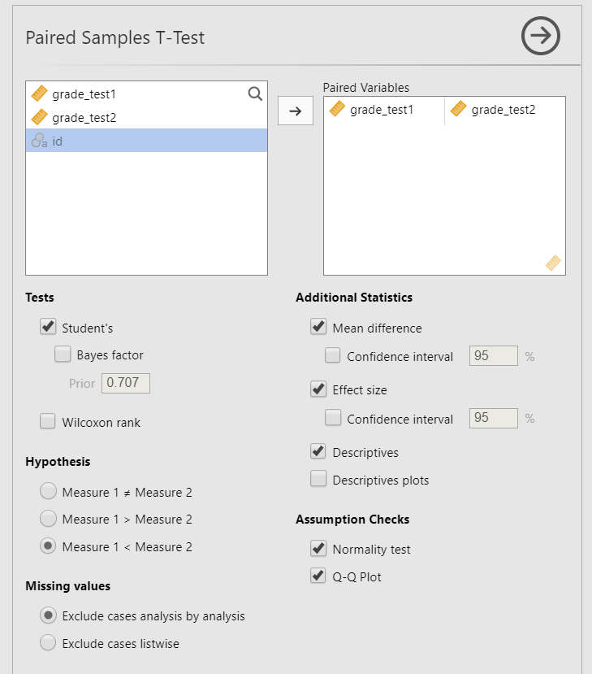
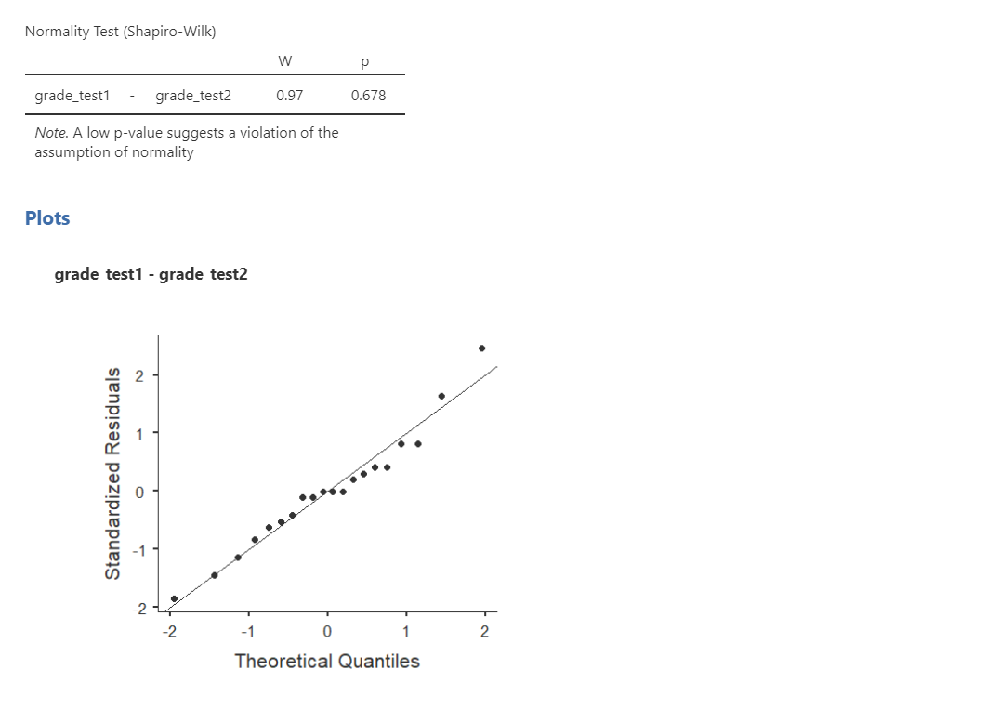
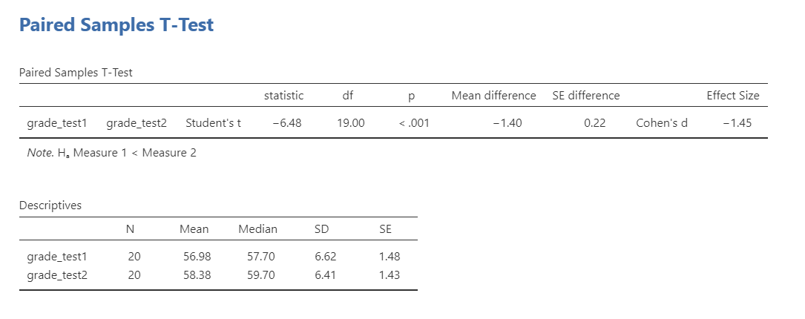
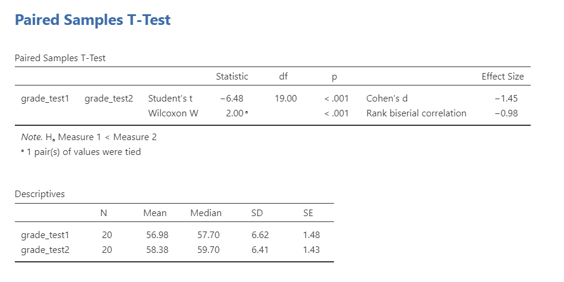

# Dependent t-test

```{r ind-t_setup, echo = FALSE, message=FALSE}
library(tidyverse)
library(webex)
options(knitr.graphics.auto_pdf = TRUE)
```

## What is the dependent t-test?

The dependent t-test is used to test the difference in our dependent variable between two categories in which participants are the *same* across categories. Our category variable is our independent variable. In other words, we use the dependent t-test when we have a research question with a **continuous dependent variable** and a **categorical independent variable with two categories in which the same participants are in each category**.

The dependent t-test is also called a dependent samples t-test or paired samples t-test.

There are three different types of alternative hypotheses we could have for the dependent t-test:

1.  **Two-tailed**

    -   $H_1$: There is a difference in means between the two time points or conditions.
    -   $H_0$: There is no difference in means between the two time points or conditions.

2.  **One-tailed**

    -   $H_1$: The mean at time 1 or condition 1 is greater than the mean at time 2 or condition 2.
    -   $H_0$: The mean at time 1 or condition 1 is less than or equal to the mean at time 2 or condition 2.

3.  **One-tailed**

    -   $H_1$: The mean at time 1 or condition 1 is smaller than the mean at time 2 or condition 2.
    -   $H_0$: The mean at time 1 or condition 1 is greater than or equal to the mean at time 2 or condition 2.

## Data set-up

To conduct the dependent t-test, we first need to ensure our data is set-up properly in our dataset. This requires having two columns: one is our dependent variable score for the participant in one category and the other column is our dependent variable score for the participant in the other category. Each row is a unique participant or unit of analysis. Here's what example data may look like if we were testing for differences in test scores across the same participants in the fall and spring:

| ID  | TestScore_Fall | TestScore_Spring |
|:----|:---------------|-----------------:|
| 1   | 75             |               86 |
| 2   | 79             |               80 |
| 3   | 65             |               75 |
| 4   | 81             |               79 |
| 5   | 73             |               82 |
| 6   | 72             |               84 |
| 7   | 69             |               90 |
| 8   | 60             |               72 |
| 9   | 75             |               75 |
| 10  | 74             |               81 |

: Example data for the dependent t-test

In the example data above, what is your **independent variable**? `r mcq(c("ID", answer = "Semester", "TestScore"))`

In the example data above, what is your **dependent variable**? `r mcq(c("ID", "Semester", answer = "Test Score"))`

## The math behind the dependent t-test

The basic math of the dependent t-test is the mean difference divided by the standard error, which is estimated based on the standard deviation and sample size (N).

$t = \frac{\bar{X}_1 - \bar{X}_2}{s_d/ \sqrt{N}}$

## Assumptions

As a parametric test, the dependent t-test has the same assumptions as other parametric tests minus the homogeneity of variance assumption because we are dealing with the same people across categories

1.  The *differences in scores* in the dependent variable are **normally distributed**

2.  The dependent variable is **interval or ratio** (i.e., continuous)

3.  Scores are **independent** across participants

We cannot [test]{.ul} the second and third assumptions; rather, those are based on knowing your data.

However, we can and should test for the first assumption. Fortunately, the dependent samples t-test in jamovi has two check boxes under "Assumption Checks" that lets us test normality.

## In jamovi

Let's run an example with data from lsj-data. Open data from your Data Library in "lsj-data". Select and open "Chico". This dataset is hypothetical data from Dr. Chico's class in which students took two tests: one early in the semester and one later in the semester. Dr. Chico thinks that the first test is a "wake up call" for students. When they realise how hard her class really is, they'll work harder for the second test and get a better mark. Is she right? Let's test it!

1.  To perform an dependent t-test in jamovi, go to the Analyses tab, click the T-Tests button, and choose "Paired Samples T-Test".

2.  Move both measurements of your dependent variable (`grade_test1` and `grade_test2`) to the Paired Variables box.

3.  Under Tests, select `Student's`

4.  Under Hypothesis, choose the correct hypothesis: `r mcq(c("Measure 1 is not equal to Measure 2", "Measure 1 > Measure 2", answer = "Measure 1 < Measure 2"))`

5.  Under Additional Statistics, select `Mean difference`, `Effect size`, and `Descriptives`.

6.  Under Assumption Checks, select both options: `Normality test` and `Q-Q plot`.

When you are done, your setup should look like this

```{r echo = FALSE, fig.cap = "Dependent t-test setup in jamovi", out.width = "80%"}

```

### Checking assumptions in jamovi

#### Testing normality

We test for normality using the Shapiro-Wilk test and the Q-Q plot. The Shapiro-Wilk test was not statistically significant (W = .97, *p* = .678); therefore, this indicates the data is normally distributed. Furthermore, the lines are fairly close to the diagonal line in the Q-Q plot (although it's a bit hard to tell because our sample size is small). We can conclude that we satisfy the assumption of normality.

```{r echo = FALSE, fig.cap = "Testing normality in jamovi"}

```

### Interpreting results

Once we are satisfied we have satisfied the assumptions for the dependent t-test, we can interpret our results.

```{r echo = FALSE, fig.cap = "Dependent t-test results in jamovi"}

```

Our p-value is less than .05, so our results are statistically significant. We can write up our results in APA something like this:

> The 20 students in Dr. Chico's class performed worse on the first test (*M* = 56.98, *SD* = 6.62) than they did on the second test (*M* = 58.38, *SD* = 6.41), *t*(19) = -6.48, *p* \< .001, *d* = -1.45.

Remember in the previous chapter that our t-test can be negative but we can always flip the interpretation. Here's another example of how we could write-up our results in APA style:

> Dr. Chico's hypothesis was correct in that her 20 students performed better on the second test (*M* = 58.38, *SD* = 6.41) than they did on the first test (*M* = 56.98, *SD* = 6.62), *t*(19) = 6.48, *p* \< .001, *d* = 1.45.

## What if I violated assumptions?

If you violated the assumption of normality and no transformation fixed your data, then you can perform the non-parametric version of the dependent t-test called the Wilcoxon Rank test. As a reminder, non-parametric tests do not make assumptions about the distribution of data because it deals with the *median* not the *mean*.

Here is the output for both the dependent t-test and the Wilcoxon rank test:

```{r echo = FALSE, fig.cap = "All dependent t-test results in jamovi"}

```

#### Wilcoxon rank in jamovi

To conduct this in jamovi, under Tests select `Wilcoxon rank`. You will interpret the results similarly to the dependent t-test:

> Using Wilcoxon rank test, students' test scores were significantly higher at the second test (*Mdn* = 59.70) than at the first test (*Mdn* = 57.70), W = 2.00, *p* \< .001.

The note about tied values is not necessary to discuss. It is just telling us one participant had identical values for both test1 and test2 (student15).

## Your turn!

Open the `Sample_Dataset_2014.xlsx` file that we will be using for all Your Turn exercises. You can find the dataset here: [Sample_Dataset_2014.xlsx Download](https://github.com/danawanzer/stats-with-jamovi/blob/master/data/Sample_Dataset_2014.xlsx)

Perform dependent t-tests based on the following research questions. Think critically about whether you should be using a one-tailed or two-tailed hypothesis and check your assumptions so you know which test to use!

To get the most out of these exercises, try to first find out the answer on your own and then use the drop-down menus to check your answer.

**Note**: Technically, none of our data is suitable for a dependent t-test in this dataset. We will pretend that the four test score variables (`English`, `Reading`, `Math`, and `Writing`) are really four measurements of the same underlying test. In reality, we would analyze this data using correlation.

1.  **Do students perform better on the English test than they do the Writing test?**

    -   Should you use a one-tailed or two-tailed hypothesis? `r mcq(c(answer = "one-tailed", "two-tailed"))`

    -   Which statistic should you use based on your assumptions? `r mcq(c(answer = "dependent t-test", "Wilcoxon rank"))`

    -   Do students perform better on the English test than they do the Writing test? `r mcq(c(answer = "yes", "no"))`

2.  **Does students' English scores relate to their Reading scores?**

    -   Should you use a one-tailed or two-tailed hypothesis? `r mcq(c("one-tailed", answer = "two-tailed"))`

    -   Which statistic should you use based on your assumptions? `r mcq(c(answer = "dependent t-test", "Wilcoxon rank"))`

    -   Does students' English scores relate to their Reading scores? `r mcq(c("yes", answer = "no"))`
