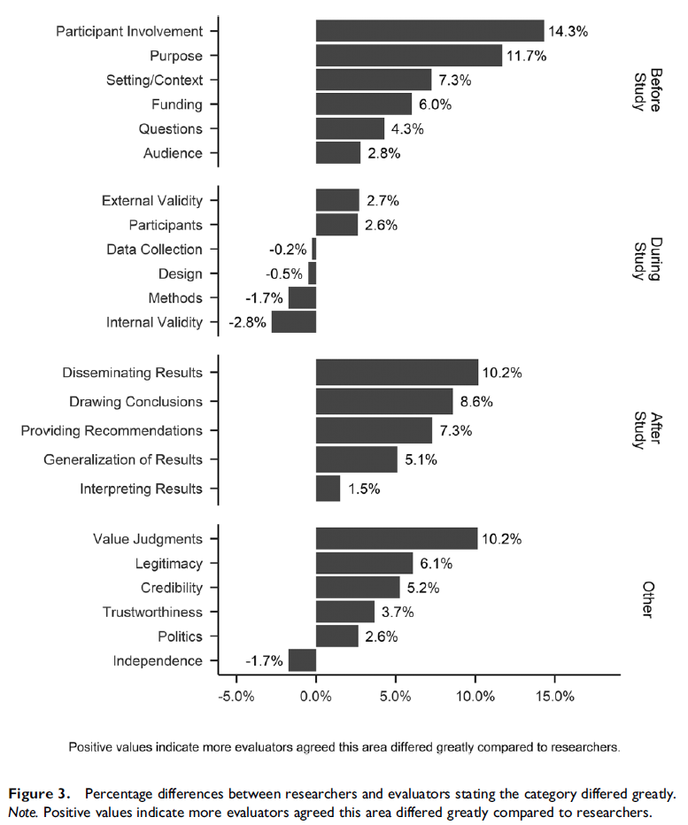

## Describing data

As a reminder, **descriptive statistics** are used to summarize, organize, and overall *describe* our sample data.

### Data variables

First, it's important to understand the different types of variables in jamovi and how they map onto our levels of measurement.

Variables in jamovi can be one of three data types:

1.  **Integer**, meaning the values are discrete whole numbers
2.  **Decimal**, meaning the values are numbers with decimals
3.  **Text**, meaning the values are alphanumeric, not just numeric

Furthermore, variables in jamovi can be one of four measure types:

1.   Nominal

2.   Ordinal

3.   Continuous (meaning jamovi combines interval and ratio and doesn't distinguish between the two)

4.   ID (used for any identifying variable you likely wouldn't ever analyze, like participant ID number or name)

There are a few great things about jamovi when it comes to these data variables. First, jamovi will try to automatically determine what the data and measure types are when you type in data or when you open a dataset; this is fabulous, until it goes wrong. It's important that you always double check your data and measure types first!

Second, those little icons will be really helpful to let you know what variables can go in which boxes. For example, we would never analyze a nominal variable as our dependent variable for a t-test, and jamovi will help remind you of that. When performing an independent samples t-test, the dependent variables box will have a little ruler icon indicating you should be putting continuous variables in that box. Similarly, it will tell you to put nominal or ordinal variables in the grouping variable (independent variable) box. Sweet!

### Describing your data

We explore our data partly to describe our data and partly to check our data before performing inferential statistics. jamovi puts all our descriptive statistics into one useful analysis under the Analyses tab within the Exploration menu called `Descriptives`.

#### Describing nominal or ordinal data

Nominal and ordinal data is described mainly using frequencies. Choose your categorical variable(s) and move it to the Variables box and then select the option `Frequency tables`. Note that it tells you it's best for nominal and ordinal data with the two icons!

I recommend you watch this video by Alexander Swan on [how to describe categorical data in jamovi](https://youtu.be/eGdkYZbljbQ).

#### Describing continuous data

Continuous data is described using a variety of measures of central tendency, dispersion, and more. Choose your continuous variable(s) in the list of variables on the left side and move it to the Variables box.

I recommend you watch this video by Alexander Swan on [how to describe continuous data in jamovi](https://youtu.be/oVE0nxJ0J44).

In the `Descriptives` analysis, these are under the `Statistics` drop-down menu. There are a ton of possible options!

1.  **Sample size**: you can ask for the sample size (`N`) and number of missing values (`Missing`)
2.  **Percentile values**: these are useful for creating quartiles (`Cut points for 4 equal groups`) or `Percentiles` of various sizes.
3.  **Dispersion**: you should already be familiar with most of the measures of dispersion, particularly the `Minimum` and `Maximum`, but there is also the `Std. deviation` (SD) and `Variance` (which is just SD^2^). We'll learn about the `S. E. Mean` later.
4.  **Central Tendency**: similarly, you should also be familiar with all of the measures of central tendency: `Mean`, `Median`, `Mode`, and `Sum`.
5.  **Distribution**: you should also be familiar with both `Skewness` and `Kurtosis` and later we will learn what those values mean and how that helps us test for normality
6.  **Normality**: lastly, there is a statistical test for normality called the `Shapiro-Wilk` test that we will learn about later.

#### Describing one variable split by another variable

Sometimes we want to get the descriptive statistics for one variable across multiple groups of another variable. Usually, this is a continuous variable split by a categorical variable. In that case, move your continuous variable to the `Varables` box and the variable you want split by categories in to the `Split by` box.

### Writing up descriptive statistics

We'll learn more about writing up our inferential statistics results later, but first let's learn how we might report our descriptive statistics.

In small examples, we might write-up our descriptive statistics into a paragraph[^03.1-descriptive-statistics-1] (note that there is also an independent t-test and a chi-square test of independence!):

[^03.1-descriptive-statistics-1]: This comes from [Wanzer (2017) Developmentally appropriate evaluations: How evaluation practices differ across age of participants](https://thesiscommons.org/bk57d/)

{width="602"}

In examples with many variables, we might write-up our descriptive statistics into a table[^03.1-descriptive-statistics-2]:

[^03.1-descriptive-statistics-2]: This comes from [Wanzer et al. (2020) Experiencing flow while viewing art: Development of the aesthetic experience questionnaire](https://psycnet.apa.org/record/2018-49650-001)

{width="400"}

## Visualizing data

"A picture is worth a thousand words," and in a world in which journal articles have word count limits, figures and graphs are priceless. They are also an incredibly powerful way to examine your data because it can often illuminate patterns you may not be able to see through a table.

jamovi has some plots built into its platform, both under the `Plots` drop-down menu in the `Descriptives` analysis and as options for many of the inferential statistical analyses.

We'll learn more about how to choose and conduct better data visualizations later, but for now here are some recommended visualizations depending on what you are trying to do. Note that we will do most of our visualizations in jamovi, but we may also learn how to visualize data via Excel. There are also excellent LinkedIn Learning courses on data visualization in Excel and other tools that I strongly recommend; they are free for you if you are a UW-Stout student.

[When you want to visualize the distribution of a continuous variable]{.underline}

First, there are two **Histogram** options: `Histogram` and `Density`. These are useful for seeing the overall distribution of your data and to help check for normality. Which should you use? I think they're both pretty great, and in fact you can combine the two to have a histogram plot with a density overlay. I like this option best because it presents more information and better lets us see if the if the density curve looks normally distributed.

[When you want to visualize the distribution of a continuous variable split by a categorical variable]{.underline}

There are three options under **Box Plots**: `Box plot`, `Violin` (which is really a density plot with its mirror image!), `Data` (which can be Jittered or Stacked; I prefer Jittered so you can see the density of data points really well), and `Mean`. Personally, I love checking all four boxes! This gives you the best of all them: the distribution of your data with the `Violin` option, the quartiles and mean with the `Box plot` option, a visualization of all your data points using the `Data` option, which is really useful because the other two options can be *hiding* weird things in your data, and what the `Mean` is.

[When you want to visualize the frequencies of a categorical variable]{.underline}

For this you would choose the single option under **Bar Plots**: `Bar plot`. It will simply show the frequencies of a categorical variable.

```{block, type="info"}

**Remember: it is incredibly important to always visualize your data!** You never know what descriptive statistics may be hiding.
```

```{r echo = FALSE, message = FALSE, warning = FALSE}
library(vembedr)
embed_url("https://www.youtube.com/watch?v=d2wU0kmCJEY")
```

### Expanding your data visualization

Although these can be useful plots, I often do most of my data visualizations in other platforms. For most of my work, I use Excel because I find it pretty easy to make beautiful graphs. Here's an example of a visualization I made in Excel[^03.1-descriptive-statistics-3]:

[^03.1-descriptive-statistics-3]: This comes from [Wanzer et al. (2020) Promoting intentions to persist in computing: An examination of six years of the EarSketch program](https://doi.org/10.1080/08993408.2020.1714313)


For some more complicated figures, I turn to the `ggplot2` package in R. Here's an example of a visualization I made in R[^03.1-descriptive-statistics-4]:

[^03.1-descriptive-statistics-4]: This comes from [Wanzer (2020) What is evaluation? Perspectives of how evaluation differs (or not) from research](https://journals.sagepub.com/doi/10.1177/1098214020920710)


