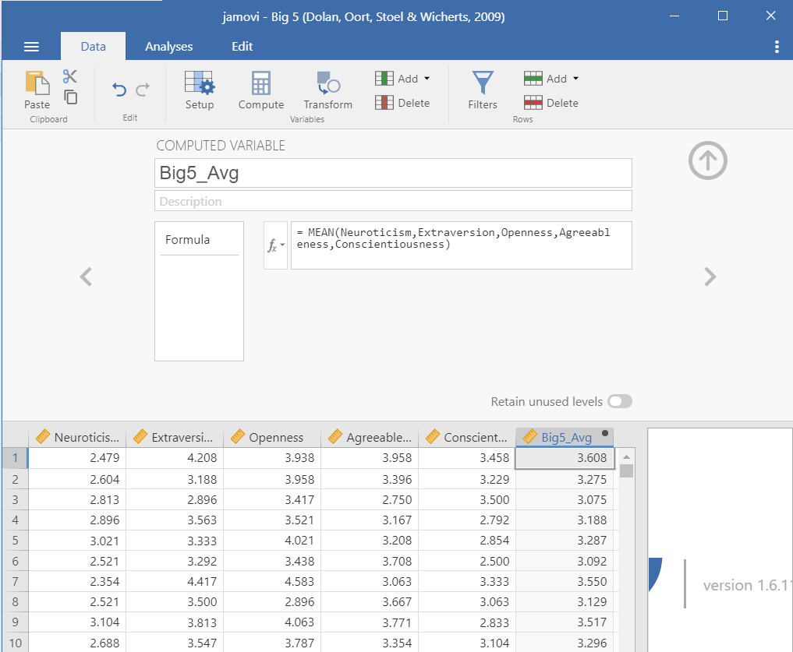
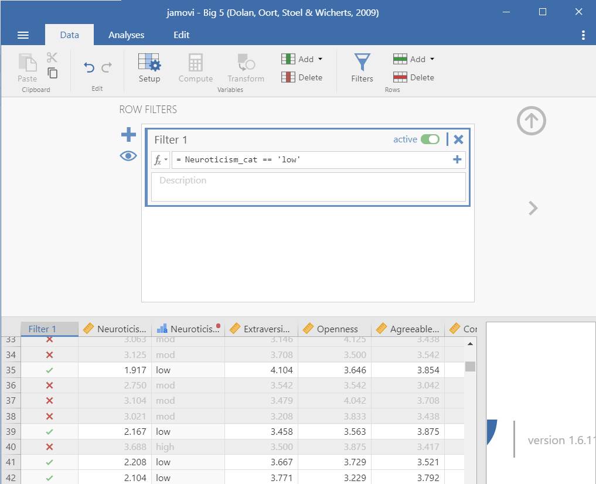
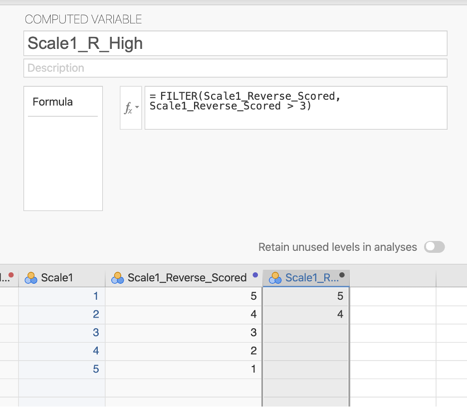

## Cleaning data

There are four basic types of cleaning we will be learning about: checking your data is setup correctly, computing new variables, transforming variables, and using filters.

The following video walks through some of these data cleaning techniques.

```{r echo = FALSE, message = FALSE, warning = FALSE}
library(vembedr)
embed_url("https://www.youtube.com/watch?v=BGOZtlHRv6k")
```

### Data setup

As previously mentioned, it's really important to check that the data types and measurement types of your variables are correct. You should open the Setup ({width="15"}) option under the Data tab to check.

When you're in Setup, here's the things you should be doing for all variables:

1.  Make sure the variable name is meaningful to you. You may also want to change it to something that will appear nicely in your data visualizations or tables (e.g., don't write `Q35` but rather `BDI Score`).

2.  Add a description to your variable so you have more context. Maybe you write `Average score of all BDI items` for the description of your `BDI Score` variable.

3.  Check your measure and data types are correct.

4.  Specify if there is a code for missing values. Make sure the code *does not* match the code you use for actual variables! For example, if I have a variable that ranges from 0-10, then I wouldn't use 9 as a code for missing values; instead, I might use 99 or -9.

5.  Add labels to levels. For example, the variable `Athlete` is 0 for non-athlete and 1 for athlete. Rather than keeping just the 0 and 1, you can specify under Levels that 0 is non-athlete.

### Compute (create new variables using some computation)

Sometimes you need to create new variables from your raw (meaning uncleaned) data. I recommend you watch this video by Alexander Swan on [computing variables in jamovi](https://youtu.be/_CqfI3eFqD4).

Perhaps you collected data on a scale that has five items. Normally, we create an average score of all the five items and that new *computed* average score is what we use in our analyses.

Let's open the Big 5 dataset built into jamovi. You can open this dataset by clicking the three horizontal lines on the top left of jamovi (the menu), choose Open, then select Data Library. In the main Data Library folder is a dataset called Big 5.

This dataset has the scores on all five subscales of the Big Five personality test. Let's imagine we want the average score of the entire Big Five test. We would click on the Data tab and choose `Compute`. We would rename the computed variable (e.g., `Big5_Avg`), add in a description, and then create the formula.

In this case, we need to select the function `MEAN`. Below the function, it provides a template of what the formula should look like. We need to specify the function `MEAN()`, add all the variables we want to calculate in the mean (i.e., the five subscales of the Big 5), and there are two alternative options: `ignore_missing` is defaulted to 0 (meaning DON'T ignore missing, or rather include missing) and `min_valid` is defaulted to 0 (meaning it's ignoring this; perhaps you only want to include people that have at least three valid cases).

The basic formula, then is to do MEAN(var1, var2, ... varn). You can see what we need to do with this dataset below. There's actually no missing data, so the two additional arguments aren't necessary for us to worry about.



Note that this was creating an average score using the MEAN() function. Sometimes, psychological scales want you to create a total score using the SUM() function. jamovi also has a lot of other functions you may need to use in the future.

If you'd like to learn more about computed variables in jamovi, [check out this jamovi blog post on the topic](https://blog.jamovi.org/2017/11/28/jamovi-formulas.html).

### Transform (revise current variables)

Sometimes we want to take an existing variable and transform it in some way or we want to do a computation across multiple variables (e.g., reverse-score multiple items in a dataset).

I recommend you watch this video by Alexander Swan on [transforming variables in jamovi](https://youtu.be/-duFdGa11kw).

If you want to learn more about transforming variables, [the jamovi blog has a great blog post on the topic](https://blog.jamovi.org/2018/10/23/transforming-variables.html).

#### Recoding

Maybe we want to recode variables. Perhaps we want to recode the Neuroticism scale into low, moderate, and high extraversion. The scale ranges from 1-5, so I'm going to say that scores between 1-2.333 are low, 2.334 to 3.666 is moderate, and 3.667 to 5 is high. First, I create a new Transform variable:


Then I need to specify the transformation. Click Edit to do so (or, when creating a new transformation, click the transformation and select Create New Transform). We need to specify the recode conditions. Click `Add recode condition` twice. For the first formula, we want to specify that if the \$source (meaning the score for the variable we're using for the transformation, in this case Neuroticism) is less than or equal to 2.333, then it will be recoded as `low`. We do the same for moderate. Then we can end with an else statement: all other values (else) are recoded as `high`. We can either let it auto determine the measure type, but I like to be in control of my data and therefore specify it is an ordinal variable.

Notice the use of apostrophes around the text! We need to do this because jamovi thinks we're recoding the numeric variable as another numeric variable. By wrapping in apostrophes or quotation marks, we are telling jamovi that it will be text.


#### Reverse-scoring

Sometimes items need to be reverse-scored because they are in the opposite direction of the entire scale.

Let's imagine we have a Happiness Scale with the following four items:

1.  I am happy.
2.  I am content.
3.  Life is overall positive.
4.  I am unhappy.

The happiness scale suggests that higher scores is higher happiness, but the fourth item is opposite. Higher scores on that item actually indicate lower happiness. Therefore, we would need to use "Transform" to recode the items so the highest score is the lowest score and so on. For example, if it were rated on a 5-point scale then you would need to recode so a 1 = 5, 2 = 4, 3 = 3, 4 = 2, and 5 = 1.

We would do this using the recode function like so. Imagine the item was #1 in the "Scale". Note that we use a double equal sign in jamovi (this is part of the R language).


#### Multiple transformations

Maybe we instead want to do a transformation across multiple variables. Perhaps we have multiple items that need to be reverse-scored. Or maybe like in our first example above we want to use our previous `Low_mod_high` transformation to perform on *all* the subscales of the Big 5.

We can click a new variable (e.g., Openness), select Transform, rename the variable, and select the `Low_mod_high` transformation we already used. Voila! The work we did previously can easily be used again in this analysis.

### Filters

Sometimes we only want to analyze certain pieces of our data. We can filter by rows and by columns. [Check out this blog post by jamovi on more details of filters](https://blog.jamovi.org/2018/04/25/jamovi-filters.html).

#### Row filters

Maybe we only want to analyze data from people who are low in neuroticism. We would create the following filter:



You'll notice in the dataset it will add a new column named `Filter 1` (the name of the filter) and there will either be an X or a green check mark indicating whether it's removed (X) or kept (check) in the analyses.

If you want to take off the filter, but keep it available, click on the filter column and toggle the green button on the top right from `active` to `inactive`. It will then grey out the column.

A couple things to note:

-   Notice that to say it equals to `low` you have to use a double equal sign: `==`

-   Another common thing you may want to specify is that the variable is *not* equal to something. You would use the following: `!=`

-   Otherwise you should be familiar with the other operations: `<`, `>`, `<=`, `>=`

#### Column filters

Column filters are useful when you want to use a filter for *some* but not all of your analyses. Rather than creating a filter, we need to compute a new variable using the `FILTER()` function.

For example, we learned how to reverse score our hypothetical happiness item above. We could then say we only want people who are high in that variable for another analysis. We could apply a column filter that is `FILTER(Scale1_Reverse_Scored, Scale1_Reverse_Scored > 3)` .


