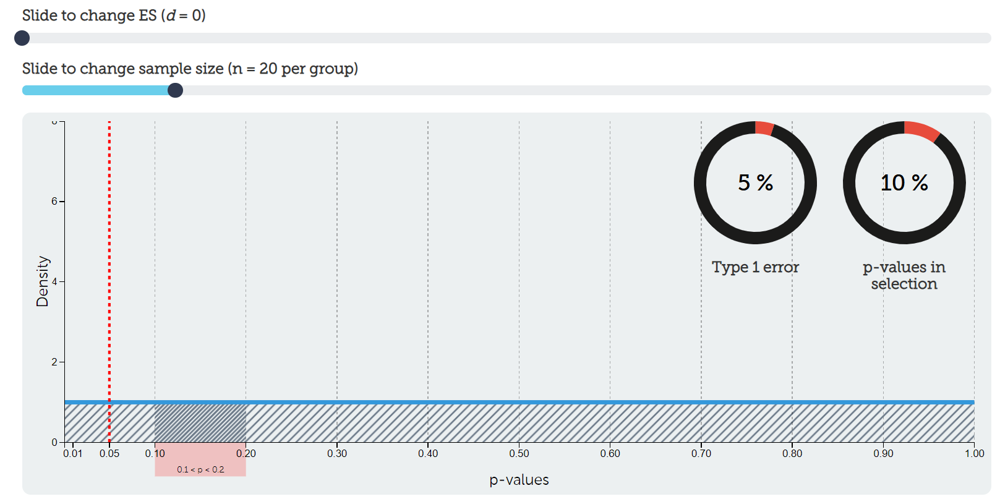
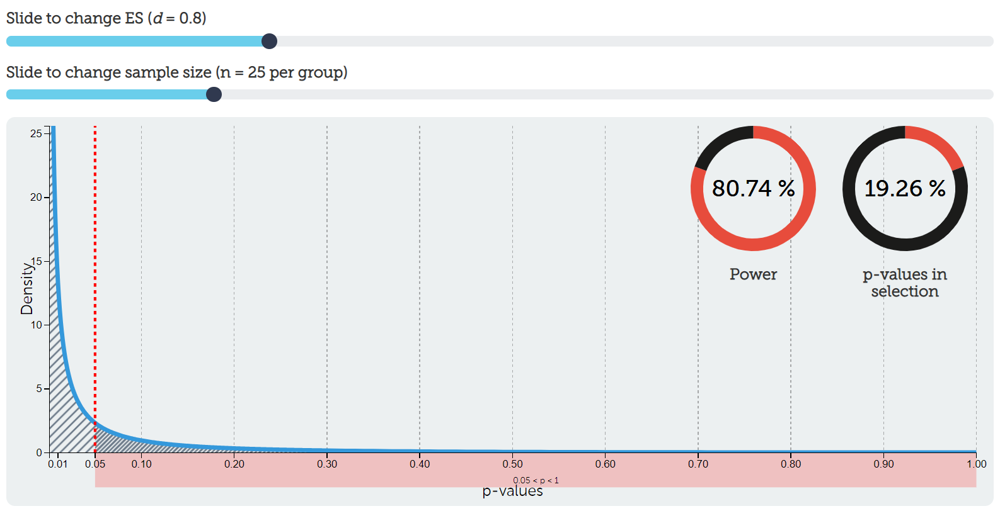

## Power

**Power** is the probability that you will observe a significance effect if there is a true effect. In other words, power is the probability of a statistically significant result assuming the alternative hypothesis is true. Let's compare this to our definition of the p-value: the probability of observing data that is as extreme or more extreme than the data you have observed, assuming the null hypothesis is true.

Power can range from 0-100%, but typically people set it at 80%. However, in practice, power is often far lower than 80%, something we'll investigate in the final section of this chapter and in the homework.

Power is based on the assumption that the alternative hypothesis is true whereas the *p*-value is based on the assumption that the null hypothesis is true. If we want to increase the likelihood of supporting our alternative hypothesis, then we should be doing all we can to increase our power!

Let's start putting all this together.

### Alpha, power, and error rates

Here's all our definitions so far (remember, we can never truly know whether the null or alternative hypothesis is true):

1.  Alpha is the value we set at for what constitutes a statistically significant result, assuming the null hypothesis is true.

2.  Power is the value we set at for what constitutes a statistically significant result, assuming the alternative hypothesis is true.

3.  A type I error is when we get a statistically significant result but in fact the null hypothesis is true.

4.  A type II error is when we do not get a statistically significant result but in fact the alternative hypothesis is true.

5.  A correct inference is when we either

    1.  get a statistically significant result when the alternative hypothesis is true *or*

    2.  when we do not get a statistically significant result when the null hypothesis is true.

In the following table, determine where each of the pieces should go. Note that we have six things to populate but only four cells: each cell must contain at least one of the six things. Think critically here before testing your answers!

|                                                    | H~0~ is true | H~1~ is true |
|----------------------------------------------------|:------------:|:------------:|
| ***p*** **\< .05** (statistically significant)     |      A       |      B       |
| ***p*** **\> .05** (statistically non-significant) |      C       |      D       |

Which cell should each of the following items go?

1.  alpha
2.  power
3.  type I error
4.  Type II error
5.  Correct inference (hint: there are 2!)

### Playing with alpha & power

We'll eventually see how power, alpha, effect sizes, and sample size all interrelate. For now, let's examine how alpha and power relate to one another in the context of hypothesis testing.

#### Assuming the null hypothesis is 100% true

*Assuming the null hypothesis is 100% true*, we could fill in the table with actual numbers. Let's also use the arbitrary values we often set alpha and power at: alpha = 5% and power = 80%. Here's the resulting table:

+----------------------------------------------------+--------------+--------------+
|                                                    | H~0~ is true | H~1~ is true |
+====================================================+:============:+:============:+
| ***p*** **\< .05** (statistically significant)     | 5%           | 0%           |
+----------------------------------------------------+--------------+--------------+
| ***p*** **\> .05** (statistically non-significant) | 95%          | 0%           |
+----------------------------------------------------+--------------+--------------+

How did I get there? First, we're assuming the null hypothesis is 100% true. Therefore, that column must add up to 100%. If the null hypothesis is 100%--and we know our hypotheses must be mutually exclusive--then the alternative hypothesis must be 0% true. Therefore, that column must add up to 0%. The whole table must equal to 100% to exhaust all options.

Therefore, our power doesn't matter at all in this case. If the null is true, then it doesn't matter what power we have to detect the alternative effect *because the alternative effect does not exist*. So we instead use alpha and put it in the upper left cell. Note that our alpha level is the Type I error rate we are setting!

If the whole table must equal to 100%, and the left column must equal to 100% because the null is 100% true, then 100-5 = 95% for the correct inference. In other words, if we tested this effect (that doesn't exist) 100 times, around 95% of the time we would get a non-significant p-value (*p* \> .05) and about 5% of the time we would get a significant p-value and be making a Type I error.

We can visualize our *p*-value distribution using this [handy interactive calculator](https://rpsychologist.com/d3/pdist/). We set our effect size (ES) to be *d* = 0, meaning there is no effect (i.e., the null hypothesis is true). This results in a uniform distribution of p-values. Exactly 5% of p-values would fall between *p* = 0 and *p* = .05 (the shaded region to the right of the red dotted line). That aligns with our Type I error rate as well (5%). Go ahead and play around with the interactive calculator and try moving the slider for sample size! Notice that it does absolutely nothing. We'll understand why when we put everything together.



#### Assuming the alternative hypothesis is 100% true

Let's try out the opposite: assume the alternative hypothesis is 100% true, alpha is 5%, and power is 80%. What would you put in the table?

|                                                    | H~0~ is true | H~1~ is true |
|----------------------------------------------------|:------------:|:------------:|
| ***p*** **\< .05** (statistically significant)     |      0%      |     80%      |
| ***p*** **\> .05** (statistically non-significant) |      0%      |     20%      |

How did I get those numbers? First, remember that the table must equal to 100% (hypotheses must be exhaustive). Second, remember that the alternative hypothesis is 100% true so that column must equal to 100% (and because hypotheses must be mutually exclusive, the other column must equal to 0%).

Therefore, it doesn't matter what we set alpha to. We cannot get a Type I error if the alternative hypothesis is true! We can only get a correct inference or make a Type II error.

We set power to 80%, and power is the probability of getting a statistically significant result assuming the alternative hypothesis is true. Therefore it goes in the top right cell. Notice that power is the probability of correctly detecting a statistically significant effect!

With simple arithmetic, 100-80 = 20% is our Type II error. If we were to test for this effect 100 times, about 80 times we would correctly detect the effect and about 20 times we would fail to detect the effect.

Let's visualize this. Go back to our [handy interactive calculator](https://rpsychologist.com/d3/pdist/) and put *d* = .8 as our effect size and *n* = 25 per group to our sample size. Notice now what our distribution of p-values looks like! Rather than a uniform distribution, now we have a steep exponential distribution. I have chosen to highlight all p-values in the range of *p* \> .05, which in that selection is roughly 20% (our Type II error rate from above). The number of *p*-values \< .05 is roughly 80%. Play again with the ES slider and sample size slider. Notice now that it makes a difference to our power! You're getting a glimpse into how power depends on our alpha, effect size, and sample size. BEAN!



#### Assuming a 50/50 split on the null and alternative hypotheses

In reality, we never truly know whether the null or alternative hypotheses are true. Maybe we're testing a new effect and we are completely 50/50 of whether the null or alternative hypothesis is true. Let's keep our alpha and power the same (5% and 80%, respectively) and fill out our table now:

|                                                    | H~0~ is true | H~1~ is true |
|----------------------------------------------------|:------------:|:------------:|
| ***p*** **\< .05** (statistically significant)     |     2.5%     |     40%      |
| ***p*** **\> .05** (statistically non-significant) |    47.5%     |     10%      |

How did we get there? Again: the table must equal to 100% and we specified ahead of time that we thought it was about 50% true for each of the hypotheses, so each column must equal to 50%. 50% of 5% (alpha) is 2.5% and 50% of 80% (power) is 40%. We then fill out the bottom row based on arithmetic.

Imagine this were your study and you got a significant *p*-value. What could you conclude? Either you reject the null hypothesis or fail to reject the null hypothesis. But which one? In reality, we never know, but there are things we can do to increase the likelihood that our statistically significant result is because the alternative hypothesis is true and not the null hypothesis.

Right now, based on the values we have set (alpha = 5% and power = 80%), it is *16 times more likely* that the alternative hypothesis is true than the null hypothesis is true (40/2.5 = 16). You might be fine with that, but what can we do to increase this likelihood?

#### Increasing power

Let's try it again, but this time let's increase our power to 95% and keep our alpha at 5% (50/50 on the hypotheses). Fill out the table!

|                                                    | H~0~ is true | H~1~ is true |
|----------------------------------------------------|:------------:|:------------:|
| ***p*** **\< .05** (statistically significant)     |     2.5%     |    47.5%     |
| ***p*** **\> .05** (statistically non-significant) |    47.5%     |     2.5%     |

Now it is *19 times more likely* (47.5/2.5 = 19) that the alternative hypothesis is true than the null hypothesis is true. Awesome! We have now discovered that increasing power increases the likelihood our alternative hypothesis is true if we get a statistically significant result.

#### Decreasing alpha

Let's do another example in which we still have a 50/50 on the hypotheses but we reduce our alpha to 1% and keep our power at 80%. Fill out the table!

|                                                    | H~0~ is true | H~1~ is true |
|----------------------------------------------------|:------------:|:------------:|
| ***p*** **\< .05** (statistically significant)     |     .5%      |     40%      |
| ***p*** **\> .05** (statistically non-significant) |    49.5%     |     10%      |

Now it is *80 times more likely* (40/.5 = 80) that the alternative hypothesis is true than the null hypothesis is true. Awesome! We have now discovered that decreasing alpha increases the likelihood our alternative hypothesis is true if we get a statistically significant result.

#### Your turn: Increasing power AND decreasing alpha

Let's see what happens when we both increase power AND decrease alpha. Fill out the table on your own. When we assume the null and alternative hypotheses are 50% likely each, and we set our alpha to 1% and our power to 95%, how much more likely is it that the alternative hypothesis is true than the null hypothesis is true?

### Video

The following walks through this power stuff some more.

```{r}
knitr::include_url("https://www.youtube.com/watch?v=_9ImSIP609I")
```
