## 10. Independent t-test

```{r ind-t_setup, echo = FALSE, message=FALSE}
library(tidyverse)
options(knitr.graphics.auto_pdf = TRUE)
```

The independent t-test is used to test the difference in our dependent variable between two different groups of observations. Our grouping variable is our independent variable. In other words, we use the independent t-test when we have a research question with a **continuous dependent variable** and a **categorical independent variable with two categories in which [different]{.underline} participants are in each category**.

The independent t-test is also called the independent samples t-test and the Student's t-test.

There are three different types of alternative hypotheses we could have for the independent t-test:

1.  **Two-tailed**

    -   $H_1$: Group 1 has a different mean than Group 2.
    -   $H_0$: There is no difference in means between the two groups.

2.  **One-tailed**

    -   $H_1$: Group 1 has a greater mean than Group 2.
    -   $H_0$: The mean for Group 1 is less than or equal to the mean for Group 2.

3.  **One-tailed**

    -   $H_1$: Group 1 has a smaller mean than Group 2.
    -   $H_0$: The mean for Group 1 is greater than or equal to the mean for Group 2.

We'll use a independent samples t-test whenever we are comparing two separate groups on a single continuous variable. For example, we might use an independent samples t-test when we have an experimental design comparing the treatment and control group on the outcome of interest. We might also use an independent samples t-test if we wanted to compare two in-tact groups (not experimentally manipulated) like pregnant vs non-pregnant people on some continuous outcome.

### Step 1: Look at the data

For this chapter, we're going to work with data from lsj-data. Open data from your Data Library in "lsj-data". Select and open "Harpo".This dataset is hypothetical data of 33 students taking Dr. Harpo's statistics lectures. We have two tutors for the class, Anastasia (*n* = 15) and Bernadette (*n* = 18). Our research question is "Which tutor results in better student grades?"

Here's a video walking through the independent t-test.

```{r echo = FALSE, message = FALSE, warning = FALSE}
library(vembedr)
embed_url("https://www.youtube.com/watch?v=64dkiHIC7uY")
```

#### Data set-up

To conduct the independent t-test, we first need to ensure our data is set-up properly in our dataset. This requires having two columns: one with our continuous dependent variable and one indicating which group the participant is in. Each row is a unique participant or unit of analysis.

Below is the first ten rows of our data from the Harpo dataset.

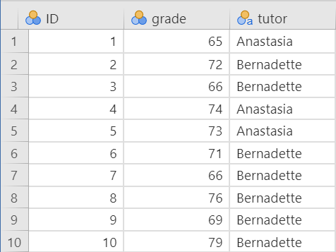

In the data above, what is your **independent variable**? What is your **dependent variable**?

#### Describe the data

Once we confirm our data is setup correctly in jamovi, we should look at our data using descriptive statistics and graphs. First, our descriptive statistics are shown below. Our overall data consists of 33 cases and the students in our dataset have a mean grade of 71.55 (SD = 7.80). The minimum and maximum values look accurate; theoretically, student grades should range from 0-100. Lastly, the distribution of data looks nice and normally distributed. Although we have a pretty small sample size, especially within each group, we can proceed with our analyses. First, though, we need to check our assumptions.

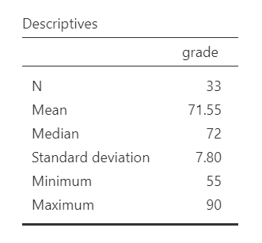

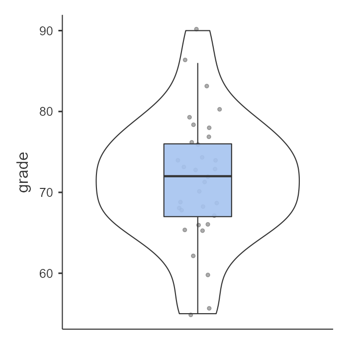{width="528"}

#### Specify the hypotheses

Our research question is "Which tutor results in better student grades?" This isn't directional. We don't have a hypothesis that one group does better than the other. Therefore our hypotheses can be written up as such:

-   $H_1$: There is a difference in student grades between Anastasia's and Bernadette's classes.
-   $H_0$: There is no difference in student grades between Anastasia's and Bernadette's classes.

From now on, we'll assume our $\alpha$ is .05 as default; however, remember that we should think critically about our alpha value when hypothesis testing!

### Step 2: Check assumptions

As a parametric test, the independent t-test has the same assumptions as other parametric tests:

1.  The dependent variable is **normally distributed**

2.  Variances in the two groups are roughly equal (i.e., **homogeneity of variances**)

3.  The dependent variable is **interval or ratio** (i.e., continuous)

4.  Scores are **independent** between groups

We cannot test the third and fourth assumptions; rather, those are based on knowing your data.

However, we can and should test for the first two assumptions. Fortunately, the independent samples t-test in jamovi has two check boxes under "Assumption Checks" that lets us test for both assumptions.

One thing to keep in mind in all statistical software is that we often check assumptions simultaneously to performing the statistical test. However, we should always check assumptions first before looking at and interpreting our results. Therefore, whereas the instructions for performing the test are below, we discuss checking assumptions here first to help ingrain the importance of always checking assumptions for interpreting results.

##### Testing normality

jamovi easily allows us to check for normality using the Shapiro-Wilk test and the Q-Q plot. The Shapiro-Wilk test was not statistically significant (W = .98, *p* = .827); therefore, this indicates the data is normally distributed. Furthermore, the lines are fairly close to the diagonal line in the Q-Q plot. We should also examine the z-scores of skew and kurtosis, as well as the histogram of the data. Overall, we can conclude that we satisfy the assumption of normality.

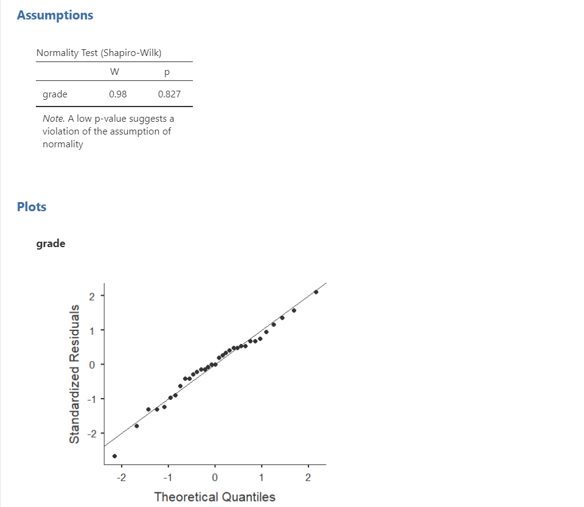

Remember that we can also test for normality by **looking at our data** (e.g., a histogram or density plot, which you can see above) and by examining **skew and kurtosis**. However, you will need to view them using Exploration --\> Descriptives, not in the t-tests menu. Here is our skew and kurtosis:

-   **Skew**: $.06/.41 = .15$

-   **Kurtosis**: $.33/.80 = .41$

Remember that we divide the value by its standard error to determine the z-score. If the absolute value of it is below 1.96 then we assume it is normally distributed. Both skew and kurtosis meet the assumption of normality. In addition, so did all our other pieces of evidence of normality: Shapiro-Wilk's, visual examination of the distribution, and the Q-Q plot. Therefore we can assume we met the assumption of normality.

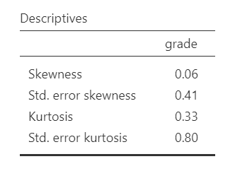

##### Testing homogeneity of variance

We test for homogeneity of variance using the Levene's test, as well as examining the variances and the histogram of the continuous DV split by the categorical IV. The Levene's test was not statistically significant (*F* [1, 31] = 2.49, *p* = .125); therefore, this indicates our data satisfies the assumption of homogeneity of variance.

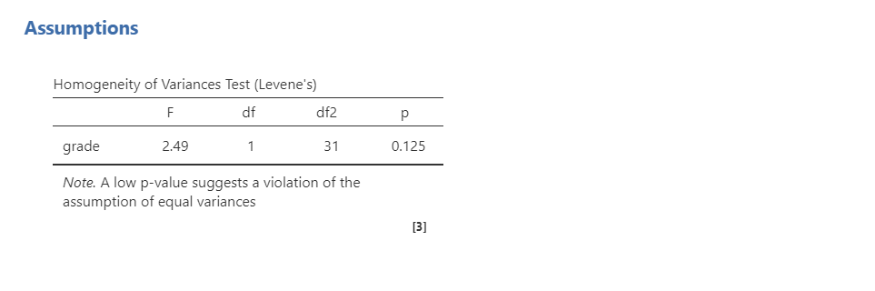

However, I would add a caveat that we have a small sample of data (*n* = 15 for Anastasia and *n* = 18 for Bernadette) and the variances are quite different from one another (SD = 80.98 vs 33.35, respectively, which we also see in the visual distribution of the variances between groups). We should have tried to collect more data.

```{block, type = "info"}
In fact, we've read in the BEAN chapters how to calculate for power! We could use our knowledge to identify what size effect size we could reliably detect (e.g., with 80% power at an alpha of .05) given our sample sizes. Try it out! 
```

### Step 3: Perform the test

#### Decide which statistical test you should be using

If you fail to meet one or both of the assumptions of normality (and no transformations fixed your data) and homogeneity of variances, jamovi has the alternative statistics easily built in. Here's what statistic you should choose based on satisfying assumptions:

|                                            | **Normality: satisfied**         | **Normality: not satisfied** |
|--------------------------------------------|----------------------------------|------------------------------|
| **Homogeneity of Variance: satisfied**     | Student's t-test                 | [Mann-Whitney U test]        |
| **Homogeneity of Variance: not satisfied** | [Welch's t-test](#welchs-t-test) | [Mann-Whitney U test]        |

#### Decide which hypothesis you should be using

When you specified the hypotheses you should understand whether you had a directional (one-tailed) or non-directional (two-tailed) alternative hypothesis based on the research question.

If the alternative hypothesis is non-directional (two-tailed) then you choose `Group 1 ≠ Group 2`.

If the alternative hypothesis directional (one-tailed) then you choose `Group 1 > Group 2` or `Group 1 < Group 2` depending on which group you think has the higher average.

```{block, type="warning"}
Remember that the hypothesis you use is based on your alternative hypothesis and research question! This is not based on what the data looks like. It's a function of the research question you have prior to looking at the data.

You may want to play around in jamovi and see what happens when you change from a non-directional to directional hypothesis. It will halve your p-value if the direction of the effect is correct; otherwise, if you choose the hypothesis in the opposite direction it will give a p-value that is practically 1.00! 
```

#### Perform the test

Now that we've checked the assumptions, we can perform the independent t-test. Here are the steps for doing so in jamovi:

1.  Go to the Analyses tab, click the T-Tests button, and choose "Independent Samples T-Test".

2.  Move your dependent variable `grade` to the Dependent Variables box and your independent variable `tutor` to the Grouping Variable box.

3.  Under Tests, select the appropriate statistical test depending on which assumptions were met. In this case, we met both assumptions so we perform `Student's`.

4.  Under Hypothesis, select the hypothesis that matches your research question and alternative hypothesis. In this case, select `Group 1 ≠ Group 2` because we have a two-sided hypothesis.

5.  Under Additional Statistics, select `Mean difference`, `Effect size`, `Descriptives`, and (optionally) `Descriptives plots`.

6.  Under Assumption Checks, select all three options: `Homogeneity test`, `Normality test`, and `Q-Q plot`.

When you are done, your setup should look like this:

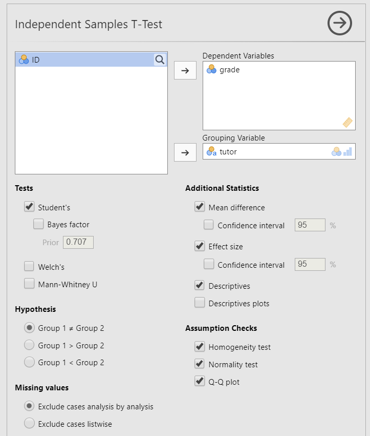

### Step 4: Interpret results

Once we are satisfied we have satisfied the assumptions for the independent t-test, we can interpret our results.

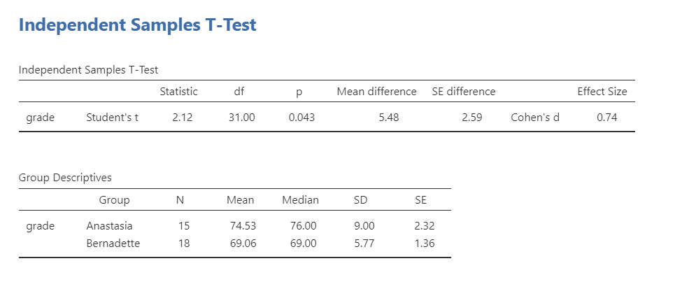

Our p-value is less than our alpha value of .05, so our results are statistically significant. Like most of the statistics we'll come across, the larger the t-statistic (or F-statistic, or chi-square statistic...), the smaller the p-value will be. That's because given the distribution of the statistic we're looking at, larger values will be at the further extremes from the middle null values and therefore more likely to be statistically significant.

Therefore, we reject our null hypothesis (i.e., that there is no difference between the two groups) and this suggests that there is a significant difference between the two groups.

```{block, type="info"}
What is "df"? That stands for degrees of freedom. The "key terms" chapter covers them in more detail, but in the case of the independent samples t-test they are calculated by the number of participants in the first group minus one plus the participants in the second group minus one (n1 - 1) + (n2 - 2) = (15-1) + (18-1) = 31. 
```

#### A note about positive and negative t values

Students often worry about positive or negative t-statistic values and are unsure how to interpret it. Positive or negative t-statistic values simply occur based on which group is listed first. Our t-statistic above is positive because we tested the difference between Anastasia's class (*M* = 74.53) versus Bernadette's class (*M* = 69.06) and so Anastasia - Bernadette is a mean difference of 5.48.

However, if our classes were reversed, our mean difference would -5.48 and our t-statistic would be -2.12.

All that is to say, *your positive or negative t-statistic is arbitrary and is just a function of which group is listed first, which is also arbitrary*. So do not fret!

One last note: this positive or negative t-statistic is only relevant for the t-test. You will not get negative values for the F-statistic or chi-square tests! You'll learn more about those tests in subsequent chapters.

#### Write up the results in APA style

When writing up the results of a statistical test, we should always include the following information:

1.  Description of your research question and/or hypotheses.
2.  Description of your data. If you fail to meet assumptions, you should specify that and describe what test you chose to perform as a result.
3.  The results of the inferential test, including what test was performed, the test value and degrees of freedom, p-value, and effect size.
4.  Interpretation of the results, including any other information as needed.

We can write up our results in APA something like this:

> The research question was whether there was a difference in student grades between Anastasia's and Bernadette's classes. Anastasia's students (*M* = 74.53, *SD* = 9.00, *n* = 15) had significantly higher grades than Bernadette's students (*M* = 69.06, *SD* = 5.77, *n* = 18), *t* (31) = 2.12, *p* = .043, *d* = .74.

Let's analyze that against the 4 things we need to report:

> **#1:** The research question was whether there was a difference in student grades between Anastasia's and Bernadette's classes. **#4** Anastasia's students **#2** (*M* = 74.53, *SD* = 9.00, *n* = 15) **#4 cont.** had significantly higher grades than Bernadette's students **#2** (*M* = 69.06, *SD* = 5.77, *n* = 18), **#3** *t* (31) = 2.12, *p* = .043, *d* = .74.

Sometimes, people like to put the statistics inside a parentheses. In that case, you need to change the parentheses around the degrees of freedom as brackets. Here's another example write-up of the results in APA style:

> **#1** I tested the difference in grades between Anastasia's students **#2** (*M* = 74.53, *SD* = 9.00, *n* = 15) and Bernadette's students (*M* = 69.06, *SD* = 5.77, *n* = 18). **#3** An independent samples t-test showed that the 5.48 mean difference between the tutor's student was statistically significant (*t* [31] = 2.12, *p* = .043, *d* = .74). **#4** Therefore, we reject the null hypothesis that there is no difference in grades between the two classes.

Note that these are not the only way we can write up the results in APA format. The key is that we include all four pieces of information as specified above.

You can also better see where we are getting all the information from with the following image:

{width="965"}

#### Visualize the results

By selecting `Descriptives plots` in the setup, you get the figure below. Personally, I don't think this is a very good plot. It's not very informative. It just provides the mean (circle), 95% confidence interval (blue bars), and the median.

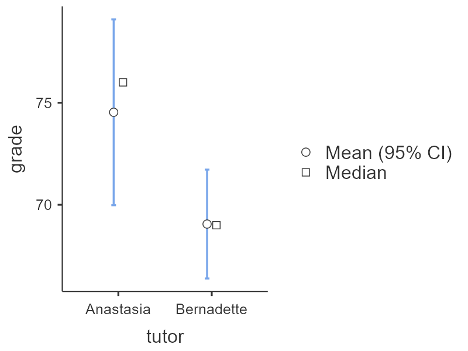

Another option in jamovi is via the Descriptives analysis. You can ask for the boxplot, violin plot, and data of your dependent variable split by your independent variable. This is a much better option. Not only does it show us our mean (black bars) and interquartile range (via the boxplot), but it also shows our distribution (violin plot) and data points (grey dots). This is much more informative.

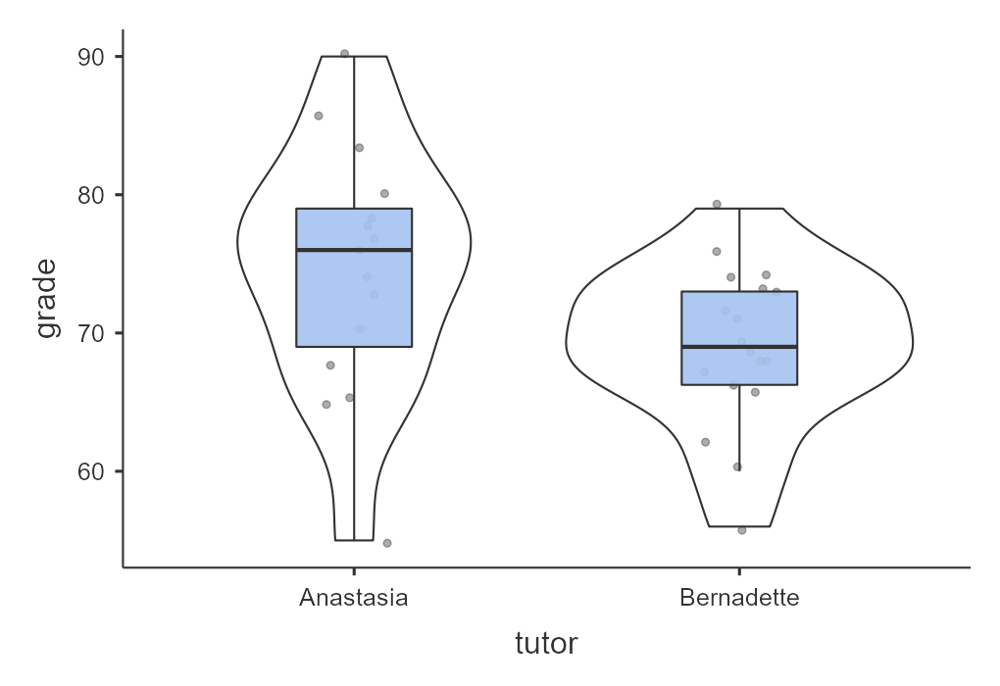

Oftentimes, people display results in a simple bar chart, often adding error bars (either 95% CI or SE error bars). But this is also not a great chart because it lacks information about the underlying distribution of data. Therefore, for the independent t-test I recommend the visualization shown above.

### Welch's t-test {#welchs-t-test}

The Welch's t-test has three main differences from the independent samples t-test: (a) the standard error (SE) is not a pooled estimate, (b) the degrees of freedom are calculated very different (not *N* - 2), and (c) it does not have an assumption of homogeneity of variance. Note that Welch's t-test is *not* a non-parametric test because it still has the assumption of a normal distribution.

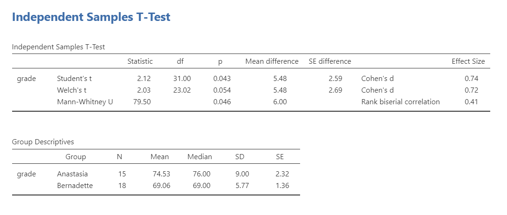

```{block, type="danger"}
Note that you never perform all three tests like I'm showing here! You only select the correct test depending on which assumptions were met. However, I'm showing all three here so you can see the comparisons of all three tests. 
```

To conduct this in jamovi, under Tests select `Welch's`. You will interpret the results similarly to the independent t-test:

> Using a Welch's t-test, there was not a statistically significant difference in grades between Anastasia's students (*M* = 74.53, *SD* = 9.00, *n* = 15) and Bernadette's students (*M* = 69.06, *SD* = 5.77, *n* = 18), *t* (23.02) = 2.03, *p* = .054, *d* = .72.

Why is it no longer statistically significant? Which result should you trust? In reality, the difference in *p*-values is likely due to chance. However, the independent t-test and Welch's test have different strengths and weaknesses. If the two populations really do have equal variances, then the independent t-test is slightly more powerful (lower Type II error rate) than the Welch's test. However, if they *don't* have the same variances, then the assumptions of the independent t-test are violated and you may not be able to trust the results; you may end up with a higher Type I error rate. So it's a trade-off.

Which should you use? I tend to prefer always using Welch's t-test because if the variances are equal, then there will be practically no difference between the independent and Welch's t-test. But if the variances are not equal, then Welch's t-test will outperform the independent t-test. For that reason, defaulting to the Welch's t-test makes most sense to me.

### Mann-Whitney U test

The Mann-Whitney U is not calculated based on the mean but rather the median and compares ranks of values across the two groups: it has no assumptions about the distribution of data or homogeneity of variances. Therefore, it is a non-parametric test.

If you do not satisfy the assumption of normality (regardless of whether you satisfy the assumption of homogeneity of variance), you should either try to transform your data to be normally distributed or you will need to use a non-parametric test. In this case, if you originally wanted to perform an independent t-test, the non-parametric equivalent test is the Mann-Whitney U test.


```{block, type="danger"}
Note that you never perform all three tests like I'm showing here! You only select the correct test depending on which assumptions were met. However, I'm showing all three here so you can see the comparisons of all three tests. 
```

I will not go into specifics, but the idea behind the Mann-Whitney U test is that you take all the values (regardless of group) and rank them. You then sum the ranks across groups and calculate your U statistic and p-value. You interpret the p-value like you normally would, but there are differences in how we report the results because this statistic is based on the *median* not the *mean*.

> Using the Mann-Whitney U test, there was a statistically significant difference in grades between Anastasia's students (*Mdn* = 76, *n* = 15) and Bernadette's students (*Mdn* = 69, *n* = 18), *U* = 79.50, *p* = .046, $r_{pb}$ = .41.

### Additional practice

Open the `Sample_Dataset_2014.xlsx` file that we will be using for all Your Turn exercises. You can find the dataset here: [Sample_Dataset_2014.xlsx Download](https://github.com/danawanzer/stats-with-jamovi/blob/master/data/Sample_Dataset_2014.xlsx)

Perform independent t-tests based on the following research questions. Think critically about whether you should be using a one-tailed or two-tailed hypothesis and check your assumptions so you know which test to use!

To get the most out of these exercises, try to first find out the answer on your own and then use the drop-down menus to check your answer.

1.  **Does height differ by gender (Gender: male = 0, female = 1)?**

    -   Should you use a one-tailed or two-tailed hypothesis?

    -   Which statistic should you use based on your assumptions?

    -   Does height differ by gender?

2.  **Do athletes (Athlete: athletes = 1, non-athlete = 0) have faster sprint times than non-athletes?**

    -   Should you use a one-tailed or two-tailed hypothesis?

    -   Which statistic should you use based on your assumptions?

    -   Do athletes have faster sprint times than non-athletes?

3.  **Do students who live on campus (LiveOnCampus: on campus = 1, off campus = 0) have higher English scores than students who live off campus?**

    -   Should you use a one-tailed or two-tailed hypothesis?

    -   Which statistic should you use based on your assumptions?

    -   Does students who live on campus have higher English scores?

4.  **Does athletic status relate to math scores?**

    -   Should you use a one-tailed or two-tailed hypothesis?

    -   Which statistic should you use based on your assumptions?

    -   Does athletic status relate to math scores?
