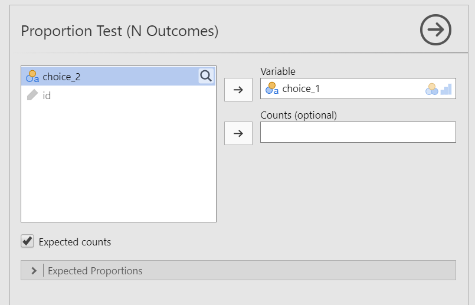

# Chi-Square Goodness-of-Fit

```{r ind-t_setup, echo = FALSE, message=FALSE}
library(tidyverse)
library(webex)
library(viridis)
options(knitr.graphics.auto_pdf = TRUE)
```

## What is the chi-square goodness-of-fit test?

The $\chi^2$ (chi-square) goodness-of-fit tests whether an observed frequency distribution of a nominal variable matches an expected frequency distribution. Our hypotheses for the chi-square goodness-of-fit test is as follows:

-   $H_0$: The observed frequencies match the expected frequencies.

-   $H_1$: At least one observed frequency doesn't match the expected frequency.

For example, if we have a deck of cards and want to see if people don't choose cards randomly, the null hypothesis would be that there is a 25% probability of getting each hearts, clubs, spades, and diamonds.

## Data set-up

Our data set-up for a chi-square goodness-of-fit test is pretty simple, We just need a single column with the nominal category that each participant is in.

## Assumptions

The chi-square goodness-of-fit test has the following assumptions:

1.  **Expected frequencies are sufficiently large**, which is usually greater than 5. If you violate this assumption, you can use Fisher's exact test.

2.  Data are independent of one another, meaning each case contributes to only one cell of the table. If you violate this assumption, you may be able to use the McNemar test.

## The math behind the chi-square goodness of fit test

```{block, type = "info"}
If the math below makes your eyes glaze over, you can skip it. This is presented for those who find it useful to understand the math behind the statistics to help understand what's happening.
```

We're going to continue using the card deck example. This data comes from the lsj-data dataset named "randomness". If you perform descriptive statistics of `choice_1` and ask for frequency tables, you get the *observed* frequencies. We expect the frequencies to be 25% for each choice (or *n* = 50 because our total N is 200, so 200/4 = 50).

|                    |               | $\clubsuit$ | $\diamondsuit$ | $\heartsuit$ | $\spadesuit$ |
|--------------------|---------------|-------------|----------------|--------------|--------------|
| Observed frequency | $O_i$         | 35          | 51             | 64           | 50           |
| Expected frequency | $E_i$         | 50          | 50             | 50           | 50           |
| Difference score   | $O_i-E_i$     | -15         | 1              | 14           | 0            |
| Difference squared | $(O_i-E_i)^2$ | 225         | 1              | 196          | 0            |

The formula for the chi-square goodness-of-fit test is as follows:

$\chi^2 = \sum{\frac{(O_i-E_i)^2}{E_i}} = \frac{225 + 1 + 196 + 0}{50} = \frac{422}{50} = 8.44$

Up to this point, we've been working with the *t* and *F* distributions for our statistics. Now we move to the $\chi^2$ distribution with $k-1$ degrees of freedom (k = number of groups; in our card's example case it's 4-1 = 3). What is the chi-square distribution? It looks a little something like this:

```{r}
ggplot(data.frame(x = c(0, 30)), aes(x = x)) +
  stat_function(fun = dchisq, args = list(df = 3), aes(colour = "df = 03")) +
  stat_function(fun = dchisq, args = list(df = 4), aes(colour = "df = 04")) +
  stat_function(fun = dchisq, args = list(df = 5), aes(colour = "df = 05")) +
  stat_function(fun = dchisq, args = list(df = 10), aes(colour = "df = 10")) +
  stat_function(fun = dchisq, args = list(df = 20), aes(colour = "df = 20")) +
  scale_color_viridis(discrete = TRUE) +
  theme_classic() +
  ylab(element_blank()) +
  xlab(label = "Value")
```

In our case, we have a degrees of freedom of 3. Just like we did early in the semester, we can look up our critical-$\chi^2$ value in a table to find that our critical value for df = 3 is 7.815. The figure below shows our critical-$\chi^2$ value in red and calculated-$\chi^2$ value in black. Because our calculated-$\chi^2$ value is in the critical region, we can reject the null hypothesis that all four suits are chosen with equal probability.

```{r}
ggplot(data.frame(x = c(0, 20)), aes(x = x)) +
  stat_function(fun = dchisq, args = list(df = 3)) +
  stat_function(fun = dchisq, args = list(df = 3), 
                xlim = c(7.815, 20), geom = "area", fill = "darkred") +
  geom_vline(xintercept = 7.815, colour = "darkred") + 
  geom_text(aes(x = 7.4, y = .15, label = "Critical-value = 7.815"), 
            angle = 90, color = "darkred") +
  geom_text(aes(x = 8.8, y = .15, label = "Calculated-value = 8.44"), 
            angle = 90) +
  geom_vline(xintercept = 8.44) + 
  theme_classic() +
  scale_color_viridis(discrete = TRUE) +
  ylab(element_blank()) +
  xlab(label = "Value of the goodness-of-fit statistic")
```

## Performing the chi-square goodness-of-fit test in jamovi

Let's run an example with data from lsj-data. Open data from your Data Library in "lsj-data". Select and open "randomness". This dataset has participants pull two cards from a deck. For now, let's just work with `choice_1`.

1.  From the 'Analyses' toolbar select 'Frequences' - 'One sample proportion tests - N outcomes'.

2.  Move `choice_1` into the Variable box.

3.  Select `Expected counts`.

When you are done, your setup should look like this

```{r echo = FALSE, fig.cap = "Chi-square goodness-of-fit setup in jamovi", out.width = "80%"}

```

## Interpreting results

```{r echo = FALSE, fig.cap = "Chi-square goodness-of-fit results in jamovi"}
knitr::include_graphics("images/09-chi-square/chi-square_results.png")
```

The first table shows us our observed frequencies (our data) and expected frequencies (N/k = 200/4 = 50). The second table gives us our results. Our p-value is less than .05 so we can reject the null hypothesis that the observed frequencies match our expected frequencies.

We can write up our results in APA something like this:

> Of the 200 participants in the experiment, 64 selected hearts for their first choice, 51selected diamonds, 50 selected spades, and 35 selected clubs. A chi-square goodness-of-fit test was conducted to test whether the choice probabilities were identical for all four suits. The results were statistically significant ($\chi^2$ (3) = 8.44; *p* = .038), suggesting that people did not select suits purely at random.

## Different Expected Frequencies

As you can tell, jamovi automatically assumed equal proportions of frequencies. However, perhaps we think our deck is loaded or we have the actual population frequencies and want to see if our distribution matches the population distribution. We can use the `Expected Proportions` in the setup to specify different expected frequencies.

For example, maybe we think our deck is a little stacked in favor of red cards--or we think our participants are more likely to choose red cards than black cards. We can specify our expected proportions and then interpret the results. In this case, participants do not seem more likely to choose red cards based on the expected frequencies we provided.

```{r echo = FALSE, fig.cap = "Chi-square goodness-of-fit - Different expected proportions"}
knitr::include_graphics("images/09-chi-square/chi-square_results2.png")
```

## Your turn!

Open the `Sample_Dataset_2014.xlsx` file that we will be using for all Your Turn exercises. You can find the dataset here: [Sample_Dataset_2014.xlsx Download](https://github.com/danawanzer/stats-with-jamovi/blob/master/data/Sample_Dataset_2014.xlsx)

To get the most out of these exercises, try to first find out the answer on your own and then use the drop-down menus to check your answer.

1.  **Are there equal numbers of athletes and non-athletes?** (`Athlete` variable)

    -   Do you meet the assumptions? `r mcq(c(answer = "yes", "no, expected frequencies are too small", "no, data are not independent"))`

    -   Are the observed frequencies similar to the expected frequencies? `r mcq(c("yes", answer = "no"))`

    -   What is your chi-square value, rounded to two decimal places: `r fitb("10.32")`

2.  **I happen to know the school this data comes from has 40% athletes and 60% non-athletes. Does our data match the school population?**

    -   Change your Expected Proportions ratio to .6 for non-athletes and .4 for athletes.

    -   Are the observed frequencies similar to the expected frequencies? `r mcq(c(answer = "yes", "no"))`

    -   What is your chi-square value, rounded to two decimal places: `r fitb("0.96")`

3.  **Are there equal numbers of freshmen, sophomores, juniors, and seniors?** (`Rank` variable)

    -   Do you meet the assumptions? `r mcq(c(answer = "yes", "no, expected frequencies are too small", "no, data are not independent"))`

    -   Are the observed frequencies similar to the expected frequencies? `r mcq(c("yes", answer = "no"))`

    -   What is your chi-square value, rounded to two decimal places: `r fitb("33.94")`
