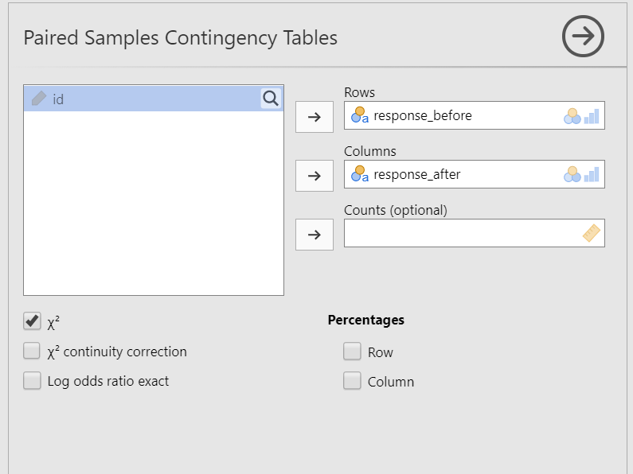
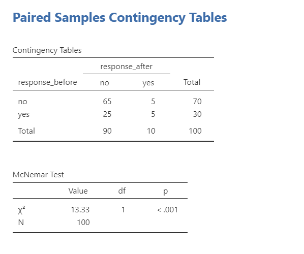

## 14. McNemar's Test

```{r ind-t_setup, echo = FALSE, message=FALSE}
library(tidyverse)
library(webex)
library(viridis)
options(knitr.graphics.auto_pdf = TRUE)
```

McNemar's test is based on the $\chi^2$ (chi-square) test of independence (or association), but is used in a repeated measures or within-subjects design.

We'll go over a brief example so you're familiar with this test, but in practice I don't see this statistic often so we won't go over it any further than this.

### Step 1: Look at the data

For example, suppose we're working with the *Australian Generic Political Party* (AGPP) and your job is to find out how effective AGPP political advertisements are. You gather 100 people and ask them to watch the AGPP ads. You ask participants before and after viewing ads whether they intend to vote for the AGPP.

This data comes from lsj-data. Open data from your Data Library in "lsj-data". Select and open "agpp". This dataset indicates the ID number of the participant and whether they would vote for AGPP before and after viewing the ads.

#### Data set-up

Our data set-up for McNemar's test is pretty simple. We just need two columns of nominal data, with one row per participant and each column being the same variable at two different time points. Here's our data for our example we'll be working with, which you can find in the lsj-data called `agpp`:

| ID      | response_before | response_after |
|---------|-----------------|----------------|
| subj.1  | no              | yes            |
| subj.2  | yes             | no             |
| subj.3  | yes             | no             |
| subj.4  | yes             | no             |
| subj.5  | no              | no             |
| subj.6  | no              | no             |
| subj.7  | no              | no             |
| subj.8  | no              | yes            |
| subj.9  | no              | no             |
| subj.10 | no              | no             |

#### Specify the hypotheses

Given you want to see if the AGPP political advertisements are, you want to see if participants are more likely to vote for AGPP after viewing the advertisement. Therefore, the alternative hypothesis is that intentions to vote for the AGPP don't match the expected frequency of intentions to vote.

### Step 2: Check assumptions

You came here because you violated the assumptions of the test of independence's assumption of independence. You should have a within-subjects design to perform this test. We meet this assumption so we can move on!

### Step 3: Perform the test

1.  Go to the Analyses tab, click the Frequencies button, and choose "Paired Samples - McNemar test".

2.  Move `response_before` into rows and `response_after` into columns. Note that the placement in rows or columns doesn't really matter.

3.  Under the Statistics tab, select $\chi^2$ under Tests.

4.  Optionally, you can request under to show the row and column percentages.

When you are done, your setup should look like this:



### Step 4: Interpret results



The first table shows us our observed frequencies.

The second table gives us our results. Our p-value is less than .05 so we can reject the null hypothesis that the observed frequencies match our expected frequencies. Unfortunately, looking at our table it also shows that the ads had a negative effect: people were less likely to vote AGPP after seeing the ads.

#### Write up the results in APA style

We can write up our results in APA something like this:

> McNemar's test indicated that support for AGPP changed from before to after reviewing the AGPP advertisement, $\chi^2$ (1) = 13.33, *p* \< .001. Most participants continued to not vote for AGPP after the ad (*n* = 65) and a few continued to vote for AGPP after the ad (*n* = 5). However, many participants who originally stated they would vote for AGPP changed to no longer voting for AGPP after the ad (*n* = 25); only five people who originally would not vote for AGPP changed to vote for AGPP after the ad.
