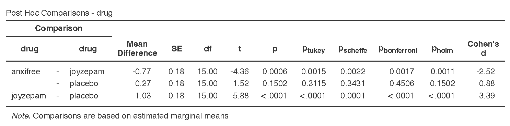

## 16. Finding Group Differences

Often, we're not interested in just *whether* there is a difference (which the F-statistic can tell us), but *where* the differences are between groups (which the F-statistic cannot tell us). For that, we use either [planned contrasts]{.underline} when you have specific hypotheses you want to test or [post-hoc comparisons]{.underline} when you have no specific hypotheses.

```{block, type="warning"}

You do not perform contrasts or post hoc comparisons if your overall F statistic is not statistically significant. You do not interpret group differences if you fail to reject the null hypothesis that there are no group differences!
```

Below I provide descriptive statistics for these results. You can get this information in jamovi either by asking for descriptives from the exploration tab, or by asking for the estimated marginal means tables in the ANOVA analysis.

### Post hoc comparisons

Sometimes, we do not have any *a priori* (or planned) predictions or hypotheses about our group differences. In this case, we use post hoc procedures. These procedures do [pairwise comparisons]{.underline} among all of our groups, like t-tests across each of our groups. As we noted on the first page of this handout, this can be highly problematic for our Type I error rate! Therefore, we must perform corrections to control our familywise error rate.

jamovi currently supports five types of post-hoc tests for the ANOVA test; I generally only use Tukey or Bonferonni:

1.  **No correction**: This doesn't correct for a Type I error at all. This is just like if you were performing 3 separate t-tests, which we've learned we shouldn't do! So I do not recommend this option.
2.  **Tukey**: This is the post hoc test I use most often. It controls the Type I error rate well, but isn't as conservative of a control as the Bonferonni. I won't get into the math for how this one works, but note how the p-values are not nearly as big as Bonferroni but they are bigger than the unadjusted (no correction) p-values.
3.  **Scheffe**: This has a complicated formula for calculating it, and quite frankly I never use it so we won't get into it here.
4.  **Bonferroni**: This is the most conservative correction to the p-value. It's good if you only have a small number of comparisons to make or if you *really* want to control your Type I error rate. If you have a lot of them to test, then you may want to use something else. The way it works is multiplies your p-value by the number of post-hoc comparisons being made. For example, in the example below, we are performing 3 t-tests so it is multiplying each p-value by 3 (e.g., .0006\*3=.0017, .1502\*3=.4506, etc.).
5.  **Holm**: This is similar to the Bonferroni correction except that it corrects p-values sequentially such that the smallest p-value is multiplied by the number of post-hoc comparisons, the second smallest p-value is multiplied by the number of post-hoc comparisons minus 1, and so on until the biggest p-value is only multiplied by 1. For example, in the example below, the smallest p-value is for joyzepam - placebo (p \< .0001) and times by 3 is still p \< .0001; the second smallest p-value is for anxifree -- joyzepam (p = .0006) and times by 3-1=2 is p=.0011, and the largest p-value for anxifree - placebo stays the same at p = .1502.

To request post hoc tests from ANOVA, open the collapsed menu `Post Hoc Tests` in the setup menu. Select the single correction that you want, as well as the Cohen's d effect size.

Below shows the post hoc test results for our one-way ANOVA. Notice the differences in p-values across the four post hoc tests! Notice how the Bonferroni is most conservative (i.e., has the largest p-values) and the no correction (just p column) is the least conservative (i.e., has the smallest p-values). Keep in mind you do not normally ask for multiple post hoc comparisons. Just pick one! Normally, I just pick Tukey's.



When you are performing Welch's F-test (due to unequal variances), you use the Games-Howell correction. When you are performing Kruskal-Wallis test (due to non-normal distribution), you use the DSCF pairwise comparisons.

#### Write up post hoc results in APA style

The way we would write up each of the post hoc comparisons is very similar. Given that I usually use Tukey, here is a write-up for those results (note that the first sentence is from the previous chapter on the one-way ANOVA!):

> There is a significant difference in mood gain across the three drug conditions, *F* (2, 15) = 18.61, *p* \< .001. Post hoc comparisons using Tukey's HSD revealed that our drug *Joyzepam* (*M* = 1.48, *SD* = .21) outperformed both *Anxifree* (*M* = .72, *SD* = .39; *t* (15) = 4.36, *p* = .002) and the placebo condition (*M* = .45, *SD* = .28; *t* (15) = 5.88, *p* \< .001); there were no differences between *Anxifree* and the placebo condition (*t* (15) = 1.52, *p* = .312).

Writing up results in APA style is both a science and an art. There's a science to what you need to report. For example, you always report the statistics exactly the same: *F* (df~BG~, df~WG~) = X.XX, *p* = .XXX. You also always report the group means (*M*) and standard deviations (*SD*), although you can report them in-text like I did above or in a descriptives table like you can ask from jamovi.

However, there's also an art to it. Notice how I wrote that up in a way to summarize the findings as succinctly as possible. I could have said there was a difference between *anxifree* and *joyzepam* and a difference between *joyzepam* and the placebo, but that's a lot more words and isn't written in a way to focus on what I'm hoping to see: that my drug *joyzepam* performed better than the competitor *anxifree* and a placebo condition.

This is where you need to think creatively and be very critical in checking that what you say makes sense. Read your write-ups carefully! Have someone else read it. Can they understand what you mean?

```{block, type = "warning"}
A common issue I see in student write-ups is that they provide a p-value but only discuss it in relation to one group. Note that these are post hoc comparisons, so the p-values are for comparisons between two groups! So you should be describing the p-value for group1 vs group2, for example. It makes no sense to provide a p-value for a single group.
```

### Welch's F-test post hoc tests

If you are using Welch's F-test using the One-Way ANOVA in jamovi, you should select under Post-Hoc Tests `Games-Howell (unequal variances)`. These will be interpreted similarly to the post hoc comparisons above.

### Kruskal-Wallis post hoc tests

If you are using the Kruskal-Wallis test, you will select the check-box for `DSCF pairwise comparisons`. This stands for the Dwass-Steel-Critchlow-Fligner (DSCF) test. All you need to know is that they, too, are interpreted similarly to the post hoc comparisons above.

### Planned Contrasts

If you have before-analysis hypotheses of group differences in your data, you will use planned contrasts. You can find the planned contrasts in the ANOVA (but not the one-way ANOVA) setup as a drop-down menu. Unfortunately, you cannot perform contrasts with either the Welch's F-test or Kruskal-Wallis test.

Note that while I show all six contrasts that jamovi provides, you normally would only perform one contrast. These are just shown for illustrative purposes:

1.  **Deviation**: compares the effect of each category (except the first category) to the overall experimental effect. The order of categories is alphabetical or numerical order. Notice how anxifree is considered the first category.

    

2.  **Simple**: Each category is compared to the first category. The order of categories is alphabetical or numerical order. Notice how anxifree is considered the first category.

    

3.  **Difference**: Each category (except the first) is compared to the mean effect of all previous categories.

    

4.  **Helmert**: Each category (except the last) is compared to the mean effect of all subsequent categories.

    

5.  **Repeated**: Each category is compared to the last category.

    

6.  **Polynomial**: Tests trends in the data. It will examine the *n-1*^th^ degree based on the number of groups. In this case, because we have 3 groups it is testing both a linear (^1^) and quadratic (^2^) trend. If we had 5 groups, it would test a linear (^1^), quadratic (^2^), cubic (^3^), and quartic (^4^) trend. Note that your factor levels must be ordinal for a polynomial contrast to make sense.

    

**Test yourself!** Which contrast do you think would make [most sense]{.underline} to test given that we want to know how our drug compares to each of the other two drugs?

#### Write up planned contrasts in APA style

Here's some example write-ups of the above results.

> There is a significant difference in mood gain across the three drug conditions, *F* (2, 15) = 18.61, *p* \< .001. Repeated contrasts showed that *Joyzepam* (*M* = 1.48, *SD* = .21) outperformed both *Anxifree* (*M* = .72, *SD* = .39; *t* = 4.36, *p* \< .001) and the placebo condition (*M* = .45, *SD* = .28; *t* = 5.88, *p* \< .001).

Note how this next example makes no sense because our data is not ordinal, but here's an example polynomial write-up:

> There is a significant difference in mood gain across the three drug conditions, *F* (2, 15) = 18.61, *p* \< .001. There was not a significant linear trend across the drug conditions (*p* = .150).

### Additional practice

Open the `Sample_Dataset_2014.xlsx` file that we will be using for all Your Turn exercises. You can find the dataset here: [Sample_Dataset_2014.xlsx Download](https://github.com/danawanzer/stats-with-jamovi/blob/master/data/Sample_Dataset_2014.xlsx)

Perform one-way ANOVAs based on the following research questions. Check your assumptions and ensure you are using the correct tests.

To get the most out of these exercises, try to first find out the answer on your own and then use the drop-down menus to check your answer.

**Note**: These are the same questions as in the one-way ANOVA chapter, but now you focus on the group differences.

1.  **Does students differ on English scores by rank (i.e., freshmen, sophomore, junior, senior)?**

    -   Perform Tukey's post hoc tests. What are the results of the post hoc comparison?

2.  **Does smoking status (Smoking: Nonsmoker = 0, Past smoker = 1, Current smoker = 2) relate to sprint time?**

    -   Perform Tukey's post hoc tests. What are the results of the post hoc comparison?
