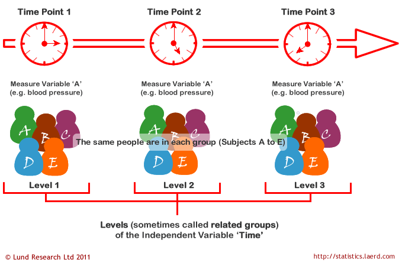
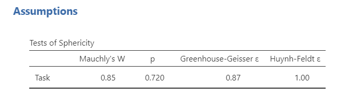
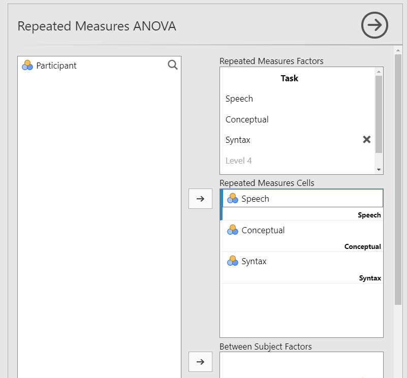
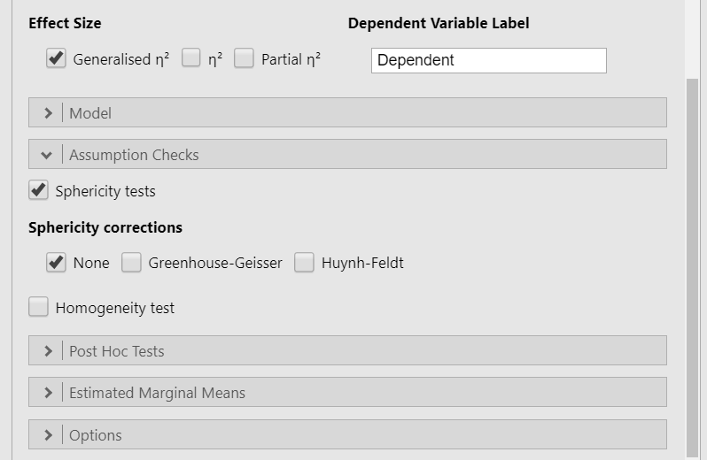
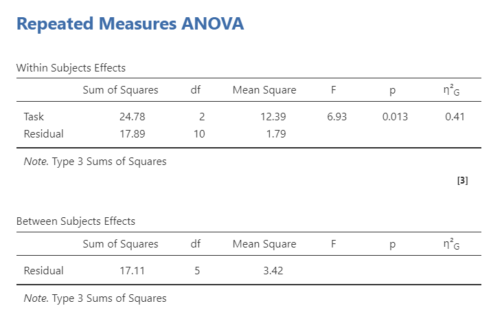
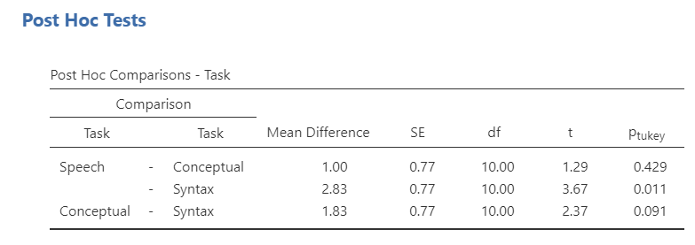
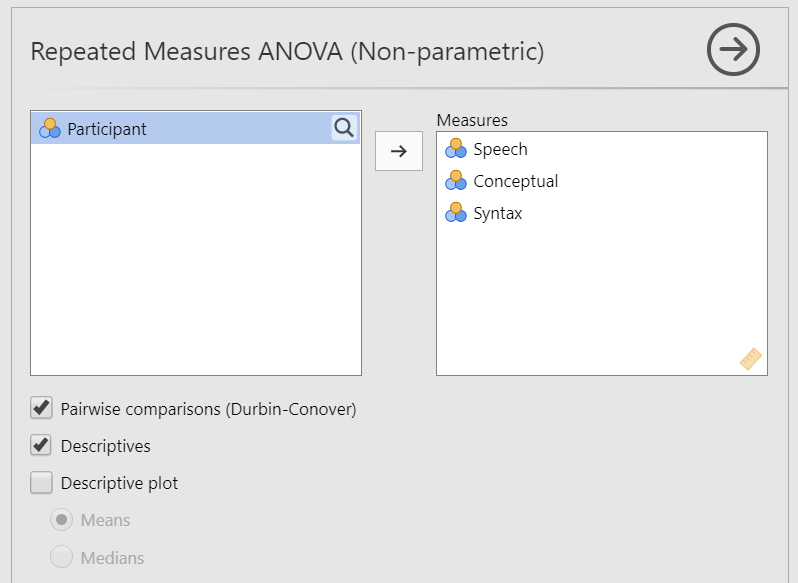
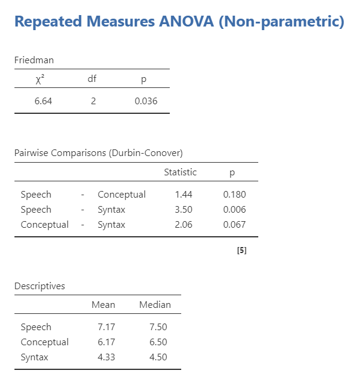

## Repeated Measures ANOVA

```{r ind-t_setup, echo = FALSE, message=FALSE}
library(tidyverse)
library(webex)
options(knitr.graphics.auto_pdf = TRUE)
```

### Overview

The repeated measures analysis of variance (ANOVA) is used to test the difference in our dependent variable between [three or more]{.ul} groups of observations in which all participants participate in all groups or levels. Our grouping variable is our independent variable. In other words, we use the one-way ANOVA when we have a research question with a **continuous dependent variable** and a **categorical independent variable with three or more categories in which the same participants are in each category**.

The repeated measures ANOVA is also sometimes called the one-way related ANOVA.

There are two ways we could have the repeated measures ANOVA. Perhaps the same group of participants are measured in the same dependent variable at three or more time points. In this case, our independent variable is time and our dependent variable is whatever is measured at each time point.

```{r echo = FALSE, fig.cap = "Repeated measures ANOVA by Time", out.width = "80%"}

```

The other way we might have the repeated measures ANOVA is if all our participants participate in all conditions of our study. In this case, our independent variable is the treatment or condition and the dependent variable is whatever is measured in each treatment or condition.

```{r echo = FALSE, fig.cap = "Repeated measures ANOVA by Conditions", out.width = "80%"}
knitr::include_graphics("images/05-repeated-measures-anova/Laerd2.png")
```

### Look at the data

Let's run an example with data from lsj-data. Open data from your Data Library in "lsj-data". Select and open "broca".

This dataset is hypothetical data in which six patients suffering from Broca's Aphasia (a language deficit commonly experienced following a stroke) complete three word recognition tasks. On the first (speech production) task, patients were required to repeat single words read out aloud by the researcher. On the second (conceptual) task, designed to test word comprehension, patients were required to match a series of pictures with their correct name. On the third (syntax) task, designed to test knowledge of correct word order, patients were asked to reorder syntactically incorrect sentences. Each patient completed all three tasks. The order in which patients attempted the tasks was counterbalanced between participants. Each task consisted of a series of 10 attempts. The number of attempts successfully completed by each patient are provided in the dataset.

#### Data set-up

To conduct the repeated measures ANOVA, we first need to ensure our data is set-up properly in our dataset. This requires having two columns: one with our continuous dependent variable and one indicating which group the participant is in. Each row is a unique participant or unit of analysis.

INCLUDE DATA SETUP HERE

In the data above, what is your **independent variable**? `r mcq(c("ID", answer = "Semester", "TestScore"))`

In the data above, what is your **dependent variable**? `r mcq(c("ID", "Semester", answer = "TestScore"))`

#### Describe the data

### Check Assumptions

#### Assumptions

As a parametric test, the repeated measures ANOVA has the same assumptions as other parametric tests:

1.  The dependent variable is **normally distributed**

2.  Variances in the two groups are roughly equal (i.e., **homogeneity of variances**); in repeated measures ANOVA this is called the assumption of **sphericity**

3.  The dependent variable is **interval or ratio** (i.e., continuous)

4.  ~~Scores are **independent** between groups~~ (this assumption is not relevant because all participants participate in all conditions)

We cannot *test* the third and fourth assumptions; rather, those are based on knowing your data. 

However, we can and should test for the first two assumptions. Fortunately, the one-way ANOVA in jamovi has three check boxes under "Assumption Checks" that lets us test for both assumptions.

##### Sphericity Assumption

The sphericity assumption is essentially the repeated measures ANOVA equivalent of homogeneity of variances. Sphericity means there is equality of variances of the *differences* between treatment levels. For example, if there are three groups, then the difference in all three pairs of differences (1-2, 1-3, 2-3) need to have approximately equal variances. You only need to care about sphericity when there are at least three conditions, which is why we did not talk about this with the dependent t-test.

Fortunately, like the other assumption checks, testing for sphericity is as simple as a checkbox in jamovi.

#### Checking assumptions

You'll notice there are no options to check for normality in the repeated measures ANOVA in jamovi. There's an [interesting conversation](https://forum.jamovi.org/viewtopic.php?f=5&t=1045) on the topic in the jamovi forums. Suffice to say, it's complicated and maybe someday they will implement it. For now, we just won't worry about it for the repeated measures ANOVA.

So what we need to worry about is testing our assumption of sphericity. You should have checked the box `Sphericity tests` under the Assumption Checks drop-down menu. That produces the following output:

```{r echo = FALSE, fig.cap = "Testing sphericity in jamovi"}

```

Mauchly's test of sphericity tests the null hypothesis that the variances of the differences between the conditions are equal. Therefore, just like with our previous assumption checks, if Mauchly's test is non-significant (i.e., *p* \> .05, as is the case in this analysis) then it is reasonable to conclude that the variances of the differences are not significantly different. This means we satisfy the assumption of sphericity and can conclude that the variances of the differences are roughly equal.

If Mauchly's test had been statistically significant (*p* \< .05), then we would conclude that the assumption had *not* been met. In this case, we should apply a correction to the *F*-value obtained in the repeated measures ANOVA:

-   If the Greenhouse-Geisser value in the "Tests of Sphericity" table is \> .75 then you should use the Huynh-Feldt correction.
-   If the Greenhouse-Geisser value is \< .75, then you should use the Greenhouse-Geisser correction.

You can select these corrections in the Assumption Checks drop-down menu.

### Perform the test

1.  To perform a repeated measures ANOVA in jamovi, go to the Analyses tab, click the ANOVA button, and choose "Repeated Measures ANOVA".

2.  Under "Repeated Measures Factors" name your independent variable. In this case you can name it "Task". Rename the three levels of Task: Speech, Conceptual, and Syntax.

3.  Under "Repeated Measures Cells" move the given variable into the correct level. For example, you'll move Speech to the Speech cell.

4.  Select Generalised $\eta^2$ as your measure of effect size.

5.  In the Assumption Checks drop-down menu, select `Sphericity tests`. You'll note that if you violate the assumption of sphericity, there are two corrections provided. These will be discussed later.

6.  In the Post Hoc Tests drop-down menu, select `Tukey`. Remember that we only interpret these if the overall *F* is statistically significant.

7.  In the Estimated Marginal Means drop-down menu, move Task to the Marginal Means box, select `Marginal means tables`, and select `Observed scores` . Uncheck `Equal cell weights`.

When you are done, your setup should look like this:

```{r echo = FALSE, fig.cap = "Repeated Measures ANOVA setup in jamovi", out.width = "80%"}

```

```{r echo = FALSE, fig.cap = "Repeated Measures ANOVA setup in jamovi", out.width = "80%"}

```

### Interpret results

Once we are satisfied we have satisfied the assumptions for the repeated measures, we can interpret our results.

```{r echo = FALSE, fig.cap = "One-way ANOVA results in jamovi"}

```

You'll notice that jamovi provides you both a Within Subjects Effects table and Between Subjects Effects table. However, we only have a within-subjects effect (Task). Why did it give us a between-subjects table? With the repeated-measures ANOVA (which only has within-subjects IVs), this is just our $SS_{BG}$. However, because we don't have one, it's not calculating anything. We can ignore it. It is only useful if we are conducting a mixed factorial ANOVA with both between-subjects and within-subjects effects.

Therefore, the Within Subjects Effects table is of most use to us. We can see that the overall effect of Task is statistically significant (*p* = .013). Therefore we can look at our Post Hoc Tests results.

```{r echo = FALSE, fig.cap = "One-way ANOVA results in jamovi"}

```

The Tukey post hoc differences show that there was a significant difference between speech and syntax (*p* = .011), but not between conceptual and both speech and syntax. Last, we can look at the Estimated Marginal Means - Task table to see the group means for reporting purposes. This shows us that participants recognized significantly more words in the speech task than in the syntax task.

#### Write up the results in APA style

We can write this up in APA style similar to the one-way ANOVA.

> A repeated measures ANOVA was performed examining how three tasks affected word recognition in patients suffering from Broca's Aphasia. Task significantly affected word recall, *F* (2, 10) = 6.93, *p* = .013, $\eta^2_G$ = .41. Tukey's post hoc difference tests indicated that participants recognized significantly more words in the speech task (*M* = 7.17, *SE* = .62) than participants in the syntax task (*M* = 4.33, *SE* = .62; *p* = .011). There were no differences between the conceptual task (*M* = 6.17, *SE* = .62) and both the speech and syntax tasks.

#### Visualize the results

### In case of violated assumptions

We have already discussed what to do if you violate the assumption of sphericity above; you select one of the two sphericity corrections.

If you violate the assumption of normality or if the dependent variable is ordinal, then you can use the Friedman test. You can select this using the Repeated Measures ANOVA - Friedman option under the ANOVA analysis.

#### Friedman's test

Friedman's test can only examine one within-subjects variable, so you will move all three conditions (Speech, Conceptual, and Syntax) to the Measures box. Select `Pairwise comparisons (Durbin-Conover` for post hoc comparisons and `Descriptives` for the Means and Medians. Optionally, you can select to plot either the Means or Medians. The Setup is shown below.

```{r echo = FALSE, fig.cap = "Repeated Measures ANOVA setup in jamovi", out.width = "80%"}

```

Once you've set-up the analysis, you can interpret the results. Overall, we continue to see a statistically significant result and that there is only a significant difference between speech and syntax.

```{r echo = FALSE, fig.cap = "Repeated Measures ANOVA setup in jamovi"}

```

We can write up the results similarly as before:

> Friedman's test was performed examining how three tasks affected word recognition in patients suffering from Broca's Aphasia. Task significantly affected word recall, $\chi^2$ (2) = 6.64, *p* = .036. Pairwise comparisons using Durbin-Conover indicated that participants recognized significantly more words in the speech task (*M* = 7.17, *Mdn* = 7.50) than participants in the syntax task (*M* = 4.33, *Mdn* = 6.50; *p* = .006). There were no differences between the conceptual task (*M* = 6.17, *Mdn* = 6.50) and both the speech and syntax tasks.

### Your turn!

Open the `Sample_Dataset_2014.xlsx` file that we will be using for all Your Turn exercises. You can find the dataset here: [Sample_Dataset_2014.xlsx Download](https://github.com/danawanzer/stats-with-jamovi/blob/master/data/Sample_Dataset_2014.xlsx)

Perform a repeated measures ANOVA based on the following research questions. Check your assumptions and ensure you are using the correct tests.

To get the most out of these exercises, try to first find out the answer on your own and then use the drop-down menus to check your answer.

1.  **Does students differ on their test scores (English, Reading, Math, Writing)?**

    -   Based on your understanding of the nature of the test scores, which statistic should you use? `r mcq(c(answer = "repeated measures ANOVA", "Friedman's test"))`

    -   Should you apply a sphericity correction? If so, which one? `r mcq(c("N/A - using Friedman's test", "no, assumption satisfed", "yes, Greenhouse-Geisser", answer = "yes, Huynh-Feldt"))`

    -   Do students differ on their test scores? `r mcq(c(answer = "yes", "no"))`

    -   Should you perform a planned contrast or post hoc comparison? `r mcq(c(answer = "yes", "no"))`

    -   What are the results of the post hoc comparison? `r mcq(c(answer = "N/A - Don't perform", "All test scores were significantly different from one another", "All test scores were significantly different from one another except for English and Reading"))`
