## Factorial ANOVA

```{r ind-t_setup, echo = FALSE, message=FALSE}
library(tidyverse)
library(webex)
options(knitr.graphics.auto_pdf = TRUE)
```

### Overview

Factorial ANOVA allows us to examine two or more independent variables (IVs) simultaneously. There are several types of factorial designs:

-   **Independent factorial design**: several between-group (independent) IVs
-   **Repeated measures factorial design**: several within-group (repeated-measures) IVs
-   **Mixed factorial design**: some between-group and some within-group IVs

Furthermore, you may read about ANOVAs referred to as "one-way", "two-way", "three-way" or greater. This simply refers to how many independent variables there are. Factorial ANOVAs are sometimes also referenced by how many groups per IV there are; for example, a 2 x 3 ANOVA is a factorial ANOVA in which the first IV has two conditions and the second IV has three conditions. You would also specify which IVs are between-group and which are within-group. For example, you might write that your design is a 2 (between-subjects: gender) x3 (within-subjects: task) mixed factorial.

We won't be going into too much detail on the different factorial ANOVA designs. Instead, I will walk through illustrative cases so that if you want to apply them in the future you can mimic the procedures below.

### Independent Factorial ANOVA

The independent factorial ANOVA has multiple between-group IVs. Let's run an example with data from lsj-data. Open data from your Data Library in "lsj-data". Select and open "rtfm". This data has two IVs: attend (whether or not the student turned up to lectures) and reading (whether or not the student actually read the textbook). 1 = they did and 0 = they did not.

Because we do not have a within-group IV, we will select the ANOVA analysis. Move grade to your Dependent Variable box and both attend and reading to your Fixed Factors. Select all the same options as you did for the one-way ANOVA (i.e., $\omega^2$, assumption checks, Tukey's post hoc tests for the two variables attend and reading, estimated marginal means).

Let's go through the output (check that your output matches!) and then discuss how to write up the results in APA format. First, we need to check assumptions. The Levene's test and Shapiro-Wilk's test are shown below. We can see that we meet the assumption of normality but fail to meet the assumption of homogeneity of variance. Unfortunately, we cannot perform a Welch's F-test with more than one independent factorial so we will note this failed assumption and move on.

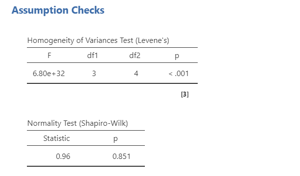

Let's look at the main results next. We got three lines of results in addition to the typical residuals (error). The first two lines are our main effects of `attend` and `reading` on grades. The p-values for both are statistically significant indicating attend affects grades and reading affects grades. However, it also added an interaction term of `attend * reading`, which is not statistically significant. This means we do not have an interaction between attend and reading on grades. Interactions will be discussed in more detail in the next section.

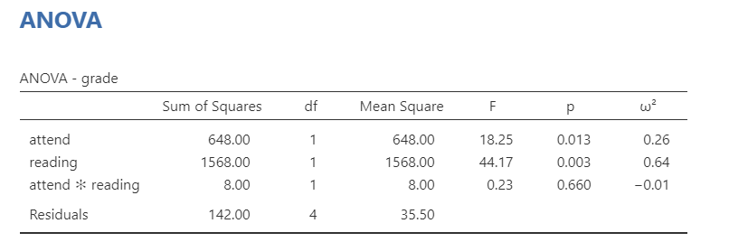

Although we could simply look at the means to know whether attending or reading had higher grades than not attending or not reading because there are only two conditions, we can also look at the post hoc tests and definitely need to look at them if we have three or more conditions per IV. These are shown below. Because the mean differences are negative, we can determine that the second group had higher means than the first group. We can confirm that with the estimated marginal means (not shown here).

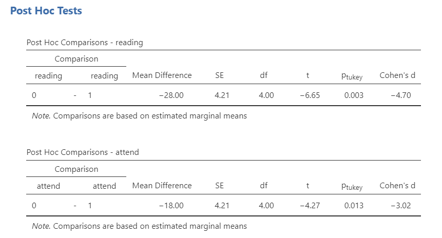

Last, we can write-up our results!

> We were interested in knowing how attendance and reading affected student grades. An independent factorial ANOVA showed that both attendance (*F* [1, 4] = 18.25, *p* = .013, $\omega^2$ = .26) and reading (*F* [1, 4] = 44.17, *p* = .003, $\omega^2$ = .64) affected student grades; there was no significant interaction between attendance and reading (*F* [1, 4] = 8.00, *p* = .660, $\omega^2$ = -.01). Post hoc comparisons using Tukey's HSD show that students who attended lectures (*M* = 75.50, *SE* = 2.98) had higher grades than students who did not (*M* = 57.50, *SE* = 2.98; *p* = .003, *d* = 4.70); furthermore, students who read (*M* = 80.50, *SE* = 2.98) had higher grades than students who did not (*M* = 52.50, *SE* = 2.98; *p* = .013; *d* = 3.02).

#### Interactions

Interactions occur when the effect of one IV on the DV depends on the lvel of the other IV. If you did not want to test for interaction effects, you could remove them from the Model Terms in the Model drop-down menu.

However, by default they will include them. If you have 2-3 IVs, it may be reasonable to look at these interactions. However, 3-variable interactions (e.g., IV1 \* IV2 \* IV3) are pushing it and 4-variable interactions are highly implausible. Be critical in which interaction terms you include!

jamovi can provide a plot of your interaction, which can be helpful to help interpret your results. Below is the plot for our interaction of attendance on reading.

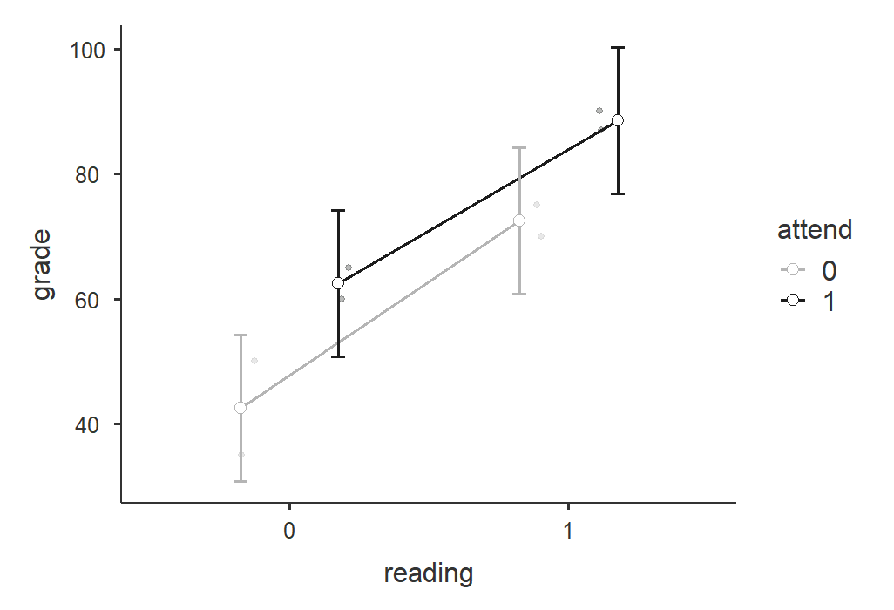

The parallel lines that are sloping upward tell me there is a significant main effect for both IVs but no interaction. How do I know that? With two variables, there are only so many interaction shapes possible. [This website](https://courses.washington.edu/smartpsy/interactions.htm) does a fantastic time showing you all 8 combinations of the three effects (2 main effects and 1 interaction effect). Spend some time looking through it and familiarizing yourself with the plots!

```{r}
knitr::include_url("https://www.youtube.com/watch?v=EynjbSDW56I")
```

### Repeated Measures Factorial ANOVA

This is also sometimes called the two-way (or three-way or n-way, depending on the *n* of IVs you have) repeated measures ANOVA. Let's go through an example repeated measures factorial ANOVA. The dataset is courtesy of [Real Statistics Using Excel](https://www.real-statistics.com/anova-repeated-measures/two-within-subjects-factors/).

> A company has created a new training program for their customer service staff. To test the effectiveness of the program they took a sample of 10 employees and assessed their performance in three areas:  Product (knowledge of the company's products and services), Client (their ability to relate to the customer with politeness and empathy) and Action (their ability to take action to help the customer). They then had the same 10 employees take the training course and rated their performance after the program in the same three areas. -[Real Statistics Using Excel](A%20company%20has%20created%20a%20new%20training%20program%20for%20their%20customer%20service%20staff.%20To%20test%20the%20effectiveness%20of%20the%20program%20they%20took%20a%20sample%20of%2010%20employees%20and%20assessed%20their%20performance%20in%20three%20areas:%20Product%20(knowledge%20of%20the%20company’s%20products%20and%20services),%20Client%20(their%20ability%20to%20relate%20to%20the%20customer%20with%20politeness%20and%20empathy)%20and%20Action%20(their%20ability%20to%20take%20action%20to%20help%20the%20customer).%20They%20then%20had%20the%20same%2010%20employees%20take%20the%20training%20course%20and%20rated%20their%20performance%20after%20the%20program%20in%20the%20same%20three%20areas.%20Based%20on%20the%20data%20in%20Figure%201,%20determine%20whether%20the%20program%20was%20effective.)

You can find the dataset here to follow along: [Repeated-measures-factorial-ANOVA.xlsx Download](https://github.com/danawanzer/stats-with-jamovi/blob/master/data/Repeated-measures-factorial-ANOVA.xlsx)

In jamovi, select Repeated Measures ANOVA under the ANOVA analysis option. Here are the general steps:

1.  In Repeated Measures Factors, you'll need to name both factors. Rename `RM Factor 1` to Time and `RM Factor 2` to Area. Under Time, specify two levels: Pre and Post. Under Area, specify three levels: Product, Client, and Action.

2.  In Repeated Measures Cells, you'll now have six cells with the combinations of the 6 columns you have. Drag the variable from the left into the correct cell on the right. Be careful here! For example, you need to put the Pre-Product variable into the cell "Pre, Product".

3.  Name your dependent variable label "Performance" and select \`Generalised $\eta^2$.

4.  Under Assumption Checks, select Sphericity tests

5.  Under Post Hoc Tests, move Area and Time over and select Tukey.

6.  Under Estimated Marginal Means, move Time over into Term 1, Area into Term 2, and both Time and Area into Term 3. Select plots and tables, Observed scores, and Equal cell weights.

Now let's go over selected output. First, we need to check our assumption of sphericity. All the Mauchly's W's are not statistically significant so we satisfy the assumption of sphericity and do not need to apply any sphericity corrections.

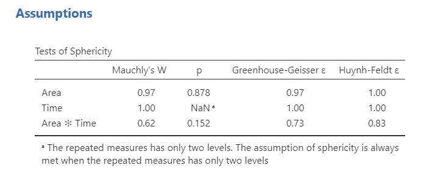

Next let's look at the within subjects effects table. Remember, we do not need to worry about the between subjects effects table because we do not have one; it will be used in the mixed factorial design below. Overall, we see a significant main effect of area, a significant main effect of time, and a significant interaction effect of both area and time. Neat!

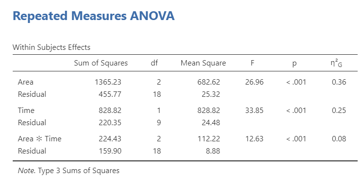

Next, we can look at post hoc comparisons because the main effects were all statistically significant. For area, we can see that client and action had significantly higher means than product, but there was no difference between client and action. Furthermore, post-intervention performance was significantly higher than pre-intervention.

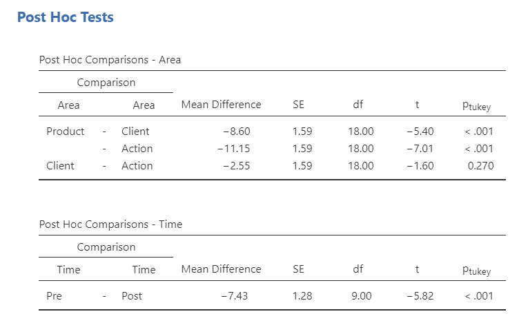

Last, let's look at the interaction to get a sense of what the interaction looks like. It appears that although there are no differences between pre- and post-intervention for product, there are significant differences from pre- to post-intervention for both client and action. To be more specific on where the statistically significant differences are, you can also ask for post hoc tests for the interaction term. This is where including a plot can be very helpful for your audience!

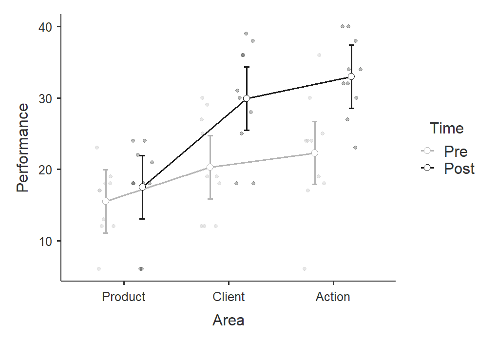

Now we have everything we need (in addition to the estimated marginal means) and can write-up our results.

> We tested a 2 (time: pre- and post-intervention) x 3 (area: product, client, action) repeated measures factorial design to examine how both time and area affected performance. We satisfied the assumption of sphericity for all effects. There was a significant main effect of time (*F* [1, 9] = 33.85, *p* \< .001, $\eta^2_G$ = .25) such that performance at post-intervention (*M* = 26.80, *SE* = 1.84) was higher than at pre-intervention (*M* = 19.37, *SE* = 1.84). There was also a significant main effect of area (*F* [2, 18] = 26.96, *p* \< .001, $\eta^2_G$ = .36) such that both client (*M* = 25.10, *SE* = 1.95) and action (*M* = 27.65, *SE* = 19.5) performance was higher than product performance (*M* = 16.50, *SE* = 1.95), but there was no difference between client and action performance. Lastly, there was a significant interaction between time and area such that there were no differences in product performance from pre- to post-intervention but there was for client and action performance (see Figure 1).

```{r}
knitr::include_url("https://www.youtube.com/watch?v=BQAFjSzoFHU")
```

### Mixed Factorial ANOVA

You can find the dataset here to follow along: [mixed-factorial.sav Download](https://github.com/danawanzer/stats-with-jamovi/blob/master/data/mixed-factorial.sav)

This dataset comes from a larger studying examining the effect of a delayed reward preference of three commodities (food, money, and music) on food cravings (as rated by the Food Craving Questionnaire [FCQ]) for each participant. Participants were in one of two conditions: the control condition did not do anything and the experimental condition had participants do the tasks while fasting.

Therefore, this study is a 2 (between-subjects: condition [control or fasting]) x 3 (within-subjects: reward [food, money, and music]) mixed factorial design.

To perform a mixed factorial ANOVA, we use the same procedures as the repeated measures ANOVA but we also need to add a between-subjects factor.

1.  To perform a mixed factorial ANOVA in jamovi, go to the Analyses tab, click the ANOVA button, and choose "Repeated Measures ANOVA".

2.  Under "Repeated Measures Factors" name your independent variable. In this case you can name it "Reward". Rename the three levels of Task: Food, Money, and Music.

3.  Under "Repeated Measures Cells" move the given variable into the correct level. For example, you'll move FQ_1 to Food, FQ_2 to Money, and FQ_3 to Music.

4.  Under "Between Subject Factors" add your between-subjects variable "condition.

5.  Select Generalised $\eta^2$ as your measure of effect size.

6.  In the Assumption Checks drop-down menu, select `Sphericity tests`.

7.  In the Post Hoc Tests drop-down menu, move your two independent variables over and select `Tukey`. Remember that we only interpret these if the overall *F* is statistically significant.

8.  In the Estimated Marginal Means drop-down menu, move Reward, Condition, and both reward and condition into the terms under Marginal Means. Select tables and plots, and select `Observed scores`. Uncheck `Equal cell weights`.

Now let's go through the output!

First, as always we check our assumption of sphericity. Mauchly's W is not statistically significant (*p* = .073) so we satisfy the assumption of sphericity. We do not need to apply a sphericity correction.

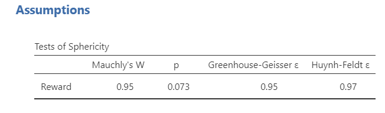

Next, we interpret out output! This time we interpret both our within subjects effects and between subjects effects tables. In the within subjects effects table, our main effect of reward is statistically significant. In the between subjects effects table, our main effect of condition is statistically significant. However, in the within subjects effects table, there is no statistically significant interaction effect of reward on condition.

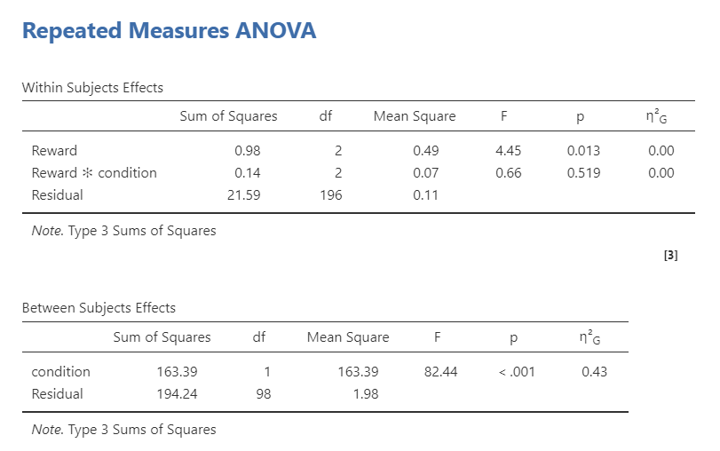

To understand where the differences lie between conditions or reward preferences, we look to our post hoc tests. For reward, it looks like there is only a significant difference between food and music (*p* = .009). For condition, it looks like cravings were higher in the fasting group than in the control group. We can look at the estimated marginal means tables to find the actual Means of the conditions and see the plots.

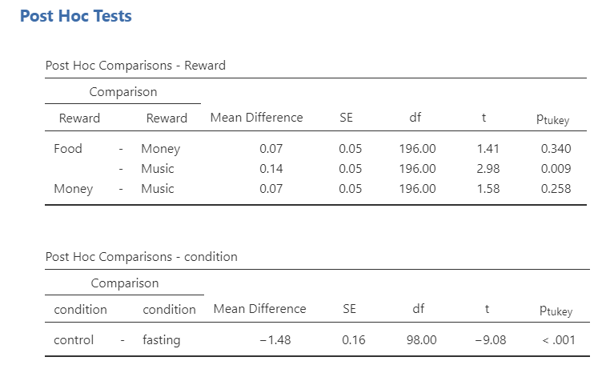

We can look at the interaction plot, but notice that the lines are parallel which is a good indication that there is no significant interaction.

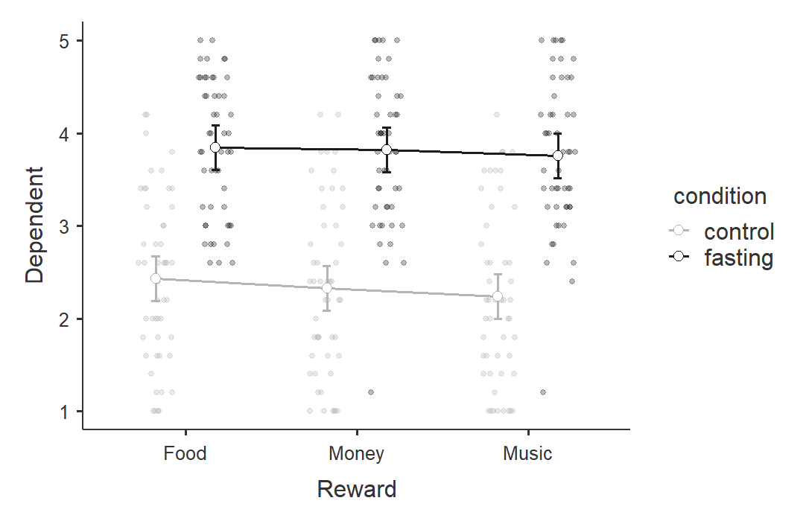

Lastly, we can write up the results in APA style!

> To test how both condition (control or fasting) and reward preference (food, money, and music) affected food cravings, we performed a mixed factorial ANOVA. There was a significant main effect of condition (*F* [1, 98] = 82.44, *p* \< .001, $\eta^2_G$ = .43) and a significant main effect of reward (*F* [2, 196] = 4.45, *p* = .013, $\eta^2_G$ = .00). However, there was no statistically significant interaction effect of reward on condition (*F* [2, 196] = .66, *p* = .519, $\eta^2_G$ = .00).
>
> For condition, participants who fasted (*M* = 3.81, *SE* = .11) reported significantly more food cravings than participants in the control condition (*M* = 2.33, *SE* = .11; $p_{Tukey}$ \< .001). For reward, the food reward (*M* = 3.14, *SE* = .09) led to significantly higher food cravings than the music reward (*M* = 3.00, *SE* = .09; $p_{Tukey}$ = .009), but there was no differences between the money reward (*M* = 3.07, *SE* = .09) and both food ($p_{Tukey}$ = .340) or music ($p_{Tukey}$ = .258).

```{r}
knitr::include_url("https://www.youtube.com/watch?v=lbZK_FoZKW4")
```
