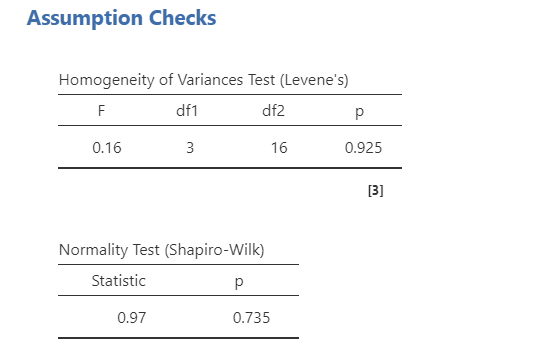
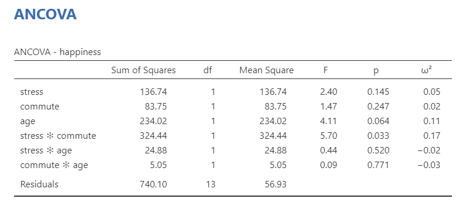
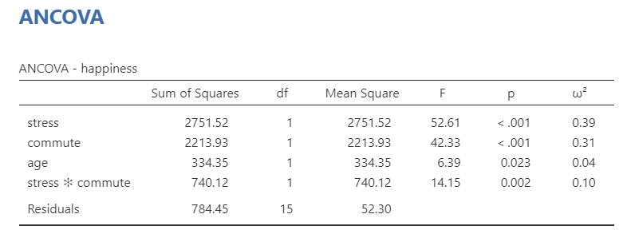

## ANCOVA

```{r ind-t_setup, echo = FALSE, message=FALSE}
library(tidyverse)
library(webex)
options(knitr.graphics.auto_pdf = TRUE)
```

### Overview

**ANCOVA** (**AN**alysis of **COVA**riance) examines the difference in means between [three or more]{.ul} groups, while controlling for or partialling out the effect of one or more continuous confounds or covariates.

**Some definitions**: A *confounding* variable is a variable that affects or is related to both the independent and dependent variable. A *covariate* variable is a variable that only affects or is only related to the dependent variable.

There are two main reasons for including covariates:

1.  **To reduce within-group error variance**: Remember that to get a larger F-statistic, we need to maximize between-groups variance and minimize within-groups variance. Adding covariates can sometimes minimize within-groups variance if that covariate helps *explain* some of the within-group variance.

2.  **Elimination of covariates**: Sometimes there are other variables that also explain our outcome variable. We want to look at the effect of another variable on the outcome while removing or eliminating the other variables (confounds) that also explain our outcome variable.

### Assumptions

In addition to the same assumptions of the one-way ANOVA (see \@ref(anova-assumptions)), the ANCOVA has two additional assumptions:

1.  **Independence of the covariate and treatment effect**: When the covariate and treatment effect are related, then we can have incorrect F-statistic values. However, this is only important in experimental designs. In quasi-experimental designs, this is often violated and you just have to interpret results accordingly.

    -   If you do have an experimental manipulation with a covariate, you can test this assumption by running a one-way ANOVA but with your experimental manipulation as your IV or group variable and your covariate as your DV. If there is a significant F-ratio, then you have violated this assumption.

2.  **Homogeneity of regression slopes**: The relationship between the covariate and the outcomes must be similar across groups.

    -   To test this assumption, add an interaction term between the covariate and each independent variable in jamovi under the Model drop-down menu. Add the interactions as model terms.

### Perform the test

Let's run an example with data from lsj-data. Open data from your Data Library in "lsj-data". Select and open "ancova". This data is fictional data from a health psychologist who was interested in the effect of routine cycling (1 = driving, 2 = cycling) and stress (1 = high, 2 = low) on happiness levels, with age as a covariate. Notice how this is a 2x2 independent factorial design with a covariate!

1.  To perform an ANCOVA in jamovi, select ANCOVA under the ANOVA analysis menu.

2.  Move your dependent variable `happiness` to the Dependent Variable box, your independent variables `stress` and `commute` to the Fixed Factors box, and your covariate `age` to the Covariates box.

3.  Select $\omega^2$ as your effect size.

4.  Under Assumption Checks, select all three assumption checks: `Homogeneity test`, `Normality test`, and `Q-Q Plot`.

5.  Under Post Hoc Tests, move both of your independent variables over, select the `Tukey` correction and select `Cohen's d` for your effect size.

6.  Under Estimated Marginal Means, move each of your independent variables over into its own term box. Also include combinations of your independent variables if you have an interaction term in your model. Select both plots and tables, select `Observed scores`, and de-select `Equal cell weights`.

First, let's check our assumptions in jamovi. Shapiro-Wilk's test was not statistically significant (*p* = .735) and the Q-Q plot looks good; therefore, we've satisfied the assumption of normality. Levene's test was not statistically significant (*p* = .925); therefore, we've satisfied the assumption of homogeneity of variance.

```{r echo = FALSE, fig.cap = "Assumption check results in jamovi"}

```

However, we have two additional assumptions we need to check. Let's check the assumption of independence of the covariate and treatment effect. For that, we need to perform another ANOVA (not an ANCOVA) with our independent variables predicting age. Our results indicate we violate this assumption: both `stress` and the interaction of `stress * commute` are related to age. This suggests age is in fact a *confounding* variable, not a covariate. We should be performing a mediation, but because we want to illustrate the ANCOVA we will continue.

```{r echo = FALSE, fig.cap = "Assumption check results in jamovi"}

```

The second additional assumption is that the relationship between the covariate and the dependent variable is similar for all levels of the independent variable (homogeneity of regression slopes). We can test this by adding an interaction term between the covariate and each independent variable in jamovi under the Model drop-down menu. If the interaction effect is not significant it can be removed. If it is significant then a different and more advanced statistical technique might be appropriate (which is beyond the scope of this class). In our case, the interactions between each IV and our covariate are not statistically significant so we can remove the interaction terms and move on.

```{r echo = FALSE, fig.cap = "Assumption check results in jamovi"}

```

Now it's time to interpret the results! The ANCOVA table shows that both independent variables (`stress` and `commute`), the interaction term (`stress * commute*`), and the covariate (`age`) are statistically significant. Therefore, we can look at our post hoc tests to find where the differences are.

```{r echo = FALSE, fig.cap = "ANCOVA results in jamovi"}

```

Technically, we don't need to look at the post hoc table much in this example. Because there are only two groups, we already know one group will have higher means than the other group if the F-test is significant. In fact, check this out: the square root of our F-statistic is equal to the t-statistic in our post hoc table. Neat!

Post hoc tests show that low stress had higher happiness than high stress, and that cycling had higher happiness than driving. We can also look to the estimated marginal means tables and plots for information for reporting.

```{r echo = FALSE, fig.cap = "Post hoc results in jamovi"}
knitr::include_graphics("images/07-ancova/ancova_tukey.png")
```

Last, we can write-up our results! Reporting ANCOVA is very similar to reporting an ANOVA test (in this case an independent factorial ANOVA) except that we also report the effect of the covariate, as well. Here's an example write-up:

> We conducted a study examining how stress and commute affect happiness levels in a 2 (stress: high or low) x 2 (commute: cycling or driving) independent factorial design. Furthermore, we collected data on age as a covariate of our study. We satisfied all assumptions of the ANCOVA except that age was in fact a confounding variable in that it relates to our independent variable of stress. Despite failing to meet this assumption, we proceeded with the ANCOVA analysis.
>
> There was a significant main effect of stress on happiness such that participants in the low stress condition (*M* = 68.45, *SE* = 2.55) reported significantly greater happiness than participants in the high stress condition (*M* = 39.85, *SE* = 2.55), *F* (1, 15) = 52.61, *p* \< .001, $\omega^2$ = .39. There was also a significant main effect of commute on happiness such that participants who commuted via cycling (*M* = 64.70, *SE* = 2.29) reported significantly greater happiness than participants who commuted via driving (*M* = 43.60, *SE* = 2.29), *F* (1, 15) = 42.33, *p* \< .001, $\omega^2$ = .31. There was a significant interaction between stress and commute type such that happiness levels were similar in the low stress condition for both commute types, but happiness was significantly higher for participants who cycled versus those who drove in the high stress condition, *F* (1, 15) = 14.15, *p* = .002, $\omega^2$ = .10. Furthermore, age was a significant covariate of our dependent variable, *F* (1, 15) = 6.39, *p* = .023, $\omega^2$ = .04.

```{r echo = FALSE, fig.cap = "Interaction in jamovi"}
knitr::include_graphics("images/07-ancova/ancova_interaction.png")
```
