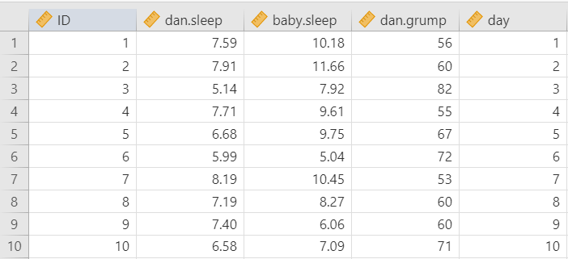

## Correlation

```{r ind-t_setup, echo = FALSE, message=FALSE}
library(tidyverse)
library(webex)
options(knitr.graphics.auto_pdf = TRUE)
```

### Overview

Correlation (*r*) tests the relationship between two variables, which are usually continuous (i.e., ratio or interval) variables. The relationship between those two variables could be *positively related*, *negatively related*, or *not related at all*.

**Note**: Remember that correlation does not always equal causation!

We will learn about other types of correlations, but mainly we are interested in the Pearson product moment correlation, which is often just called the Pearson correlation or simply correlation. Other correlations are generally referred to by their specific name.

The strength of the correlation is determined by how closely the points in the scatterplot matrix fit on the regression line. Correlations are really *standardized covariances*. [Covariance]{.ul} is the extent to which the deviation of one variable from its mean matches the deviation of the other variable from its mean. We then standardize the covariance into the correlation which ranges from -1 to +1. Because correlations are standardized, they are considered effect sizes! Commonly, we describe values of ±.1 as a small effect size, ±.3 as medium, and ±.5 as large, but remember that this heuristic is simply a heuristic and it's best to think about size in relation to your field.


**Note**: Try your hand at guessing the correlation coefficient! Play at www.guessthecorrelation.com

**Note**: Another fun website to play around with is the interactive visualization website Interpreting Correlations by Kristoffer Magnusson. You can play around with what data looks like at various correlations. <https://rpsychologist.com/correlation/>

### Specify your hypotheses

Let's run an example with data from lsj-data. Open data from your Data Library in "lsj-data". Select and open "parenthood". This dataset measures a new mother's[^correlation-1] daily grumpiness very precisely, on a scale from 0 (not at all grumpy) to 100 (extremely grumpy). In addition, I am also tracking her sleeping patterns and her son's sleeping patterns across 100 days.

[^correlation-1]: The dataset built into jamovi says the person's name is Dan, but they now go by Danielle. You can follow her on Twitter at [\@djnavarro](https://twitter.com/djnavarro).

The null hypothesis is there is no correlation whereas the alternative hypothesis is that there is a correlation. In this case, our hypothesis is a two-tailed hypothesis, although we could have an *a priori* hypothesis about the relationship between our variables.

### Look at the data

#### Data set-up

To conduct the correlation we first need to ensure our data is set-up properly in our dataset. This requires having two columns, one for each of our continuous variables. Each row is a unique participant or unit of analysis. Note that jamovi might have incorrectly imported `dan.grump` as a nominal variable but that is incorrect! This shows the importance of looking at your data and checking your measure types.

{width="500"}

#### Describe the data

Once we confirm our data is setup correctly in jamovi, we should look at our data using descriptive statistics and graphs. First, our descriptive statistics are shown below. We can see first that we have 100 cases and no missing data. The means, medians, standard deviations, and variances are then shown, followed by the minimum and maximum values.

We also see skew and kurtosis. Calculating the *z*-score for all the skew and kurtosis (remember: skew or kurtosis divided by its standard error) suggests we do not violate the assumption of normality much except for `day`. However, notice what the variable `day` is! It's just the day of the study, from 1-100. If you look at the graph, it has a *uniform distribution* (completely flat and uniform) not a normal distribution (bell curve)!


### Check assumptions

#### Assumptions

The Pearson correlation has the three following assumptions:

1.  Both variables are **normally distributed**

2.  Both variables are measured at the **interval or ratio** (i.e., continuous) level (however, we will see what we can do if we violate this)

3.  The relationship between the two variables is **linear**

We test for normal distribution using the Exploration-Descriptives analysis in jamovi, looking at Shapiro-Wilk's test, the Q-Q plot, a histogram or density plot, and skew and kurtosis z-scores.

The third assumption requires looking at a scatterplot of one variable on the x-axis and the other variable on the y-axis.

#### Checking assumptions

##### Testing normality

By now we've had a lot of practice testing for normality. One of our data points (`day)` is strange because it's just a linear number 1-100, so we can ignore it. The Q-Q plot for `dan.sleep` looks a bit iffy, but the density plot, skew, kurtosis, and Shapiro-Wilk's tests look fine. We will say we met the assumption of normality. Below, you can see our density plots in the diagonal of our scatterplot matrix.


##### Testing linearity

There's nothing we can do here except look out our correlations! Do the underlying data in any of the scatterplots look like there is actually a non-linear (e.g., curvilinear) relationship? If so, you fail to meet this assumption.

The scatterplots above do not suggest a non-linear relationship, so we meet the assumption of linearity.

### Perform the test

1.  First, you'll need to check your assumption of normality *outside* of the correlations analysis. Go to Explorations and choose Descriptives and check whether you meet the assumption of normality.

2.  To perform a correlation, go to Regression and select Correlation Matrix.

3.  Move all four variables into the dialogue box on the right (`dan.sleep`, `baby.sleep`, `day`, and `dan.grump`).

4.  Select Pearson under Correlation Coefficients. We'll go over the other two later.

5.  Under Additional Options, select `Report significance`, `Flag significant correlations`, and, if you have missing data, `N` (we don't have missing data so we can ignore this).

6.  Under Plot, select `Correlation matrix`. Alternatively, you can ask for `Densities for variables` to see the density plots for each variable and `Statistics` to have the correlation coefficient added to the plot.

When you are done, your setup should look like this:

{width="500"}

### Interpreting results

Once we are satisfied we have satisfied the assumptions for the correlation, we can interpret our results.


It looks like three of the variables are significantly (*p* \< .05) correlated with each other: `dan.sleep`, `baby.sleep`, and `dan.grump`. `day` does not seem to be significantly correlated with any of the other three variables.

#### Write up the results in APA style

We can write up our results in APA something like this:

> Dan's grumpiness (*M* = 63.71, *SD* = 10.05) is negatively correlated with both Dan's quality of sleep (*M* = 6.97, *SD* = 1.02; *r* = -.90, *p* \< .001) and the baby's quality of sleep (*M* = 8.05, *SD* = 2.07; *r* = -.57, *p* \< .001). Furthermore, Dan's and the baby's quality of sleep are positively correlated (*r* = .63, *p* \< .001).

#### Visualize the results

The default in the Correlation Matrix is to plot the correlation matrix of all the variables, and optionally show the densities for variables and the statistics. This is fine, but I'm not a huge fan of it. You can see it below:


Personally, this is why I like the `scatr` module in jamovi. You can create high-quality scatterplots of the six graphs above and then stitch them together in a nicer version. For example, here's the correlation between the sleep quality of both Dan and the baby with a linear regression line and standard error:

{width="500"}

### Video

Here's a video walking through the correlation.

```{r echo = FALSE, message = FALSE, warning = FALSE}
library(vembedr)
embed_url("https://www.youtube.com/watch?v=p4LNqatn2sg")
```

### In case of violated assumptions

If you violate any of the three assumptions, you can choose to perform Spearman's rank correlation instead of a Pearson correlation. Both Spearman's rho and Kendall's tau are non-parametric statistics based on rank order. To perform Spearman's correlation, change the check mark in jamovi from Pearson to Spearman. You will interpret just the same; however, instead of using the letter *r* you can either use $r_s$, $r_{spearman}$, or $\rho$ (the Greek letter rho).

What about Kendall's tau? It will likely give you the same results as Spearman's rho but it is interpreted slightly differently. We won't use it in this class.

### Additional information

#### R-Squared

The cool thing about the correlation is that we can square $r$ to get $r^2$, which is the percentage of variance overlap. It is the percentage of variance in one variable that is shared by the other. You simply square the $r$ correlation coefficient to find the $r^2$. For example, our correlation above between Dan's grumpiness and Dan's quality of sleep is $r$ = -.90; therefore, its $r^2$ = .81 or 81%. 81% of the variance in Dan's grumpiness can be explained by Dan's quality of sleep!

#### Comparing strengths of correlations

**Note**: For PSYC 290 students, you can read the below information but I will not test you on it.

Sometimes you want to compare two correlations to find out if one correlation is significantly stronger than another. You can use this calculator to calculate the p-value: [Testing the Significance of Correlations](https://www.psychometrica.de/correlation.html)

Note that you use \#1 (Independent Samples) when the correlations come from different samples and \#2 (Dependent Samples) when the correlations come from the same sample. For example, to compare the correlation between English and Reading to the correlation between English and Writing, you would use \#2 (Dependent Samples). But to compare the correlations between English and Reading for men and women, you would use \#1 (Independent Samples).

Let's try them both with our [Sample_Dataset_2014.xlsx](https://github.com/danawanzer/stats-with-jamovi/blob/master/data/Sample_Dataset_2014.xlsx).

1.  **Comparison of correlations from independent samples**

We want to test the correlations between English and Reading for men and women. We first need to gather those correlations in jamovi. We can do this through **filters**.

Let's first find the correlation for men. Go to the Data tab in jamovi, click Filters, and enter in the $\int_x$ = Gender == 0. Next, go to the Analyses tab in jamovi, click Regression, and choose Correlation Matrix. Move our two variables over (`English` and `Reading`) and check the box for `N`. You should get *r* = .36, *p* \< .001, *n* = 181.

Now let's find the correlation for women. Go back to the Data tab in jamovi, click Filters, and change the equation to $\int_x$ = Gender == 1. Your results should automatically update because the filter changed. For women, you should get *r* = .33, *p* \< .001, *n* = 210.

Now we can compare the correlations in [Testing the Significance of Correlations - Independent Samples](https://www.psychometrica.de/correlation.html#independent). In Correlation 1, put 181 in the n column and .36 in the r column. In Correlation 2, put 210 in the n column and .33 in the r column. The results are shown below. The z-score is not statistically significant (*p* = .369) so there is no significant difference in correlation strength.


2.  **Comparison of correlations from dependent samples**

Now let's test whether the correlation between English and Reading differs from the correlation between English and Writing.

Notice how we have three tests we are comparing: (1) English, (2) Reading, and (3) Writing. We can't use this test if we are testing the correlation between variables A and B and the correlation between variables C and D. There needs to be overlap.

If you still have your filter on in your dataset from the previous analysis, turn it off. Go to the Data tab, click Filters, and either select the X to delete it or toggle the active button so it's turned off. Return to your Correlation Matrix results and click on it to edit it. Add Writing to the box.

However, we have a problem! The [Testing the Significance of Correlations - Dependent Samples](https://www.psychometrica.de/correlation.html#dependent) webpage (\#2) wants a single N, but our correlation matrix has different Ns because of missing data. What can we do? We need to chain filters! Go back to your Data tab, click Filters, and add three filters like below (note: this is how you can get *listwise deletion* in jamovi):


Our correlation matrix should have automatically updated and all the N's equal 370. Great! We now have all the information we need to input into our [Testing the Significance of Correlations](https://www.psychometrica.de/correlation.html) webpage, \#2. For n we input 370. For $r_{12}$ we enter the correlation between (1) English and (2) Reading. For $r_{13}$ we enter the correlation between (1) English and (3) Writing. For $r_{23}$ we enter the correlation between (2) Reading and (3) Writing. Our z-score is not statistically significant (*p* = .213) so there is no significant difference in the correlation between English and Reading (*r* = .32) with the correlation between English and Writing (*r* = .37).


### Your turn!

Open the `Sample_Dataset_2014.xlsx` file that we will be using for all Your Turn exercises. You can find the dataset here: [Sample_Dataset_2014.xlsx Download](https://github.com/danawanzer/stats-with-jamovi/blob/master/data/Sample_Dataset_2014.xlsx)

Perform correlations based on the following research questions.

To get the most out of these exercises, try to first find out the answer on your own and then use the drop-down menus to check your answer.

1.  **Are there significant correlations among the four tests (English, reading, math, writing)?**

    -   Do you meet the assumption of normality for all four tests?

    -   Do you meet the assumption of linearity for all four tests?

    -   Are the four tests significantly correlated among each other?

    -   Round your answers to two decimal places:

        -   What is the correlation between reading and math?

        -   What is the correlation between writing and reading?

        -   What is the correlation between writing and English?
