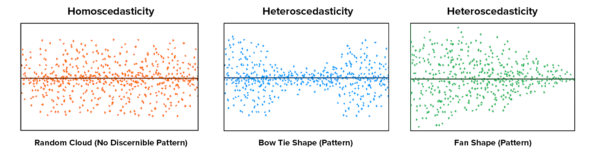

## 22. Regression

```{r ind-t_setup, echo = FALSE, message=FALSE}
library(tidyverse)
library(webex)
library(viridis)
options(knitr.graphics.auto_pdf = TRUE)
```

Regression can examine multiple predictor variables simultaneously. Whereas the factorial ANOVA can only handle categorical variables (i.e., nominal or ordinal), regression can handle all types of predictor variables including both categorical and continuous.

There are three types of regression in general:

1.  [Linear regression]{.ul}: this looks at the effect of a single predictor (IV) on a single outcome (DV). This is equivalent to a t-test (dichotomous predictor), one-way ANOVA (ordinal predictor), or correlation (scale predictor).

2.  [Multiple regression]{.ul}: this looks at the effect of multiple predictors (IVs) on a single outcome (DV).

3.  [Hierarchical regression]{.ul}: this looks at the effect of multiple predictors (IVs) on a single outcome (DV), but there are multiple "blocks" or "steps" so that you can check the added predictability of new variables.

Note that the linear regression is actually equivalent to a lot of the statistics we've learned. For example, the linear regression will produce the same results as a t-test when we have a dichotomous predictor, a one-way ANOVA when we have an ordinal predictor, and a correlation when we have a continuous predictor. We'll learn more about this at the end of the textbook when we wrap everything up.

#### Understanding regression

A linear regression model is basically a linear line, which many of us learned as y = mx + b, where y is our predicted outcome score, x is the IV, b is the intercept (the score in y when x = 0), and m is the slope (when you increase x-value by 1 unit, the y-value goes up by m units).

Let's imagine we have a dataset of dragons with a categorical predictor (whether they are spotted or striped) and a continuous predictor (height) and a continuous dependent variable (weight). We want to use this dataset to be able to predict the weight of future dragons. First, let's learn how to interpret the coefficients for our two predictor variables (images from [Allison Horst](https://github.com/allisonhorst/stats-illustrations#multiple-linear-regression-dragons-thread)).

```{r echo = FALSE, fig.cap = "Regression lines and residuals", fig.show='hold',fig.align='center', out.width = "49%"}
knitr::include_graphics(c("images/13-regression/dragon_categorical.png", "images/13-regression/dragons_continuous.png"))
```

We determine our line equation from the scatterplot of scores by figuring out the line that fits closest to all data points. The regression line is the line with the *smallest* residuals between the line and data points.

Let's visualize the regression line for how Dan's sleepiness affect Dan's grumpiness. On the left, we see the regression line (in purple) is very close to the data points and the residuals (the grey lines between the purple line and the data points) are smaller. On the right, we see the regression line is far from a lot of the data points and the residuals are larger.

```{r echo = FALSE, fig.cap = "Regression lines and residuals", fig.show='hold',fig.align='center', out.width = "49%"}
knitr::include_graphics(c("images/13-regression/good-regression-line.jpg", "images/13-regression/bad-regression-line.jpg"))
```

Let's go back to our dragon example and input one of our dragons into the model to find out how residuals work. On the left, based on our dataset and the fact that our dragon is striped (spotted = 0) and has a height of 5.1 feet, we would expect our dragon to weigh 3.9 tons. However, when we actually weigh him, he weighs 4.2 tons! Therefore, the residual in this case would be .3 tons.

```{r echo = FALSE, fig.cap = "Regression lines and residuals", fig.show='hold',fig.align='center', out.width = "49%"}
knitr::include_graphics(c("images/13-regression/dragon_predict_mlr.png", "images/13-regression/dragon_residual.png"))
```

One of our assumption checks is that our residuals are normally distributed, so we would take all our residuals and examine those for normality.

```{r echo = FALSE, fig.cap = "Regression lines and residuals", fig.show='hold',fig.align='center', out.width = "49%"}
knitr::include_graphics("images/13-regression/dragon_residual_distribution.png")
```

There is more math to regression, which is needed to calculate the *F*-test you get for the overall model test and the t-tests you get for your model coefficients, but we won't get into that detail.

### Step 1: Look at the data

Let's run an example with data from lsj-data. Open data from your Data Library in "lsj-data". Select and open `parenthood`. This dataset includes the sleep quality of both Dan and Dan's baby, Dan's grumpiness, and the day of the data collection from 1-100.

We'll be testing how both Dan's and Dan's baby's quality of sleep affect Dan's grumpiness.

Here's a video walking through the regression.

```{r echo = FALSE, message = FALSE, warning = FALSE}
library(vembedr)
embed_url("https://www.youtube.com/watch?v=SfubvsatkdA")
```

#### Data set-up

Our data set-up for regression depends on the type of regression and type of data, but in general we'll have one column of our continuous DV and one or more columns of our IV(s).

For this chapter, we're going to return to the `parenthood` dataset from lsj-data. Remember that this dataset includes the sleep quality of both Dan and Dan's baby, Dan's grumpiness, and the day of the data collection from 1-100.


#### Describe the data

Once we confirm our data is setup correctly in jamovi, we should look at our data using descriptive statistics and graphs. First, our descriptive statistics are shown below. We can see first that we have 100 cases and no missing data. The means, medians, standard deviations, and variances are then shown, followed by the minimum and maximum values.

We also see skew and kurtosis. Calculating the *z*-score for all the skew and kurtosis (remember: skew or kurtosis divided by its standard error) suggests we do not violate the assumption of normality much except for `day`. However, notice what the variable `day` is! It's just the day of the study, from 1-100. If you look at the graph, it has a *uniform distribution* (completely flat and uniform) not a normal distribution (bell curve)!


### Step 2: Check Assumptions

The regression has a lot of assumptions.

Some require no testing and are a function of understanding your data and research design:

1.  **Variable types**: The DV is continuous and the IVs are either continuous, dichotomous, or ordinal.

2.  **Independence**: All the outcome variable values are independent (e.g., come from a separate entity).

Other assumptions require testing. We'll go through each of these one at a time.

#### No outliers

There shouldn't be any data in the dataset that is an outlier which would strongly influence your results.

Under Data Summary, you should have a table with Cook's distance. This is one way we can check for *multivariate outliers*. This examines whether any one *line* of data is an outlier, not just one data *point*. In general, Cook's distances greater than 1 indicate a multivariate outlier. Our Cook's distances are very small, so we do not have a problem with outliers.


If you violate this assumption and have one or more multivariate outliers, then go to the Save tab in your regression setup and select the box for Cook's distance. That will create a new variable in your dataset with the Cook's distance. Create a filter and remove any data that has a Cook's distance greater than 1.

#### Normality of the residuals

Up to this point, we've examined the normality of the outcome variables. With regression, our variables can be non-normal as long as the residuals (i.e., error) are normally distributed.

The regression analysis in jamovi allows us to check multivariate normality with the Shapiro-Wilk's test and the Q-Q plot of our residuals. We've seen this multiple times, so by now it should be well-ingrained that because Shapiro-Wilk's is not statistically significant and our data points fall along the diagonal line that we satisfy the assumption of normally distributed residuals.

Note that in large datasets, your Q-Q plot may look fine but your Shapiro-Wilk's test may be statistically significant. In that case, you can likely assume your data is normally distributed. The Shapiro-Wilk's test tends to say things are not normal with very small deviations from large datasets.

If you violate the assumption of normality, you can try transformating one or more variables. For the purposes of our assignments, if you violate this assumption then just mention that it is violated and that you will proceed anyways.


#### Linearity & homoscedasticity

**Linearity**: The assumption of linearity means relationship between each IV and DV is linear. Sometimes you may expect a curvilinear relationship between an IV and DV, in which case we square or cube the IV and use that variable as our predictor variable in the regression.

**Homogeneity of variance (homoscedasticity)**: The assumption of homoscedasticity means at each level of the predictor variables, the variance of the residual terms should be constant.

To examine linearity and homoscedasticity we examine the Residuals Plots. You will get one plot of the overall model (Fitted) and one for each of your variables (DV and IV(s). We only focus on the Fitted residuals, shown below. In these plots, we want our data to look like a random scattering of dots even dispersed around zero on the y-axis.

We will not be learning non-normal or weighted least squares regression in this course, so if you violate one or both of these assumptions then mention which are violated and that you will proceed anyways.


**Linearity**: If the data points seem to have a curve in the graph, then that suggests you have failed the assumption of linearity. Our data doesn't seem to have any curve to it, so we satisfy the assumption of linearity.

This image by [Laerd Statistics](https://statistics.laerd.com/spss-tutorials/pearsons-product-moment-correlation-using-spss-statistics.php) shows what non-linear relationships might look like.


**Homoscedasticity**: If the graph seems to funnel (e.g., widely dispersed on one end of the x-axis and narrowly dispersed on the other end), then that suggests you fail the assumption of homoscedasticity. Our data doesn't seem to be wider at any point, so we satisfy the assumption of homoscedasticity.

This image by [CleverTap](https://clevertap.com/blog/a-brief-primer-on-linear-regression-part-ii/) shows what heteroscedasticity might look like.



#### Independence of residuals

This assumption means that for any two observations, the residual terms should be uncorrelated (or independent). Our errors must be normally distributed and uncorrelated.

The Durbin-Watson test for autocorrelation tests for independence of residuals. We want the Durbin-Watson value to be as close to 2 as possible. Values less than 1 or greater than 3 are problematic and indicate we are violating this assumption. In our case, the DW test statistic is 2.12 and so very close to 2. Furthermore, they provide a p-value and the p-value is greater than .05 so the test statistic is not statistically significant, further supporting that we meet the assumption that our residuals are independent.

If you violate this assumption, it's likely a function of how your data was collected (e.g., a time effect or you have nested data). We won't be covering what to do in these cases, but if you have nested data you may be interested in multilevel or hierarchical modeling (MLM/HLM).


#### No multicollinearity

This assumption means there should be no perfect or near-perfect linear relationship between two or more of the predictors in your regression model. For example, you would not include "heigh_cm" and "heigh_in" in your model because they would be perfectly related to one another.

Multicollinearity is a problem for three reasons:

1.  **Untrustworthy *B*s**: As multicollinearity increases, so do the standard errors of the *B* coefficient. We want smaller standard errors, so this is problematic.
2.  **Limits the size of R**, and therefore the size of R^2^, and we want to have the largest R or R^2^ possible, given our data.
3.  **Importance of predictors**: When two predictors are highly correlated, it is very hard to determine which variable is more important than the other.

Multicollinearity is simply that multiple variables are correlated. We can first just look for general *collinearity*, or the correlations between all our predictors, using the correlation matrix in jamovi. Any correlations greater than .8 or .9 are problematic. You would either need to drop one variable or combine them into a mean composite variable.

However, to test for *multicollinearity*, we examine the VIF and Tolerance values. VIF is actually a transformation of Tolerance (Tolerance = 1/VIF and VIF = 1/Tolerance). In general, we want values 10 or lower, which corresponds to Tolerance values greater than .2.

In our data, our VIF is 1.65 and Tolerance is .61, so we satisfy the assumption of no multicollinearity.


Now that we met all the assumptions, we can interpret our results!

### Step 3: Perform the test

1.  From the 'Analyses' toolbar select 'Regression' - 'Linear regression'. Note that we select this option regardless of whether we are performing a linear regression, multiple regression, or hierarchical regression.

2.  Move your dependent variable `dan.grump` into the Dependent Variable box and all your independent variables into either Covariates (if they are continuous variables) or Factors (if they are categorical variables). In this case, all our variables are continuous so move both `dan.sleep` and `baby.sleep` to the Covariates box.

3.  If you are performing a hierarchical regression, you will use the Model Builder drop-down menu. More information on hierarchical regression will be discussed later.

4.  If you have categorical predictors with more than two levels, you will use the Reference Levels drop-down menu to specify what you want your reference level to be and whether you want the intercept to be the reference level or the grand man. More information on categorical predictors will be discussed later.

5.  Under Assumption Checks, check *all* the boxes!

6.  Under Model Fit, select `R`, `R-squared`, `Adjusted R-squared`, and `F test`. The other options (AIC, BIC, RMSE) are more useful when we are comparing models and will be discussed later in the Hierarchical regression section.

7.  Under Model Coefficients, select `Standardized estimate`.

8.  Optionally, you can ask for plots and tables of the estimated marginal means.

I'm not going to show the set-up figure here because there's just too much to show.

### Step 4: Interpret results


The first table shows us our overall model results.

**R, R-squared, and adjusted R-squared**: We get our R and R-squared values (R-squared literally being R squared). Remember back to correlation: R-squared is the *proportion* of variance in the dependent variable that can be accounted for by the predictor(s). In this case, Dan and the baby's sleep quality predict 82% of the variance in Dan's grumpiness.

However, more commonly we report the adjusted R-squared value, which adjusts the R-squared value based on the number of predictors in the model. Adding more predictors to the model will *always* cause R-squared to increase (or at least not decrease) so it's important that we control for that using an adjustment. It's interpreted basically the same, just adjusted for biased. I encourage you to use the adjusted R-squared, *especially* if you have lots of predictors in your model.

**Overall Model Test**: We also get an *F*-test for the overall model. If you want, you can get the full ANOVA test by selected ANOVA test under Model Coefficients. This is how we know if the overall model is statistically significant. In our case, our *F*-test is statistically significant so we know that the set of predictors significantly predicts our dependent variable.

**Model coefficients**: Just like in ANOVA, we first examine if the model is significant (overall model test) and then look at individual factors, in this case being individual variables in our regression model. Each variable--our intercept and both independent variables--have an associated *t*-test. In this case, Dan's sleep significantly predicts Dan's grumpiness, but the baby's sleep does not.

**Standardized coefficients**: We also asked for standardized estimates (Stand. Estimate), which we get in the last column of our model coefficients table. These are *standardized* so that we can compare them to other variables. They give us an idea of the *strength* of the relationship between that IV on the DV. Larger values = bigger effects. The standardized estimate is called Beta ($\beta$) whereas the unstandardized estimate is just called that or B (the letter B, not Beta). We use the standardized estimates to compare the strength of the estimate to other IVs and we use unstandardized estimates to write our linear equations and predict the DV given values of the IV.

***What about the intercept?***You might be wondering what we do with the intercept. Typically, nothing. We only use it to create our equation so that we can predict Dan's grumpiness based on Dan's sleep and the baby's sleep. For example, our equation from our data is such:

$y = 125.97 - 8.95(dan.sleep) + .01(baby.sleep)$

If Dan's sleep was 5 and baby's sleep was 8, then we'd expect Dan's grumpiness to be:

$y = 125.97 - 8.95(5) + .01(8) = 125.97 - 44.75 + .08 = 81.3$

#### Write up the results in APA style

We can write up our results in APA something like this:

> Dan collected data on how many hours of sleep Dan and Dan's baby got, as well as Dan's grumpiness, for 100 days. Dan tested how the hours of sleep both Dan and the baby got affected Dan's grumpiness using a multiple regression. The combination of predictors were significantly related to Dan's grumpiness, *F* (2, 97) = 215.24, *p* \< .001, adjusted $R^2$ = .81. The number of hours of sleep Dan got significantly predicted Dan's grumpiness, $\beta$ = -.90, *t* (97)= -16.17, *SE* = .55, *p* \< .001. However, the number of hours of sleep the baby got did not significantly relate to Dan's grumpiness, $\beta$ = 0.00, *t* (97)= .04, *SE* = .27, *p* = .969.

Note that in many of these write-ups I did not include anything about assumption checking. I normally write up that information as part of my analytic plan in my methods section (e.g., "I checked for multivariate outliers using Cook's distance."). Included in this section, I explain what I will do if I do not meet various assumptions. Then, if I don't meet the assumption in the results section I explain that I did not meet the assumption, explain the results if necessary, explain what I did, and then give the results. In this case, we met all the assumptions (that presumably I described in my methods section) and therefore went straight to the results.

### Categorical Predictors

Dummy coded variables (with values 0 or 1) are pretty easy to interpret in regression. If the Beta is positive, then the value of 1 would have a higher mean on the DV than the value of 0. If the Beta is negative, then the value of 0 would have a higher mean on the DV than the value of 1.

However, if we have a nominal variable with more than two categories, then we need to dummy code the data to analyze in a regression. Fortunately, jamovi can do this automatically for us!

The dataset we're using doesn't currently have a categorical variable, so I'm going to manually create one for demonstration purposes. I'm going to transform the `day` variable, which is the day of the data collection from 1 to 100, into a new variable that indicates whether the day is 1-32, 33-65, or 66-100, which is roughly 3 equal groups. You can see the transformation here:


Let's add that to our regression model and just make it a simple multiple regression model. Three independent variables (`dan.sleep`, `baby.sleep`, and our new `day_3groups` variable) all in one block.

Now we need to go to the Reference Levels drop-down menu. We have two options:

1.  **Reference level (dummy coding)**: We can have our intercept be the mean of our reference level group, meaning that if all other variables were set to 0 this is the mean of our dependent variable for that group. For example, if we set day = 1 to be our reference level, then the intercept is the value of Dan's grumpiness when Dan's sleep is 0 and baby's sleep is 0 for the first 32 days. *This is the option I normally choose.*
2.  **Grand mean (simple coding)**: Alternatively, we can have our intercept be the grand mean, or the overall mean when all other variables were set to 0 and we ignored day. *I am not sure when I would use this option, to be honest*.

The other option you have is what is considered your reference level. It will default to your first level in your dataset (in this case, day_3Groups = 1) but you can change to any other level in your variable. I set my reference level to be 1, the default, and I know that because the day variable compares both levels 2 and 3 to 1. Our intercept (126.02) then is the value of grumpiness if Dan and the baby slept 0 hours in the first 32 days of our data collection.


The first line of day - 3_Groups (2 -- 1) is then the difference in Dan's grumpiness between the second 1/3 of days (days 33-65) and the first 1/3 of days (days 1-32). It is not statistically significant, so there is no difference in Dan's grumpiness between the first and second 1/3 of days. Because the estimate is negative, that indicates that the first 1/3 of days have a higher estimated mean of Dan's grumpiness, but again it's not statistically significant.

The second line of day - 3_Groups (3 -- 1) is the difference in Dan's grumpiness between the third 1/3 of days (days 66-100) and the first 1/3 of days (days 1-32). It is not statistically significant, so there is no difference in Dan's grumpiness between the first and third 1/3 of days, either.

In this case, the Estimated Marginal Means can be very helpful for us to interpret the model coefficients. We can get the estimated marginal means of each group on the DV at the average levels of the other two variables.


### Hierarchical regression

Hierarchical regression is exactly the same as multiple regression but now we have multiple models or blocks. You can specify hierarchical regression using the Model Builder drop-down menu in jamovi. Let's try an example where we have `baby.sleep` as Block 1 and `dan.sleep` as Block 2. In addition, using the Model Fit drop-down menu you should check `AIC` and `BIC` in addition to the previously selected options. Your setup should look something like this:


Our model results now change. We now have two lines for the Model Fit Measures and a Model Comparisons table. In addition, under Model Specific Results, we have a drop-down menu to specify which model we want to examine.


Let's interpret. Our first model (with just `baby.sleep` is significant), *F* (1, 98) = 46.18, *p* \< .001, *adjusted* $R^2$ = .31. So is our second model (that has both `baby.sleep` and `dan.sleep`), *F* (2, 97) = 215.24, *p* \< .001, *adjusted* $R^2$ = .81. There was a significant improvement between model 1 and model 2, $F_{change}$ (1, 97) = 261.52, *p* \< .001, $\Delta R^2$ = .50. The significant improvement means that the predictors added to model 2 significantly predict our DV *above and beyond* the predictors in model 1.

We might write-up these results as such:

> Dan collected data on how many hours of sleep Dan and Dan's baby got, as well as Dan's grumpiness, for 100 days. Dan tested how the hours of sleep both Dan and the baby got affected Dan's grumpiness using hierarchical regression to find out how Dan's sleep predicted Dan's grumpiness above and beyond the baby's sleep.
>
> First, the baby's sleep significantly predicted Dan's grumpiness*, F* (1, 98) = 46.18, *p* \< .001, *adjusted* $R^2$ = .31. As the baby's hours of sleep increased, Dan's grumpiness decreased, *t* (98) = -6.80, *SE* = .40, *p* \< .001, $\beta$ = -.57.
>
> A second model was tested that added Dan's sleep. This model--comprised of both baby's sleep and Dan's sleep--significantly predicted Dan's grumpiness, *F* (2, 97) = 215.24, *p* \< .001, *adjusted* $R^2$ = .81. There was a significant improvement between model 1 and model 2, $F_{change}$ (1, 97) = 261.52, *p* \< .001, $\Delta R^2$ = .50. In the second model, as Dan's sleep increased, Dan's grumpiness decreased, *t* (97) = -16.17, *SE* = .55, *p* \< .001, $\beta$ = -.90. However, the baby's sleep did not significantly relate to Dan's grumpiness when controlling for Dan's sleep, *t* (97) = .04, *SE* = .27, *p* = .969, $\beta$ = .00.

### Additional practice

Open the `Sample_Dataset_2014.xlsx` file that we will be using for all Your Turn exercises. You can find the dataset here: [Sample_Dataset_2014.xlsx Download](https://github.com/danawanzer/stats-with-jamovi/blob/master/data/Sample_Dataset_2014.xlsx)

To get the most out of these exercises, try to first find out the answer on your own and then use the drop-down menus to check your answer.

1.  **Perform a multiple regression examining how `English`**, **`Reading` and `Writing`, as well as `Gender` relate to the dependent variable `Math`.**

    -   Do you have any significant outliers?

    -   Are your residuals normally distributed?

    -   Do you satisfy the assumption of linearity and homoscedasticity of your residuals (just check the Fitted residual plot)?

    -   Do you meet the assumption of independent residuals?

    -   Do you meet the assumption of no multicollinearity?

    -   Can you perform a regression with this data?

    -   What is your adjusted R-squared, rounded to two decimal places?

    -   Is the overall model statistically significant?

    -   Is `English` statistically significant?

    -   Is `Reading` statistically significant?

    -   Is `Writing` statistically significant?

    -   Is `Gender` statistically significant?

    -   For `Gender`, do male (Gender = 0) or female (Gender = 1) students have higher math scores?
