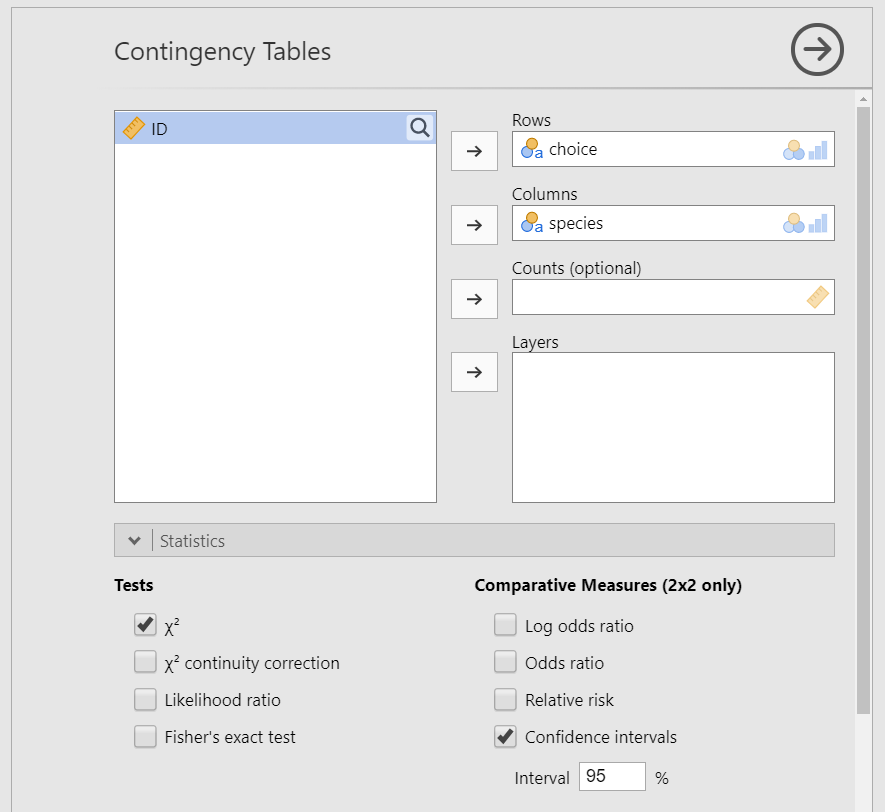
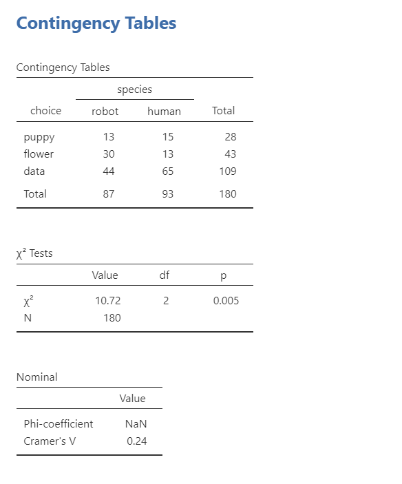

# Chi-Square Test of Independence

```{r ind-t_setup, echo = FALSE, message=FALSE}
library(tidyverse)
library(webex)
library(viridis)
options(knitr.graphics.auto_pdf = TRUE)
```

## What is the chi-square test of independence?

The $\chi^2$ (chi-square) test of independence (or association) tests whether an observed frequency distribution of a nominal variable matches an expected frequency distribution, but unlike the goodness of fit test we are looking at the relationship, independence, or association between two variables. Our hypotheses for the chi-square goodness-of-fit test is as follows:

-   $H_0$: The observed frequencies match the expected frequencies.

-   $H_1$: At least one observed frequency doesn't match the expected frequency.

For example, imagine we are watching a show about the planet *Chapek 9*. On this planet, for someone to gain access to their capital city they must prove they're a robot, not a human. In order to determine whether or not a visitor is human, the natives ask whether the visitor prefers puppies, flowers, or large, properly formatted data files. Our alternative hypothesis would be that humans and robots have different preferences and our null is that they have the same preferences.

## Data set-up

Our data set-up for a chi-square test of independence is pretty simple, We just need two columns of nominal data, with one row per participant. Here's our data for our example we'll be working with, which you can find in the lsj-data called `chapek9`:

| ID  | species | choice |
|-----|---------|--------|
| 1   | robot   | flower |
| 2   | human   | data   |
| 3   | human   | data   |
| 4   | human   | data   |
| 5   | robot   | data   |
| 6   | human   | flower |
| 7   | human   | data   |
| 8   | robot   | data   |
| 9   | human   | puppy  |
| 10  | robot   | flower |

## The math behind the chi-square test of independence

```{block, type = "info"}
If the math below makes your eyes glaze over, you can skip it. This is presented for those who find it useful to understand the math behind the statistics to help understand what's happening.
```

We're going to continue using the Chapek 9 example. This data comes from the lsj-data dataset named "chapek9". If you perform descriptive statistics of `choice` by `species` and ask for frequency tables, you get the *observed* frequencies below. I've added row, column, and table totals on the right column and bottom row.

| *Observed Frequencies* | Robot  | Human  | Total   |
|------------------------|--------|--------|---------|
| Puppy                  | 13     | 15     | **28**  |
| Flower                 | 30     | 13     | **43**  |
| Data                   | 44     | 65     | **109** |
| **Total**              | **87** | **93** | **180** |

Next, we need to calculate our *expected* frequencies based on our data. Our expected frequencies for each cell by multiplying the row total by the column total and dividing by the total sample size:

$Expected frequencies = \frac{C_j * P_i}{N}$

<<<<<<< HEAD
+------------------------+-------------------------+--------------------------+---------+
| *Expected Frequencies* | Robot                   | Human                    | Total   |
+========================+=========================+==========================+=========+
| Puppy                  | (28 \* 87)/180 = 13.533 | (28 \* 93)/180 =14.467   | **28**  |
+------------------------+-------------------------+--------------------------+---------+
| Flower                 | (43 \* 87)/180 =20.783  | (43 \* 93)/180 = 22.217  | **43**  |
+------------------------+-------------------------+--------------------------+---------+
| Data                   | (109 \* 87)/180 =52.683 | (109 \* 93)/180 = 56.317 | **109** |
+------------------------+-------------------------+--------------------------+---------+
| **Total**              | **87**                  | **93**                   | **180** |
+------------------------+-------------------------+--------------------------+---------+

We then need to calculate the squared differences of observed minus expected frequencies:

+-----------------------+--------------------------+--------------------------+---------+
| *Squared differences* | Robot                    | Human                    | Total   |
+=======================+==========================+==========================+=========+
| Puppy                 | $(13-13.533)^2 = .284$   | $(15-14.467)^2 = .284$   | **28**  |
+-----------------------+--------------------------+--------------------------+---------+
| Flower                | $(30-20.783)^2 = 84.953$ | $(13-22.217)^2 = 84.953$ | **43**  |
+-----------------------+--------------------------+--------------------------+---------+
| Data                  | $(44-52.683)^2 = 75.394$ | $(65-56.317)^2 = 75.394$ | **109** |
+-----------------------+--------------------------+--------------------------+---------+
| **Total**             | **87**                   | **93**                   | **180** |
+-----------------------+--------------------------+--------------------------+---------+
=======
| *Expected Frequencies* | Robot                   | Human                    | Total   |
|------------------------|-------------------------|--------------------------|---------|
| Puppy                  | (28 \* 87)/180 = 13.533 | (28 \* 93)/180 =14.467   | **28**  |
| Flower                 | (43 \* 87)/180 =20.783  | (43 \* 93)/180 = 22.217  | **43**  |
| Data                   | (109 \* 87)/180 =52.683 | (109 \* 93)/180 = 56.317 | **109** |
| **Total**              | **87**                  | **93**                   | **180** |

We then need to calculate the squared differences of observed minus expected frequencies:

| *Squared differences* | Robot                    | Human                    | Total   |
|-----------------------|--------------------------|--------------------------|---------|
| Puppy                 | $(13-13.533)^2 = .284$   | $(15-14.467)^2 = .284$   | **28**  |
| Flower                | $(30-20.783)^2 = 84.953$ | $(13-22.217)^2 = 84.953$ | **43**  |
| Data                  | $(44-52.683)^2 = 75.394$ | $(65-56.317)^2 = 75.394$ | **109** |
| **Total**             | **87**                   | **93**                   | **180** |
>>>>>>> 66306ca0d7acd82110bbda4742c158777d2e08d2

The formula for the chi-square test of independence is the very similar to the chi-square goodness of fit test:

$\chi^2 = \sum{\frac{(O_i-E_i)^2}{E_i}} = \frac{.284}{13.533} + \frac{.284}{14.467} + \frac{84.953}{20.783} + \frac{84.953}{22.217} + \frac{75.394}{52.683} + \frac{75.394}{56.317}$

$\chi^2 = .021 + .020 + 4.070 + 3.834 + 1.431 + 1.339 = 10.72$

Our degrees of freedom equals $(r-1)(c-1)$ where *r* is the number of rows and *c* is the number of columns. Our dataset has 3 rows and 2 columns: $(r-1)(c-1) = (3-1)(2-1) = (2)(1) = 2$ degrees of freedom.

## Performing the chi-square test of independence in jamovi

Let's run an example with data from lsj-data. Open data from your Data Library in "lsj-data". Select and open "chapek9". This dataset indicates the ID number of the participant, the species (robot or human), and their preference of the three things (puppy, flower, or data).

1.  From the 'Analyses' toolbar select 'Frequencies' - 'Independent Samples - $\chi^2$ test of association'.

2.  Move `choice` into rows and `species` into columns. Note that the placement in rows or columns doesn't really matter, but because we typically work with portrait pages I tend to prefer putting in rows whatever variable has more levels. In this case, choice has 3 levels and species only 2 so I like to put choice in rows and species in columns.

3.  Under the Statistics tab, select $\chi^2$ under Tests and `Phi and Cramer's V` under Nominal.

4.  Optionally, you can request under the Cells tab to show the expected counts and the row, column, and total percentages.

When you are done, your setup should look like this

```{r echo = FALSE, fig.cap = "Chi-square test of independence setup in jamovi", out.width = "80%"}

```

## Interpreting results

```{r echo = FALSE, fig.cap = "Chi-square test of independence results in jamovi"}

```

The first table shows us our observed frequencies. The second table gives us our results. Our p-value is less than .05 so we can reject the null hypothesis that the observed frequencies match our expected frequencies. jamovi also gives us our Cramer's V value.

We can write up our results in APA something like this:

> Pearson's $\chi^2$ test of independence showed a significant association between species and choice, $\chi^2$ (2) = 10.72, *p* = .005. Robots appeared to be more likely to say they prefer flowers and humans appeared to be more likely to say they prefer data.

I would either write-up the observed frequencies above or, ideally, I would share the contingency table with my observed frequencies.

## Fisher's exact test

If you violate the assumption that there your expected frequencies are sufficiently large and you have a 2x2 table, you can still perform the $\chi^2$ test of independence but instead of selecting $\chi^2$you'll select `Fisher's exact test`. You'll interpret your results exactly the same but specify you used the Fisher's exact test.

## Ordinal variable(s)

If either of your variables are ordinal, instead of selecting `Phi and Cramer's V` you should select `Gamma` or `Kendall's tau-b`. Which do you choose? `Kendall's tau-b` should only be chosen if you have a square table (e.g., 3x3, 4x4, 5x5) whereas `Gamma` can be done with any size table. `Kendall's tau-b` will be a slightly more conservative estimate compared to `Gamma`.

## Your turn!

Open the `Sample_Dataset_2014.xlsx` file that we will be using for all Your Turn exercises. You can find the dataset here: [Sample_Dataset_2014.xlsx Download](https://github.com/danawanzer/stats-with-jamovi/blob/master/data/Sample_Dataset_2014.xlsx)

To get the most out of these exercises, try to first find out the answer on your own and then use the drop-down menus to check your answer.

1.  **Is Athlete related to Gender?**

<<<<<<< HEAD
    -   Do you meet the assumptions? `r mcq(c(answer = "yes", "no, expected frequencies are too small", "no, data are not independent"))`
=======
    -   Do you meet the assumptions? `r mcq(c(answer = "yes", "no, expected frequencies are too small", "no, data are not independent))`
>>>>>>> 66306ca0d7acd82110bbda4742c158777d2e08d2

    -   Which test should you perform? `r mcq(c(answer = "Chi-square", "Fisher's exact test"))`

    -   Are the observed frequencies similar to the expected frequencies? `r mcq(c("yes", answer = "no"))`

    -   What is your chi-square value, rounded to two decimal places: `r fitb("8.45")`

2.  **Is Gender related to Rank?**

<<<<<<< HEAD
    -   Do you meet the assumptions? `r mcq(c(answer = "yes", "no, expected frequencies are too small", "no, data are not independent"))`
=======
    -   Do you meet the assumptions? `r mcq(c(answer = "yes", "no, expected frequencies are too small", "no, data are not independent))`
>>>>>>> 66306ca0d7acd82110bbda4742c158777d2e08d2

    -   Which test should you perform? `r mcq(c(answer = "Chi-square", "Fisher's exact test"))`

    -   Are the observed frequencies similar to the expected frequencies? `r mcq(c(answer = "yes", "no"))`

    -   What is your chi-square value, rounded to two decimal places: `r fitb("0.61")`
