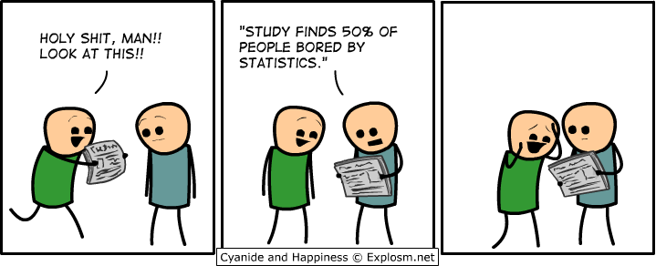

# Introduction

This chapter will introduce you to the course, the instructor (Dr. Dana Wanzer), and the textbook.

## Getting help in this class

Come to student hours regularly! The GA and myself are *always* available to help you. We will be scheduling regularly recurring student hours each week so you can come ask questions, get help on your homework, or just have a space to come together to work on your assignments in a dedicated online space.

If you have more personal questions, you can message me on Teams or email me at wanzerd\@uwstout.edu.

## Dana, your instructor

My name is Dana Wanzer (pronounced DAY-nuh JUAN-zur) and I started teaching at UW-Stout in Fall 2019. I teach statistics (BS and MS programs) and evaluation (MS program) in the psychology department. I *love* statistics! It is one way we can answer our research questions and test our hypotheses.

However, I know not everyone likes statistics. Some of you may not care much about it, and some of you may be apprehensive or anxious about taking this course. Please know that **I am here for you and I want to make this class an enjoyable learning experience**. If there is anything I can do to help make this class more enjoyable and to help you learn, please reach out to me.

## Navigating this website/book

This book was developed in R/Rstudio using [bookdown](https://bookdown.org/yihui/bookdown) and is hosted on a platform called GitHub. You can see the code for this book [here](https://github.com/danawanzer/stats-with-jamovi).

There are some icons at the top of this book that you may find useful:

1.  The first button of the toolbar toggles the visibility of the sidebar, which contains the table of contents. You can also hit the `S` key on your keyboard to toggle the sidebar.

2.  The second button of the toolbar is the search button, which you can use to search the entire book. You can also hit the `F` (Find) key on your keyboard.

3.  The third button is for font/theme settings, which you can use to change font size (smaller or bigger), font family (serif or sans serif), and theme (white, sepia, or night).

4.  The fourth button provides information on the keyboard shortcuts.

5.  On the right of the toolbar are icons to share on various social media platforms.

### Quiz questions

Throughout this textbook, there will be questions to help you test your knowledge. When you type in or select the correct answer, the dashed box will change color and become solid.

For example:

-   What is 2+2? <input class='webex-solveme nospaces' size='1' data-answer='["4"]'/>

-   We attend the University of Wisconsin- <select class='webex-solveme' data-answer='["Stout"]'> <option></option> <option>Stout</option> <option>Madison</option> <option>Green Bay</option></select>

-   True or false: Dana thinks statistics is awesome. <select class='webex-solveme' data-answer='["TRUE"]'> <option></option> <option>TRUE</option> <option>FALSE</option></select>

### Errors, mistakes, and suggestions

I am human, therefore I err. If you find an error in the textbook or something you think might be a mistake, please let me know ASAP so I can update this for everyone else. Let me know which section you find the error or mistake in and what the error or mistake is. For example, if there was an error here you could say, "There was an error in 1.2 that the first sentence should really be 'To err is human (Alexander Pope, 1711).'"

In addition, if you have ideas to help make this textbook even better, please let me know. I would love to make this a useful resource to you both during our course and in your future research. Help me in making that a reality!
