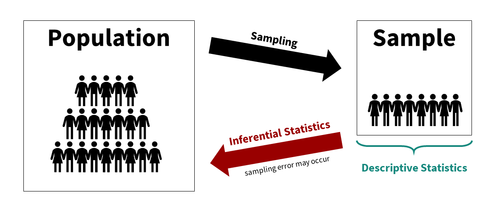

# Statistics foundations

You have learned about both quantitative and qualitative methods. We will be focusing primarily on quantitative methods in this class and in this textbook. By quantitative methods, I mean methods that predominantly collect quantitative data that deals with numbers. We can then analyze that data using statistical procedures, which we will shorthand to "statistics." Understanding what we mean by statistics is the purpose of this chapter.

## Descriptive vs inferential statistics

There are basically two different types of statistics:

1.  **Descriptive statistics** are used to summarize, organize, and overall *describe* our sample data. Typically, we do so using measures of central tendency (e.g., mean, median, mode) and measures of dispersion (e.g., range, standard deviation, variance). We may also visualize the data using tables or graphs.

2.  **Inferential statistics** are what we use when we collect data about a sample and see how well that sample *infers* things about the population from which the sample comes from. Typically, we do so with statistical tests like the t-test, ANOVA, correlation, chi-square, regression, and more.

We can visualize the relationship between the population, sample, descriptive statistics, and inferential statistics (see figure below). We are typically interested in a **population** of interest but may not be able to collect data from the entire population because of budget, time, access, or other constraints. We therefore **sample** from the population; ideally, we do so randomly, but there are other types of sampling methods available. We then use **descriptive statistics** to describe our sample data and **inferential statistics** to make generalizations about the population from which they were selected.

### An example

This has been pretty abstract so far. Let's go through a fairly simple research study to walk through all of this.

Imagine we're conducting an experimental study examining whether watching Schitt's Creek--a very good show--versus watching video lessons on studying techniques--useful, but boring--improved test performance in UW-Stout students.

Our population of interest is therefore all UW-Stout students, roughly 9,500 students total. We cannot include them all in our study; it wouldn't be feasible for us to collect all that data and probably not possible to get the university to get on board with the study of the entire student body. Therefore, we smartly decide to only collect data from a sample of the student body.

Who might our sample be? Ideally, we'd gather a random sample of the 9,500 students. However, to do that we'd likely need to still get university approval and get a list of a portion of student emails for recruitment purposes (oversampling because our response rate is unlikely to be 100%). I just want to do this study to show what descriptive and inferential statistics are, so I just use students in my two sections of introduction to psychology classes (around 80 students total) as my population. This is definitely not a random sample, but a fine study for our illustrative purposes.

We conduct our study--let's assume we're fabulous researchers and it worked out perfectly. We randomly assign half our students to watch Schitt's Creek as part of their studying, and the other half watch video lessons on studying techniques. They have an exam a week later and we measure their accuracy on that exam. We then want to know: which group performed better on the exam?

First, let's describe the sample. We would likely visualize our results, perhaps as a histogram of all test scores, maybe separated by which group they were in. This would help us look at whether our data is normally distributed (more on this in a subsequent chapter on assumption checking). We would get the descriptive statistics: probably the mean, maybe the median if our data is skewed, the standard deviation and variance, and the range. If we wrote up our results and didn't share a visualization, this information would give a good sense of our data to our readers.

But what we really want to know is: which group performed better on the test? For that, we need our mean, standard deviations, and sample sizes for both groups. We then plug the numbers into the equation for this particular inferential statistic (in this case, an independent t-test, but we'll learn about that later) or--even better--we perform the statistic in our statistical software (jamovi). It spits out our statistical value and our p-value and we can then infer what the results mean for our population and answers our research question.[^statistics-foundations-1]

[^statistics-foundations-1]: You might be wondering: well, what were the results? Which group performed better? As much as I love Schitt's Creek, most students don't know how to study well, and so the students who watched the video lessons on studying techniques far outperformed the students who watched Schitt's Creek.

    Interested in better techniques for studying? Check out [The Learning Scientists](https://www.learningscientists.org/blog/category/For+Students). This [article](https://www.learningscientists.org/blog/2020/1/9-1)does a good job of summarizing the research on effective study practices.

## Measures of central tendency and dispersion

Watch the following video that goes over measures of central tendency and measures of dispersion.

## Levels of measurement

This should be refresher material for you, but it is extremely important you are familiar with the four levels of measurement.

**Categorical**: variables that have *categories* to the levels, but cannot be analyzed with a mean because the levels are not proportionate

-   **Nominal**: a categorical variable in which each level of the variable is named but there is no order to them (e.g., breeds of dogs)

    -   **Binary**, **dummy-coded**, or **dichotomous**: a nominal variable with only two levels (general 0 or 1). This is a special type of nominal variable.

-   **Ordinal**: a categorical variable in which each level of the variable is named and there is an order to them (e.g., ranks)

**Continuous**: variables with proportionate intervals between the levels meaning they can be analyzed with a mean, SD, variance

-   **Interval**: a continuous variable that has intervals that are directly proportionate (e.g., the distance between 2-3 is the same as the distance between 5-6)

-   **Ratio**: a continuous variable like an internal variable but can accommodate an absolute zero, meaning a zero is actually possible (e.g., weight, temperature in Kelvin, reaction time)

## Normal distribution

A very important distribution of data is known as the **normal distribution**. You may have also heard it called a bell-shaped curve. It has really important statistical properties which is why most of the inferential statistics we'll be learning in this class are *parametric statistics* that assume our data has a *normal distribution*.

Some of the important statistical properties of the normal distribution:

-   Data are equally distributed on both sides of the mean.

-   Skew and kurtosis are equal to 0, which is to say there is no skew or bad kurtosis.

-   The mean is equal to the median, and both are the exact center of the distribution of data.

-   We know the percentage of cases within 1, 2, 3, etc. standard deviations from the mean.

Watch this video which goes over the normal distribution and skew/kurtosis.

## Entering data in Excel

An important skill to learn is how to appropriately enter data, especially if you're working with paper surveys instead of online surveys. [Broman & Woo (2018)](https://www.tandfonline.com/doi/full/10.1080/00031305.2017.1375989) have a great article on how to properly organize data in spreadsheets. This video will walk you through example data and how to appropriately enter into a spreadsheet program (i.e., Microsoft Excel). Next week, we'll learn how to clean data in our statistical program jamovi, which is an important skill to learn before you analyze your data.
