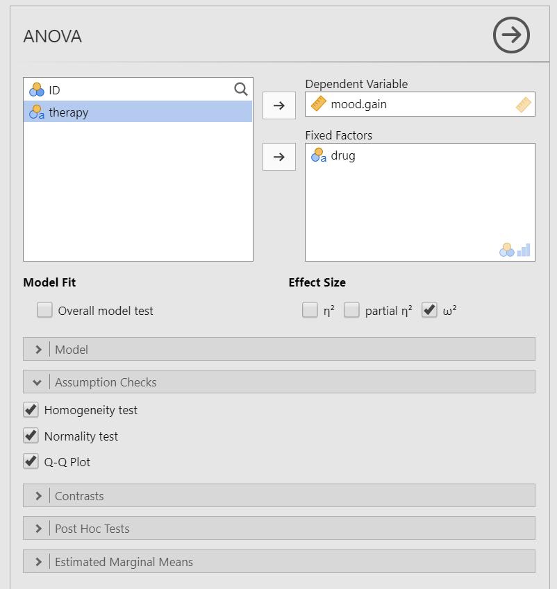
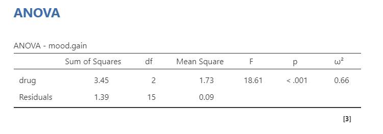

# One-way ANOVA

## What is the one-way ANOVA?

The one-way analysis of variance (ANOVA) is used to test the difference in our dependent variable between [three or more]{.ul} different groups of observations. Our grouping variable is our independent variable. In other words, we use the one-way ANOVA when we have a research question with a **continuous dependent variable** and a **categorical independent variable with three or more categories in which different participants are in each category**.

The one-way ANOVA is also known as an independent factor ANOVA.

One thing to keep in mind is the one-way ANOVA is an omnibus statistic that tests against the null hypothesis that the three or more means are the same. It does not tell us where the mean differences are (e.g., that 1 \> 2); for that, we need planned contrasts or post-hoc procedures, which you'll learn about later.

## Data set-up

To conduct the independent t-test, we first need to ensure our data is set-up properly in our dataset. This requires having two columns: one with our continuous dependent variable and one indicating which group the participant is in. Each row is a unique participant or unit of analysis. Here's what example data may look like if we were testing for differences in a test score by students in my fall, spring, or summer semesters of my course

+----------------------+----------------------+-----------------------+
| ID                   | Semester             | TestScore             |
+:=====================+:=====================+======================:+
| 1                    | Fall                 | 86                    |
+----------------------+----------------------+-----------------------+
| 2                    | Fall                 | 80                    |
+----------------------+----------------------+-----------------------+
| 3                    | Fall                 | 75                    |
+----------------------+----------------------+-----------------------+
| 4                    | Spring               | 79                    |
+----------------------+----------------------+-----------------------+
| 5                    | Spring               | 82                    |
+----------------------+----------------------+-----------------------+
| 6                    | Spring               | 84                    |
+----------------------+----------------------+-----------------------+
| 7                    | Summer               | 90                    |
+----------------------+----------------------+-----------------------+
| 8                    | Summer               | 72                    |
+----------------------+----------------------+-----------------------+
| 9                    | Summer               | 75                    |
+----------------------+----------------------+-----------------------+

: Example data for the one-way ANOVA

In the example data above, what is your **independent variable**? <select class='solveme' data-answer='["Semester"]'> <option></option> <option>ID</option> <option>Semester</option> <option>TestScore</option></select>

In the example data above, what is your **dependent variable**? <select class='solveme' data-answer='["TestScore"]'> <option></option> <option>ID</option> <option>Semester</option> <option>TestScore</option></select>

## Why not multiple t-tests?

In the example above, we have three groups: fall, spring, and summer. We could just perform three separate t-tests: fall vs. spring, fall vs. summer, and spring vs. summer.

However, the reason we do not perform multiple t-tests is to reduce our Type I error rate. If I had performed three separate t-tests, set my alpha (Type I error rate) at 5%, and knew for a fact the effects do not actually exist, then each test has a probability of a Type I error rate of 5%. Because we are running three tests, our alpha rate actually becomes 1 - (.95^3^)= 1 - .857 = 14.3%! So now our *familywise* or *experimentwise* error rate is 14.3%, not the 5% we originally set alpha at.

With three groups, that's not so bad, but let's see what happens with more tests we perform:

-   **1 test**: 1 - (.95^1^)= 1 - .95 = **5%**
-   **2 tests**: 1 - (.95^2^)= 1 - .9025 = **9.8%**
-   **3 tests**: 1 - (.95^3^)= 1 - .857 = **14.3%**
-   **4 tests**: 1 - (.95^4^)= 1 - .814 = **18.6%**
-   **5 tests**: 1 - (.95^5^)= 1 - .774 = **22.6%**
-   **10 tests**: 1 - (.95^10^)= 1 - .598 = **40.1%**
-   **20 tests**: 1 - (.95^20^)= 1 - .358 = **64.1%**

Ouch! 10 tests would have a Type I error rate of 40%! That means that if we performed 10 statistical tests (assuming the effect does not exist), then 40% of the results would be statistically significant by chance alone and would be a false positive. That's not good!

Therefore, we use the one-way ANOVA as one test to see if there is a difference overall. We can also do things to control or limit our familywise error rate, which I'll get into later.

## The math behind the one-way ANOVA

The basic math of the one-way ANOVA is the between-group variance (mean squares - between groups) divided by the within-group variance (mean squares - within groups).

$F = \frac{BG \:variance}{WG \:variance} = \frac{MS_{BG}}{MS_{WG}} = \frac{\frac{SS_{BG}}{df_{BG}}}{\frac{SS_{WG}}{df_{WG}}}$

There are specific formulas for the between-group (also called the model) sum of squares (SS) and within-group (also called the residual) sum of squares. Keep in mind the following symbols:

-   n/N = sample size (little n is per group, big N is the overall sample)
-   k = number of groups
-   X = mean
-   s = standard deviation

The between-group SS is the *variation between group means*. The calculations you see below is to subtract the overall mean ($\bar{X}_{grand}$) from the group mean ($\bar{X_k}$), square that mean difference, multiply that by the sample size in that group ($n_k$), and then sum all the results of doing that per group.

$SS_{BG} = \sum{n_k}(\bar{X_k}-\bar{X}_{grand})^2$

$df_{BG} = k - 1$

The within-group SS is the *variation of scores within groups*. The calculations you see below is to take the sample size in that group ($n_k$) and subtract 1 from it, then multiply it by the group's variance ($s_k^2$, which is standard deviation squared), and then sum all the results of doing that per group.

$SS_{WG} = \sum{s_k^2}(n_k - 1)$

$df_{WG} = N - 1$

In other words, the F-ratio is a ratio of the group or experimental effect by the individual differences in performance.

For our F-ratio to be statistically significant, we want to *maximize* the variance between groups (numerator) and *minimize* the variance within groups (denominator).

### An example with the math

In case it's useful, read below. If your eyes are glazing forward, just move to the next section.

You can read the example dataset below. I've pulled the relevant data here so we can go through a hand calculation ourselves.

+-------------+--------+----------+----------+
| Drug        | N      | Mean     | Variance |
+=============+========+==========+==========+
| Anxifree    | 6      | 0.72     | .15      |
+-------------+--------+----------+----------+
| Joyzepam    | 6      | 1.48     | .05      |
+-------------+--------+----------+----------+
| Placebo     | 6      | 0.45     | .08      |
+-------------+--------+----------+----------+
| **Overall** | **18** | **0.88** | **.28**  |
+-------------+--------+----------+----------+

Let's start with the easy stuff! Let's calculate our degrees of freedom.

$df_{BG} = k - 1 = 3 -1 = 2$

$df_{WG} = N - 1 = 18 - 1 = 17$

Now let's move to the more complicated ones.

$\begin{aligned}
SS_{BG} = \sum{n_k}(\bar{X_k}-\bar{X}_{grand})^2 \\
SS_{BG} = 6(.72-.88)^2 + 6(1.48-.88)^2 + 6(.45-.88)^2 \\
SS_{BG} = 6(-.16)^2 + 6(.60)^2 + 6(-.43)^2 \\
SS_{BG} = 6(.0256) + 6(.36) + 6(.1849) \\
SS_{BG} = .1536 + 2.16 + 1.1094 \\
SS_{BG} = 3.423
\end{aligned}$

\$\$\$\$\
\\begin{aligned}

SS\_{BG} = \\sum{n_k}(\\bar{X_k}-\\bar{X}\_{grand})\^2 = 6(.72-.88)\^2 + 6(1.48-.88)\^2 + 6\
\$\$

## Assumptions

As a parametric test, the one-way ANOVA has the same assumptions as other parametric tests:

1.  The dependent variable is **normally distributed**

2.  Variances in the two groups are roughly equal (i.e., **homogeneity of variances**)

3.  The dependent variable is **interval or ratio** (i.e., continuous)

4.  Scores are **independent** between groups

We cannot [test]{.ul} the third and fourth assumptions; rather, those are based on knowing your data.

However, we can and should test for the first two assumptions. Fortunately, the one-way ANOVA in jamovi has three check boxes under "Assumption Checks" that lets us test for both assumptions.

## In jamovi

Let's run an example with data from lsj-data. Open data from your Data Library in "lsj-data". Select and open "clinicaltrial". This dataset is hypothetical data of a clinical trial in which you are testing a new antidepressant drug called *Joyzepam*. In order to construct a fair test of the drug's effectiveness, the study involves three separate drugs to be administered. One is a placebo, and the other is an existing antidepressant / anti-anxiety drug called *Anxifree*. A collection of 18 participants with moderate to severe depression are recruited for your initial testing. Because the drugs are sometimes administered in conjunction with psychological therapy, your study includes 9 people undergoing cognitive behavioral therapy (CBT) and 9 who are not. Participants are randomly assigned (doubly blinded, of course) a treatment, such that there are 3 CBT people and 3 no-therapy people assigned to each of the 3 drugs. A psychologist assesses the mood of each person after a 3 month run with each drug, and the overall improvement in each person's mood is assessed on a scale ranging from -5 to +5.

1.  To perform a one-way ANOVA in jamovi, go to the Analyses tab, click the ANOVA button, and choose "One-Way ANOVA".

2.  Move your dependent variable `mood.gain` to the Dependent Variables box and your independent variable `drug` to the Grouping Variable box.

3.  Under Variances, select `Assume equal (Fisher's)`; we'll discuss later when you might select the first option.

4.  Under Additional Statistics, select `Descriptives table` and `Descriptives plots`.

5.  Under Assumption Checks, select all three options: `Homogeneity test`, `Normality test`, and `Q-Q plot`.

When you are done, your setup should look like this (we'll discuss Post-Hoc Tests later):

(\#fig:unnamed-chunk-1)Independent t-test setup in jamovi

### Checking assumptions in jamovi

We test for normality using the Shapiro-Wilk test and the Q-Q plot. The Shapiro-Wilk test was not statistically significant (W = .96, *p* = .605); therefore, this indicates the data is normally distributed. Furthermore, the lines are fairly close to the diagonal line in the Q-Q plot. We can conclude that we satisfy the assumption of normality.

We test for homogeneity of variance using the Levene's test. The Levene's test was not statistically significant (*F* [2, 15] = 1.45, *p* = .266); therefore, this indicates our data satisfies the assumption of homogeneity of variance. However, I would add a caveat that we have a small sample of data (*N* = 18); we should have tried to collect more data.

(\#fig:unnamed-chunk-2)Testing assumptions in jamovi

(\#fig:unnamed-chunk-3)**CAPTION THIS FIGURE!!**

## Interpreting results

Once we are satisfied we have satisfied the assumptions for the independent t-test, we can interpret our results.

(\#fig:unnamed-chunk-4)One-way ANOVA results in jamovi

Our p-value is less than .05, so our results are statistically significant. We can write up our results in APA something like this:

> There is a significant difference in mood gain across the three drug conditions, *F* (2, 15) = 18.61, *p* \< .001.

Sometimes, people like to put the statistics inside a parentheses. In that case, you need to change the parentheses around the degrees of freedom as brackets. Here's another example write-up of the results in APA style:

> There is a significant difference in mood gain across the three drug conditions (*F* [2, 15] = 18.61, *p* \< .001).

## What if I violated assumptions?

The great news is that jamovi includes the Welch's F-statistic and the Kruskal-Wallis non-parametric test! Just like with the Welch's t-statistic (for the independent t-test), it does not have the assumption of equal variances so it's appropriate to use if your data is normally distributed but does not have homogeneous variances. Similarly, the Kruskal-Wallis test is the non-parametric version of the one-way ANOVA and should be used if you do not satisfy the assumption of normality.

Here's what statistic you should choose based on satisfying assumptions:

+--------------------------------------------+--------------------------+------------------------------+
|                                            | **Normality: satisfied** | **Normality: not satisfied** |
+============================================+==========================+==============================+
| **Homogeneity of Variance: satisfied**     | one-way ANOVA            | Kruskal-Wallis               |
+--------------------------------------------+--------------------------+------------------------------+
| **Homogeneity of Variance: not satisfied** | Welch's F-test           | Kruskal-Wallis               |
+--------------------------------------------+--------------------------+------------------------------+

#### Welch's F-test in jamovi

To conduct this in jamovi, under Variances select `Don't assume equal (Welch's)`. You will interpret the results similarly to the one-way ANOVA:

(\#fig:unnamed-chunk-5)One-way ANOVA results in jamovi

> Using a Welch's F-test, there is a significant difference in mood gain across the three drug conditions, *F* (2, 9.49) = 26.32, *p* \< .001.

#### Kruskal-Wallis test in jamovi

Unlike with the t-tests in which the non-parametric tests were located in the same statistical test window, you need to select under the ANOVA button "One-Way ANOVA, Kruskal Wallis" towards the bottom of the list of options. Move `mood.gain` to the Dependent Variables box and `drug` to the Grouping Variable box. Select Effect size. You will interpret the results similarly to the one-way ANOVA:

(\#fig:unnamed-chunk-6)Kruskal-Wallis results in jamovi

> Using a Kruskal-Wallis test, there is a significant difference in mood gain across the three drug conditions, $\chi^2$ (2) = 12.08, *p* = .002, $\epsilon^2$ = .71.

Notice how in this case all three results converge and show there is a statistically significant difference in the results! The problem is... differences in which groups?

1\. Post-hoc tests (both one-way ANOVA and Kruskal-Wallis)

2\. Cover planned contrasts briefly

3\. What about effect sizes?

4\. Repeated-measures ANOVA

5\. Factorial ANOVA and ANCOVA (brief here)

## Your turn!

Open the `Sample_Dataset_2014.xlsx` file that we will be using for all Your Turn exercises.

Perform independent t-tests based on the following research questions. Think critically about whether you should be using a one-tailed or two-tailed hypothesis and check your assumptions so you know which test to use!

To get the most out of these exercises, try to first find out the answer on your own and then use the drop-down menus to check your answer.

1.  **Does height differ by gender (Gender: male = 0, female = 1)?**

    -   Should you use a one-tailed or two-tailed hypothesis? <select class='solveme' data-answer='["two-tailed"]'> <option></option> <option>one-tailed</option> <option>two-tailed</option></select>

    -   Which statistic should you use based on your assumptions? <select class='solveme' data-answer='["Mann Whitney U"]'> <option></option> <option>independent t-test</option> <option>Welch's t-test</option> <option>Mann Whitney U</option></select>

    -   Does height differ by gender? <select class='solveme' data-answer='["yes"]'> <option></option> <option>yes</option> <option>no</option></select>

2.  **Do athletes (Athlete: athletes = 1, non-athlete = 0) have faster sprint times than non-athletes?**

    -   Should you use a one-tailed or two-tailed hypothesis? <select class='solveme' data-answer='["one-tailed"]'> <option></option> <option>one-tailed</option> <option>two-tailed</option></select>

    -   Which statistic should you use based on your assumptions? <select class='solveme' data-answer='["Mann Whitney U"]'> <option></option> <option>independent t-test</option> <option>Welch's t-test</option> <option>Mann Whitney U</option></select>

    -   Do athletes have faster sprint times than non-athletes? <select class='solveme' data-answer='["yes"]'> <option></option> <option>yes</option> <option>no</option></select>

3.  **Do students who live on campus (LiveOnCampus: on campus = 1, off campus = 0) have higher English scores than students who live off campus?**

    -   Should you use a one-tailed or two-tailed hypothesis? <select class='solveme' data-answer='["one-tailed"]'> <option></option> <option>one-tailed</option> <option>two-tailed</option></select>

    -   Which statistic should you use based on your assumptions? <select class='solveme' data-answer='["Welch&apos;s t-test"]'> <option></option> <option>independent t-test</option> <option>Welch's t-test</option> <option>Mann Whitney U</option></select>

    -   Does students who live on campus have higher English scores? <select class='solveme' data-answer='["no"]'> <option></option> <option>yes</option> <option>no</option></select>

4.  **Does athletic status relate to math scores?**

    -   Should you use a one-tailed or two-tailed hypothesis? <select class='solveme' data-answer='["two-tailed"]'> <option></option> <option>one-tailed</option> <option>two-tailed</option></select>

    -   Which statistic should you use based on your assumptions? <select class='solveme' data-answer='["independent t-test"]'> <option></option> <option>independent t-test</option> <option>Welch's t-test</option> <option>Mann Whitney U</option></select>

    -   Does athletic status relate to math scores? <select class='solveme' data-answer='["yes"]'> <option></option> <option>yes</option> <option>no</option></select>
