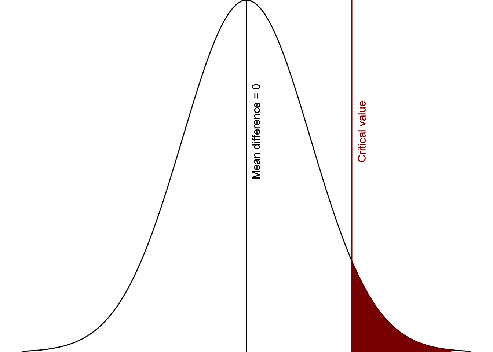
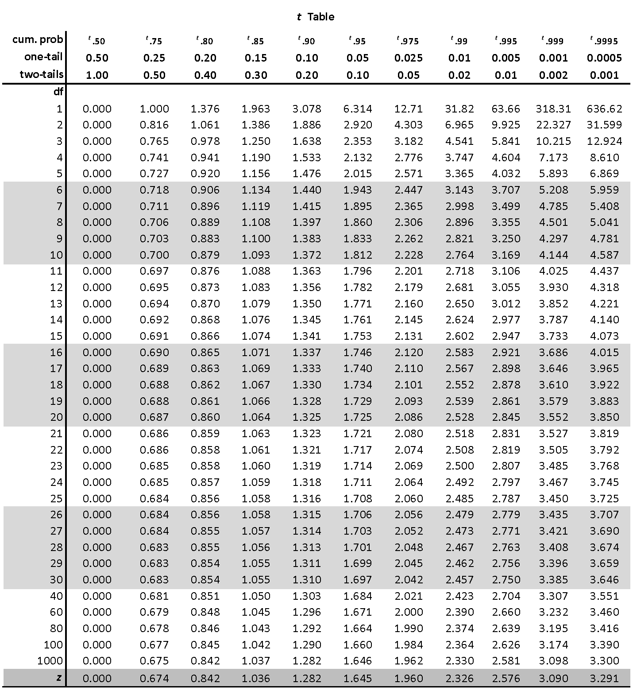

# (PART) NHST {.unnumbered}

# 4. Hypothesis testing

Now that we've covered descriptive statistics and are familiar with our statistical software, it's time to turn to inferential statistics. Remember, we conduct inferential statistics because we often cannot collect data from an entire population. Therefore, we collect a sample to draw inferences about the population of interest.

One of the ways we make inferences is using hypothesis testing. We are going to be learning about **Null Hypothesis Significance Testing (NHST)**, which means we test and make inferences about the null hypothesis (which we'll learn about in more detail soon).

Regardless of the inferential statistic we are performing, hypothesis testing goes through the same basic set of procedures:

1.  **Look at the data** by examining the descriptive statistics and describing your hypotheses
2.  **Check assumptions** to ensure your data is satisfactory for performing the inferential statistic (or choosing the correct statistic depending on which assumptions are met)
3.  **Perform the test** by running the inferential statistic
4.  **Interpret the results** and make a decision about whether you reject or fail to reject the null hypothesis, write-up the results in APA format, and provide a visualization of the results.


```{=html}
<div class="vembedr">
<div>
<iframe src="https://www.youtube.com/embed/Eqs9L6gDaJg" width="533" height="300" frameborder="0" allowfullscreen="" data-external="1"></iframe>
</div>
</div>
```

Let's go through each of these in turn, using a hypothetical example.

<div class="info">
<p>Check Canvas for a useful 2-page “cheat sheet” of the hypothesis
testing 4-step process detailed here. It summarizes the info you will
learn here and in the subseqeunt set of chapters. Print it and bring it
with you to class! It’s something you can use every time you perform
inferential statistics.</p>
</div>

## Example of hypothesis testing

Imagine a researcher wants to replicate Alburt Bandura's famous Bobo doll experiment. In their replication study, the researcher randomly assigns 30 six-year-old children to one of two conditions: one group watches a video of an adult showing aggressive behavior toward a Bobo doll and the other group watches a video of an adult passively playing with a Bobo doll. After watching their assigned video, children then went to the same room from the videos with the same Bobo doll. Researchers observed for aggressive behaviors[^04.0-hypothesis-testing-1].

[^04.0-hypothesis-testing-1]: Note that the study design was actually much more impressive than what I'm describing. They accounted for the children's baseline aggression and the gender of both the child and the person in the video. If you are interested, you can read more here: <https://www.simplypsychology.org/bobo-doll.html>

### 1. Look at the data

The first step is to look at our data. We need to make sure we understand our study, what research design was used, how data was collected, and what the dataset looks like.

#### Describe the data

Although we are working with a hypothetical scenario, we can think about what the data would look like in a spreadsheet. We have two variables:

1.  The independent variable is what condition of the study they were randomly assigned to. The variable might be called "condition" which might have two categories or levels, one being "aggressive" and the other being "passive".
2.  The dependent variable is the observed aggressive behaviors. The variable might be called "aggression" which would be a continuous measure of how many aggressive behaviors were observed for the child.

This would result in two columns, one for each variable, and 30 rows, one for each participant in the study.

#### Specify the hypotheses

As mentioned previously, we are using Null Hypothesis Significance Testing, or NHST. We are therefore *testing hypotheses* in our inferential statistics, and specifically testing the null hypothesis. We need to first write out our hypotheses, which are our **alternative** and **null** hypotheses.

The alternative hypothesis is that there is an effect of the IV on the DV, or a relationship between two variables, or difference between groups. We usually write this out as H~1~ although sometimes you'll see it written as H~a~.

The null hypothesis is that there is no effect, no relationship, or no difference. Most null hypotheses tend to be *nill* hypotheses, and nill means zero. That's hopefully an easy way to remember the difference between null and alternative hypotheses. We usually write the null hypothesis out as H~0~.

<div class="info">
<p>Note that regardless of our research question, our null hypothesis is
always that there is no effect. This is what “null” means: none or zero
effect.</p>
</div>

The two hypotheses--our alternative and null hypotheses--must be **mutually exclusive** and **exhaustive**. Mutually exclusive means a potential result of the study cannot support both the alternative and null hypothesis; it must exclusively support only one. Exhaustive means the entire possible universe of results must be captured in our two hypotheses; it must exhaust all possible results.

<div class="warning">
<p>A common error students make in writing out their hypotheses is that
they are not mutually exclusive or exhaustive. If there is any possible
value that, if you got it, would not support either hypothesis then your
hypotheses are not exhaustive. If there is any possible value that, if
you got it, would support both hypotheses then your hypotheses are not
mutually exclusive.</p>
</div>

We might also have **directional** or **non-directional** hypotheses. Directional hypotheses are also called one-tailed hypotheses because only one tail of the distribution would lead us to fail to reject the null hypothesis. Non-directional hypotheses are such that we don't know whether the difference will be greater or less than 0, but we just think there will be a difference; these are also called two-tailed hypotheses because both tails of the distribution would lead us to fail to reject the null hypothesis. This will make a little more sense below and a lot more sense in the next chapter.

Let's go back to our Bobo doll replication study. What might the hypotheses be? There should be theory and research to support alternative hypotheses. There is ample research now that viewing aggression leads to aggression through imitation and observed learning. Therefore, the researcher likely has a hypothesis that watching the aggressive adult will lead to more aggressive behavior than watching the passive adult.

Therefore, our hypotheses would be:

**H~1~**: Children watching the video with the adult aggressively playing with the Bobo doll will exhibit *more* aggressive behaviors than children watching the video with the adult playing passively.

**H~0~**: There will be *no difference* in children's aggressive behaviors between the two groups OR children watching the video with the adult aggressively playing with the Bobo doll will exhibit *fewer* aggressive behaviors than children watching the video with the adult playing passively.

Let's analyze these hypotheses in more detail:

1.  The hypotheses are mutually exclusive because no possible result could be both more aggressive AND no difference in aggression, for example.

2.  The hypotheses are exhaustive because all possible results are that there are fewer, zero, or more aggressive behaviors when comparing the groups. Basically, it encompasses negative infinity to positive infinity!

3.  The hypotheses are one-tailed because we anticipate a direction in the difference between the groups. If we had no prior thought about how one group would compare to another, then we could have had a two-tailed, non-directional hypothesis.

A common error in a directional hypothesis like this is to forget that the null hypothesis is both no difference *and* the opposite. In other words, we have three possible options for our null and alternative hypotheses based on direction ($\mu$ is the Greek letter "mu" and we often use it to signify the mean):

|                        | Two-tailed         | One-tailed (greater) | One-tailed (less than) |
|------------------|------------------|------------------|------------------|
| **Alternative** (H~1~) | $\mu_1$ != $\mu_2$ | $\mu_1$ \> $\mu_2$   | $\mu_1$ \< $\mu_2$     |
| **Null** (H~0~)        | $\mu_1$ == $\mu_2$ | $\mu_1$ \<= $\mu_2$  | $\mu_1$ \>= $\mu_2$    |

Since we're talking about mean differences, we could also reformulate the above table slightly differently:

|                        | Two-tailed        | One-tailed (greater) | One-tailed (less than) |
|------------------|------------------|------------------|------------------|
| **Alternative** (H~1~) | $\mu_{diff}$ != 0 | $\mu_{diff}$ \> 0    | $\mu_{diff}$ \< 0      |
| **Null** (H~0~)        | $\mu_{diff}$ == 0 | $\mu_{diff}$ \<= 0   | $\mu_{diff}$ \>= 0     |

<div class="info">
<p>Note: != means “not equal” like the ≠ symbol. I write != because that
is the notation that R uses for “not equal.”</p>
<p>Similarly, you might be wondering why I use == instead of just =.
Again, this is the notion R uses for “exactly equal to.” In R, a single
equal sign is usually equivalent to the assignment operator (e.g., x =
10 means assign 10 to the variable x).</p>
</div>

### 2. Check assumptions

We're going to skip over this for now (read more in the "Parametric Assumptions" chapter later). Just keep in the back of your head that you need to understand whether you met the assumptions to know exactly what statistical test to perform.

### 3. Perform the test

<div class="info">
<p>For this example chapter, we’re going to walk through how we might do
these analyses by hand. Back in the day before computers existed, or
before they were more widely available, this is how folks would analyze
their data!</p>
<p>This helps us both understand the “behind the scenes” processes of
our statistical programs, but also gives us a greater appreciation for
what our statistical programs provide us.</p>
</div>

The basic thing we're trying to do with our inferential testing is determine what constitutes "more" aggression versus "no difference" in aggression.

No difference seems easy. That's a difference of zero, right? Well, not exactly, because it's highly unlikely we would get an *exact* difference of zero. Therefore the question is: which values are close enough to a difference of zero that we'd still say that there is no difference? If our values are within that range, then we would fail to reject the null hypothesis. If our values are *outside* that range, then we would reject the null hypothesis.

<div class="warning">
<p>Note my language carefully here: fail to reject the null hypothesis
OR reject the null hypothesis. Note how I am not saying support the
alternative hypothesis!</p>
<p>Through NHST, we are only ever testing the null hypothesis and
therefore can only make conclusions about the null hypothesis. This is
why we need replication studies to provide ample support for alternative
hypotheses.</p>
</div>

Let's try to visualize this. We are saying that the null hypothesis is there is no difference (or less aggression), but at some point no difference turns into *greater* difference. Furthermore, we have a directional hypothesis in that we do not think the difference will be negative, that children watching the adult play aggressively will exhibit fewer aggressive behaviors. Basically, we need to know what the critical value is in the figure below.

<div class="figure" style="text-align: center">

<p class="caption">(\#fig:unnamed-chunk-8)Critical area of statistical significance</p>
</div>

<div class="info">
<p>This visual is for a one-tailed, directional hypothesis with an alpha
of 5%. Therefore, the critical region is only on one side and covers 5%
of the area under the curve.</p>
<p>If our test had been for a two-tailed, non-directional hypothesis
with an alpha of 5% then the critical region would be on both sides of
the curve, with 2.5% of the area under the curve on both sides.</p>
<p>If our test had been one-tailed with an alpha of 1%, then the
critical region would be further to the right (larger, and in fact would
be 2.048, which you can find in the table below) and would only be 1% of
the area under the curve.</p>
</div>

We figure out that critical value based on what we set as our level of significance, also known as the **alpha level**. Most studies you read use the arbitrary $\alpha$ = .05 (or 5%), although we really should be thinking critically about what alpha level we use (more on that in the next chapter). In the visualization above, we set the alpha to 5% and so the area shaded in red is exactly 5% of the area under the curve of the normal distribution.

Our alpha is the level of which we are saying would be considered "surprising" versus "not surprising." If we got a mean difference that fell in that red area, then we would consider that "surprising" *if we believed the null hypothesis was true*. Basically, if we assume there is a mean difference of 0 (i.e., the null hypothesis), values past the critical value would be considered surprising enough that we would say that we reject the null hypothesis. Again, this is why it is called *null hypothesis significance testing*.

In other words, *the area in red are values that are unlikely to occur if the null hypothesis (in this case, mean difference \<= 0) were true.*

Now that we understand that a bit better, how do we find out our critical value, or the red region? We do so based on our understanding of the incredible properties of the normal distribution! We also do it based on knowing what statistical test we are performing (covered in more detail in Chapter \@ref(choosing-the-correct-test)). Back in the day before computers, some fancy mathematicians and statisticians figured out the exact *t*-values based on things like the direction of our hypothesis, our alpha, and our degrees of freedom. Let's figure these out for our example:

1.  **Direction of our hypothesis**: We have already determined we're using a one-tailed hypothesis because we have a directional hypothesis
2.  **Alpha**: Let's stick with the default that most psychological research uses of $\alpha$ = .05
3.  **Degrees of freedom**: For this test, this is calculated by n~1~ + n~2~ - 2, or N - 2. We have 30 children total, so 30 - 2 is 28

<div class="info">
<p>In our course, we will always assume that alpha is 5%. However, our
next chapter will explain more about when we might change our alpha,
typically to something lower like 1% or .5% or .1%.</p>
</div>

We then go to a t-table like the one below and find the cell we are looking for to identify our **critical t-value (*t*~crit~)** which we will then compare to our **obtained t-value (*t~obt~*)** in the 4th step.



First, we have a one-tailed hypothesis and our alpha probability is set at .05 so we're going to look under the sixth column (t~.95~, one-tail = .05). Then we need to find the row for our degrees of freedom (df = 28). That leads us to our critical t-value, a ***t~crit~*** **of** **1.701**.

<div class="info">
<p>If our alpha was still .05 but we had a two-tailed test, then we
would look under the seventh column (t.975, two-tails = .05).</p>
<p>If our alpha was .01 and one-tailed, we’d look at the eighth column,
and if it was .01 and two-tailed we’d look at the ninth column.</p>
</div>

Let's figure out how to get our obtained t-value (*t~obt~*) results based on the data from our study. We had 30 participants, 15 in each condition. The researcher performed the experiment and got the following results:

-   Children who watched the video of the adult playing aggressively with the Bobo doll displayed an average of 51.10 aggressive behaviors (*SD* = 3.50).

-   Children who watched the video of the adult playing passively with the Bobo doll displayed an average of 27.40 aggressive behaviors (*SD* = 3.30).

The mean difference is 51.10 - 27.40 = 23.70. We'll learn how to conduct a t-test in jamovi later, but for now you can just input the numbers into [this calculator](https://www.graphpad.com/quickcalcs/ttest1/?format=SD) (note: select to `Enter mean, SD and N` and choose the test `Unpaired t test`. It nicely gives you a lot of the values, but the one we are looking for is the test statistic, which is ***t~obt~*** **= 19.08** (notice we round to two decimals).

<div class="info">
<p>The calculator also gives us our exact p-value, which in this case is
&lt; .00001 but in APA style we typically report p-values to three
decimal places, so we would say p &lt; .001. The probability of getting
a t-value as large as we did it less than .1% (less than our alpha of
.05, so it is statistically significant). Very surprising!</p>
<p>This calculator is acting as a statistical software and therefore
giving us our exact p-value just like jamovi will provide for you once
we move to the software. For now, just appreciate that we can estimate
whether we met the p-value threshold when we analyze things by hand
below.</p>
</div>

### 4. Interpret the results

We then need to compared our **critical t-value (*t*~crit~ = 1.701)** to our **obtained t-value (*t~obt~* = 19.08):**

-   When *t~obt~ \> t~crit~* then we reject the null hypothesis. The results are statistically significant (*p* \< α).

-   When *t~obt~ \< t~crit~* then we fail to reject the null hypothesis. The results are not statistically significant (*p* \> α).

Since 19.08 \> 1.701, *we* *reject the null hypothesis that there is no difference in conditions or that children in the passive condition displayed more aggression than children in the aggressive condition.*

<div class="warning">
<p>A common mistake is assuming that p &lt; .05 means that the
alternative hypothesis is true. This is inaccurate because the p-value
is the probability of our data given the null hypothesis is true. It
says nothing about the alternative hypothesis.</p>
<p>Similarly, a common mistake is assuming p &gt; .05 means the
alternative hypothesis is false. This is incorrect for the same exact
reason; NHST says nothing about the alternative hypothesis.</p>
</div>

#### Type 1 and 2 errors

However, this is when **Type 1** and **Type 2** errors come into play. Just because we get a result *does not automatically mean that result is 100% accurate*. There are many things that could lead us to an inaccurate interpretation! Perhaps it was a fluke, perhaps you didn't do something correct in your study, or perhaps the effect does or does not actually exist.

I like to use this table when discussing errors. On the far left column, we have our results: were they statistically significant (*p* \< .05) or not (*p* \> .05)? On the top row, we have whether *in the real world* the null or alternative hypothesis is true. In reality, we can *never* truly know whether the null or alternative hypothesis is true. We can at best approximate our understanding of the real world through replication!

|                                                    | H~0~ is true           | H~1~ is true           |
|--------------------------------------------------|--------------------------------|----------------------------------|
| ***p*** **\< .05** (statistically significant)     | Type 1 error           | Correct interpretation |
| ***p*** **\> .05** (statistically non-significant) | Correct interpretation | Type 2 error           |

Therefore, any time we get a statistically significant result (*p* \< .05), then *either* we made a correct interpretation *or we made a Type 1 error!*

Similarly, any time we get a statistically non-significant results (*p* \> .05) then *either* we made a correct interpretation *or we made a Type 2 error*!

<div class="warning">
<p>Another common mistake is to assume statistically significant results
mean we 100% reject the null hypothesis. However, we can never know
beyond a certainty of a doubt whether a significant result is a correct
interpretation; we could also be making a Type 1 error.</p>
<p>Similarly, another common mistake is to assume a non-significant
results we definitely fail to reject the null hypothesis. We never know
for sure whether the null or alternative is true, so in this case we
could be making a Type 2 error.</p>
</div>

*If you'd like to read a more in-depth discussion of error control, I recommend also reading [Daniel Lakens' chapter in his textbook "Improving Your Statistical Inferences."](https://lakens.github.io/statistical_inferences/errorcontrol.html)*

Next week we'll learn a lot more about p-values, errors, and more. For now, tuck this piece of information into your brain to remember!

### Final note

When you read journal articles, you'll note that they rarely discuss the null or alternative hypothesis. They may explain their research questions or their hypotheses (these hypotheses are their alternative hypotheses), but they rarely discuss the null.

This is not *necessarily* a bad thing. Rather, what may be problematic with it is if researchers apply NHST without critically thinking about what their null hypothesis is or whether they have a one-sided hypothesis, which leads researchers to use defaults when the defaults may not be most appropriate. However, it would probably be a better thing if everyone clearly specified their alternative and null hypotheses if they are doing NHST.

Also, you may have heard some things about *p*-values not being reliable or desirable. We'll discuss what *p*-values are and how some researchers want to move away from them in the next chapter. In the meantime, just know that *p*-values are often misunderstood and therefore misused, and a lot of the recommendations for moving away from *p*-values are just replacing one potentially problematic approach with another.
