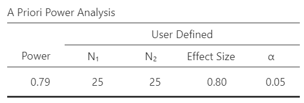
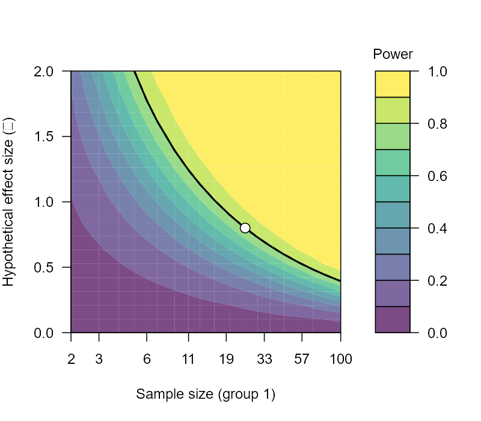

## Sample size & power analysis

### Sample size (N)

Sample size is the total number of participants in a study (often denoted as *n* in a paper). In a between-subjects study, we should also describe how many participants are in each group, especially if the groups are unequal in size.

Often, the biggest question we want to know is: what sample size do I need for my study? Daniel Lakens has a great new [preprint](https://psyarxiv.com/9d3yf/) and [chapter](https://lakens.github.io/statistical_inferences/power.html) out on the topic and a [sample size justification online tool](https://shiny.ieis.tue.nl/sample_size_justification/). We often cannot measure the entire population, but some other ways we can determine the sample size are:

1.  Resource constraints: sometimes time and budget limits our sample size
2.  Accuracy or an *a priori* power analysis: based on the statistical power we hope to achieve (which is in turn based on the effect size we expect)
3.  Heuristics: some prespecified rule or norm that is described in the literature (to be avoided as much as possible because they're often wrong)

The first option is more of a research methods discussion and will not be discussed here. The third option is to be avoided as much as possible. Therefore, that leads us to the second option, which is to conduct an *a priori* power analysis.

We'll cover it broadly here, but if you want to learn more about conducting power analyses in jamovi [Bartlett & Charles (2022) have a great preprint on the topic](https://psyarxiv.com/bh8m9/).

### BEAN: Power analysis

We previously saw how alpha and power relate to one another. In the [interactive calculator](https://rpsychologist.com/d3/pdist/) you started to discover that effect sizes and sample size also relate to alpha and power. This is the power of the BEAN: if you know three out of the four of BEAN, you can determine the fourth. Power, effect sizes, alpha, and sample sizes all interrelate!

Typically, there are three things we may be interested in figuring out related to BEAN:

1.  What sample size do I need given the effect size of interest, alpha level, and power level?
2.  What power do I have to detect the effect size of interest given my alpha level and sample size?
3.  What effect size can I reasonably detect given my alpha level, power level, and sample size?

There is software out there to help you conduct power analyses. The most popular is [G\*Power](https://www.psychologie.hhu.de/arbeitsgruppen/allgemeine-psychologie-und-arbeitspsychologie/gpower.html) (there are various guides on how to use G\*Power, including [this](https://link.springer.com/article/10.3758/BF03203630) and [this](https://link.springer.com/article/10.3758/BF03193146)). There are specific power calculators for more complex statistical procedures. There are also methods of using simulations to determine the power, but they are more complex and we won't cover them in this course.

For our purposes, we're going to simplify things and use the jpower module in jamovi. This can calculate power for an independent samples t-test, a paired samples t-test, and a one-sample t-test. Our previous example in the last chapter (the Bobo doll experiment) has two groups in a between-subjects design. Next chapter you'll learn how to determine what statistical test you would perform, but for now I will just tell you that we would conduct an independent samples t-test with this experiment's data.

In the jpower module, choose your statistical test in the drop-down menu; in this case, let's choose independent samples t-test. Next, you specify what you want to calculate: your N per group (sample size), power, or effect size. It will grey out that box in the three boxes below. Let's discuss them in turn:

1.  [Drop-down menu]{.underline}: First choose whether you are solving for sample size, effect size, or power.
2.  [Minimally-interesting effect size]{.underline}: it shows the lower case Greek letter delta here, but we can essentially think of it as a Cohen's *d* value. Go back to the effect size section for help in determining your smallest effect size of interest.
3.  [Minimum desired power]{.underline}: remember from the last section that when we increase power, we increase the likelihood of both obtaining statistically significant results *and* the likelihood that a statistically significant result because the alternative hypothesis is true than that the null hypothesis is true.
4.  [N for group 1]{.underline}: this is the sample size in one of your two groups.
5.  [Relative size of group 2 to group 1]{.underline}: if your sample sizes are equal in both groups, leave it at 1. If they aren't, you need to figure out the ratio. For example, if one group is *n* = 20 and the other is *n* = 40 then you would change this box to "2". You can easily calculate this by dividing *n*~2~ by *n*~1~.
6.  [$\alpha$ (type I error rate)]{.underline}: remember from the last section that when we decrease alpha, we increase the likelihood of obtaining non-significant results when the null hypothesis is true *and* increase the likelihood that a statistically significant result means the alternative hypothesis is true. You probably shouldn't increase it above .05, but you should consider whether it would be useful to decrease it in your case.
7.  [Tails]{.underline}: specify whether you have a two-tailed (non-directional) or one-tailed (directional) hypothesis.

There are also options for four types of plots and whether to have explanatory text. For now, keep the explanatory text checked because it will help explain what is going on in the results. The plots are optional and I encourage you to check them out to see if they help you understand what is going on.

### Power analysis example #1

Let's return to our example that we used in our [interactive calculator](https://rpsychologist.com/d3/pdist/) before. We are going to calculate Power, set our effect size at $\delta$ = .8, N for group 1 at 25, Relative size of group 2 to group 1 at 1 (equal sample sizes), and $\alpha$ (type I error rate) to .05. We'll assume we have a two-tailed hypothesis for now. You should get the following results. This table specifies that we defined the sample size, effect size, and alpha, which results in a power calculation of 79%.

{width="353"}

The results also provide a useful explanation:

> A design with a sample size of 25 in each group can detect effect sizes of δ≥0.8 with a probability of at least 0.791, assuming a two-sided criterion for detection that allows for a maximum Type I error rate of a=0.05.

This assumes that an effect size of .8 is the smallest effect size of interest. The next table shows us the power to detect various other effect sizes based on our alpha and sample size:

|  True effect size  | Power to detect |      Description       |
|:------------------:|:---------------:|:----------------------:|
|   0 \< d = 0.566   |      ≤50%       |      Likely miss       |
| 0.566 \< d = 0.809 |   50% -- 80%    | Good chance of missing |
| 0.809 \< d = 1.041 |   80% -- 95%    |    Probably detect     |
|     d = 1.041      |      ≥95%       |  Almost surely detect  |

In other words, we are almost sure to detect really large effect sizes (d \> 1.04), but we'll likely miss really small effect sizes (d \< .56). This gives us a good hint to the relationship among BEAN: holding alpha and sample size constant, as effect sizes go up power goes up.

The Power Contour plot can show a bit more about how power (color), effect size (y-axis) and sample size (x-axis) all relate to one another. Notice how the x-axis is not linear. We are learning some more about the relationship among BEAN: increasing our sample size increases our power, holding alpha and effect size constant.

{width="457"}

The next two plots are basically the Power Contour plot, but they shift power to the y-axis and either show effect size or N on the x-axis.

The last plot (Power Demonstration) helps us visualize our Type I and Type II errors and correct inferences nicely. The purple distribution is our null hypothesis distribution (centered at *d* = 0) and the green distribution is our alternative hypothesis distribution (centered at *d* = .8). The vertical dashed lines are the critical values of obtaining *p* \< .05 on either side of the null distribution (so 2.5% on either side). The dark green area is therefore our power (80%) and the dark purple areas are our Type I error rate (5%). The light green area to the left of the dashed line is our Type II error rate (20%) and the light purple area is the probability of a correct inference assuming the null is true (95%). Keep in mind that these are the distributions of *both* hypotheses though, and in reality only one is true. We can just never know which is true; we can at best approximate it through repeated testing of effects.

{width="533"}

### Play with jpower

Play around some more with jpower. Try calculating other things (e.g., sample size or effect size). Play with power and see what increasing it does to your effect size and sample size. Play with effect sizes and see what decreasing them does to your power and sample size. Play with alpha (don't go higher than .05) and see what that does to your power, effect size, and sample size. And lastly, play with your sample size and see what it does to your power and effect size.

Your assignments for this unit will have you conduct power analyses based on various scenarios, so playing around with jpower will help prepare you for them.

### Extending our knowledge of power analysis

If you'd like to learn more about power analyses in a variety of experimental designs using G\*Power or R packages, I recommend this article by [Perugini et al. (2018) called "A practical primer to power analysis for simple experimental designs."](https://www.rips-irsp.com/articles/10.5334/irsp.181/)
