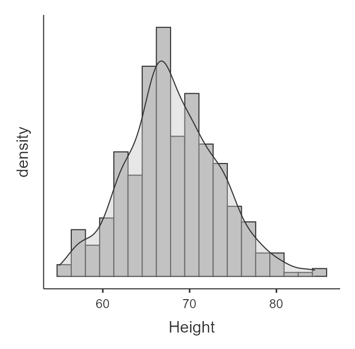
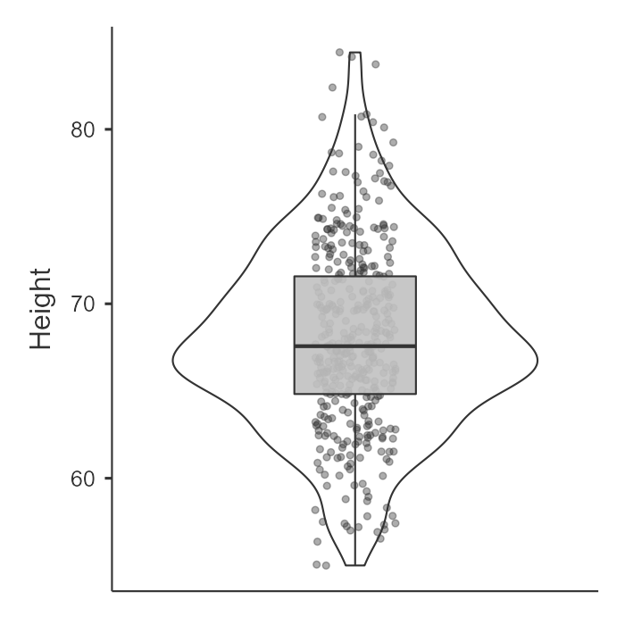
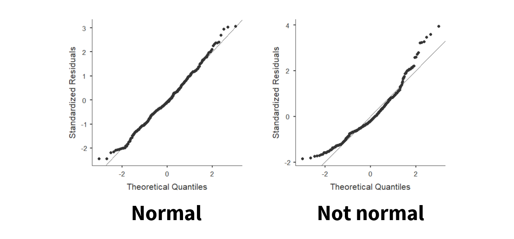

## Checking assumptions

There are four basic assumptions of most parametric tests:

1.  Normal distribution
2.  Interval or ratio (i.e., continuous) dependent variable
3.  Homogeneity of variances
4.  Independent scores


```{=html}
<div class="vembedr">
<div>
<iframe src="https://www.youtube.com/embed/tNojQp7DQt8" width="533" height="300" frameborder="0" allowfullscreen="" data-external="1"></iframe>
</div>
</div>
```

Let's discuss these in turn and how to test for them.

### Normal distribution

For all our statistics, our dependent variable needs to be normally distributed.[^checking-assumptions-1] We have already covered what the normal distribution is multiple times, so let's move on to how to test for normality. There are four ways to test for normality **and we should test for normality using as many tests as we possibly can!**

[^checking-assumptions-1]: Technically, it's that the *residuals* need to be normally distributed, but in the case of t-tests and ANOVAs the results are the same if we test for normality of residuals or the dependent variable.

1.  Visualize the distribution
2.  Test the skew and kurtosis
3.  Conduct a Shapiro-Wilk test
4.  Visualize the Q-Q plot

#### Visualize the distribution

In jamovi, we can go to the Explorations option and choose Descriptives. Under Plots, we can choose a histogram and/or density plot (figure on the left) or boxplot and/or violin plot and/or data points (figure on the right). We can just look at this data and visually inspect with our eyes whether the data is normally distributed based on the density curve. We are looking to see to what extent it looks like a normal distribution. Height looks pretty fairly normally distributed in this case.

{width="400"}

{width="400"}

#### Test the skew and kurtosis

In jamovi, we can go to the Explorations option and choose Descriptives. Under statistics, choose skew and kurtosis. You'll have to do a bit more work to actually figure out whether the skew and kurtosis is problematic though.

For height, here is our skew and kurtosis:

|                     |            |
|---------------------|------------|
| **Descriptives**    | **Height** |
| Skewness            | .230       |
| Std. error skewness | .121       |
| Kurtosis            | .113       |
| Std. error kurtosis | .241       |

We need to calculate *z*-scores for skew and kurtosis. We do that by dividing the value by its standard error:

-   Skew: .230 / .121 = 1.90

-   Kurtosis: .113 / .241 = .47

How do we know if it's problematic? **If the *z*-score for skew or kurtosis are less than \|1.96\| then it is *not* statistically significant and *is* normally distributed.** However, if the *z* \> \|1.96\| then it *is* statistically significant and *is not* normally distributed. In this case, both skew and kurtosis z-scores are less than 1.96 so we meet the assumption of normal distribution as evidenced by skew and kurtosis.

#### Shapiro-Wilk test

In jamovi, we can go to the Explorations option and choose Descriptives. Under statistics, choose Shapiro-Wilk. It will provide you the Shapiro-Wilk W test statistic and its respective p-value. In our case, Shapiro-Wilk's for height is 68.03, *p* = .070. **If the Shapiro-Wilk's test is *not* statistically significant then it *is* normally distributed.** However, if the Shapiro-Wilk's test *is* statistically significant then it *is not* normally distributed. In this case, our Shapiro-Wilk's test is not statistically significant so we meet the assumption of normal distribution as evidenced by the Shapiro-Wilk's test.

#### Q-Q plot

Last, we can visualize the Q-Q plot. In jamovi, we can go to the Explorations option and choose Descriptives. Under plots, choose Q-Q plot. We don't need to go into details of what is being visualized, but what we are looking for is that the data points fall along the diagonal line. On the figure on the left, we can see that the data is pretty well falling on the diagonal line (with small deviations at the tails) so we can say it looks normally distributed. However, on the figure on the right, the data points deviate from the diagonal line pretty significantly and so we can say it does not look normally distributed.



Remember we should look at all pieces of evidence to determine whether we meet the assumption of normal distribution. Typically, all four will support each other, but there are times when some evidence contradicts other evidence. You'll have to use your best judgment there, and often the visual inspection is the one I prioritize (e.g., if it doesn't look normally distributed but then the other tests suggest it is, I would probably be cautious and just say we don't meet the assumption).

### Interval/ratio data

If we are performing a test that has a continuous DV, then the variable must be measured at the interval or ratio level. It is important that the data has proportional intervals between levels of the variable, and ordinal variables often do not meet this assumption.

It is very important to avoid treating ordinal variables as continuous variables. We cannot calculate a mean or difference between ordinal values, but we *can* for continuous variables. What is often done--and is often inappropriate to do--is treat Likert-scale items as a continuous DV. What we *can* do is take a sum or average of multiple Likert-scale items and treat that sum or average as a continuous DV.

There is no "test" we can perform here. Rather, you will need to just recognize whether data is interval/ratio (continuous) or ordinal/nominal (categorical).

### Homogeneity of variance

Our third assumption is that the variance in the DV needs to be the same at each level of the IV. If we fail to meet the assumption, we say we have heterogeneity. It might help you to remember that the prefix *homo* means same and *hetero* means different.

We can test this assumption in two ways.

#### Visualize the distribution of data across groups

First, we can look at the data points across groups. This can be done by choosing a plot in the Descriptives analysis and adding your IV to the "Split By" box. For example, here's an example of data that violates the assumption of homogeneity of variance (gender by mile time) because the variance in scores for females (1) is a lot wider than the variance in scores for males (0):

{width="500"}

Similarly, in the Descriptives under Statistics you can ask for Variance. The variance for Gender == 0 (male) is 6796.20 whereas the variance for Gender == 1 (female) is 15401.55. Clearly, there is much greater variability for females than males for time it takes to run the mile.

#### Levene's test

When we perform inferential statistics that have the assumption of homogeneity of variance, in jamovi there will be a check box to check the assumption. It will perform Levene's test.

However, you may be testing the assumption prior to running your analysis (or learning about inferential statistics just yet). In that case, to perform Levene's test, go to Analyses then ANOVA then One-way ANOVA. Move your continuous variable to the Dependent Variables box and move your nominal variable to the Grouping Variable box. Check the box "homogeneity test." Only report the results of Levene's test; ignore the one-way ANOVA results!

Here's the result of Levene's test for the effect of gender on mile duration:

| Levene's   |     F | df1 | df2 |      p |
|:-----------|------:|----:|----:|-------:|
| MileMinDur | 41.33 |   1 | 381 | \<.001 |

Like the other tests above, **a non-significant Levene's test means we meet the assumption of homogeneity of variance.** However, if Levene's test is statistically significant, then we fail to meet the assumption of homogeneity of variance and have heterogeneity of variance. In this case, our test is statistically significant so, in combination with our plot above, we say we violated this assumption.

### Independent scores

In between-subjects designs (e.g., the independent t-test or one-way ANOVA), data from different participants should be independent meaning that the response of one participant does not influence the response of another participant. We violate this assumption in the case of nested data (e.g., when our sample consists of students in three different classrooms, it is likely that students within classrooms are more similar than we would expect otherwise).

In within-subjects designs (e.g., the dependent t-test or repeated measures ANOVA), we automatically violate the assumption because *of course* the scores of one participant in one condition will relate to their scores on another condition. However, their scores should still not influence any other participant's response.

This is another assumption, like interval/ratio data, that we do not ever *test* but is a function of knowing our data.
