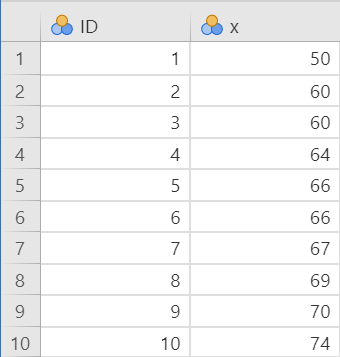
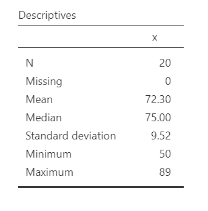
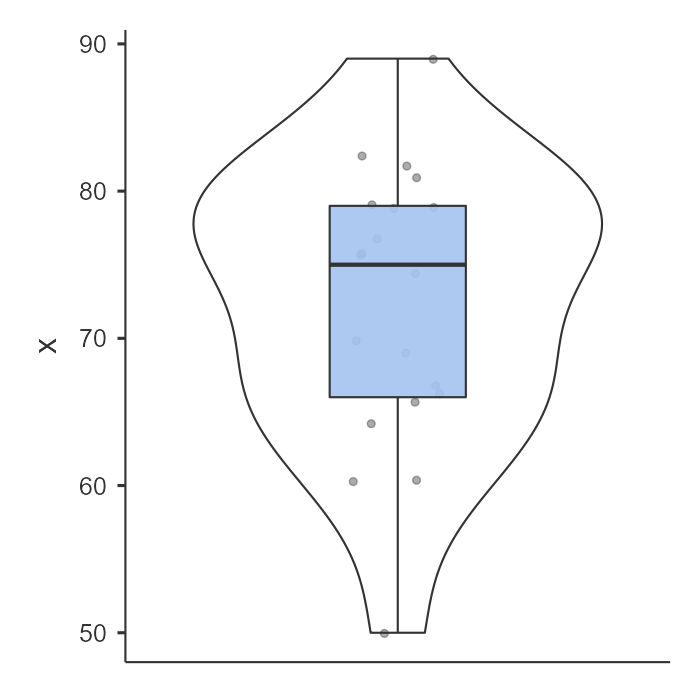
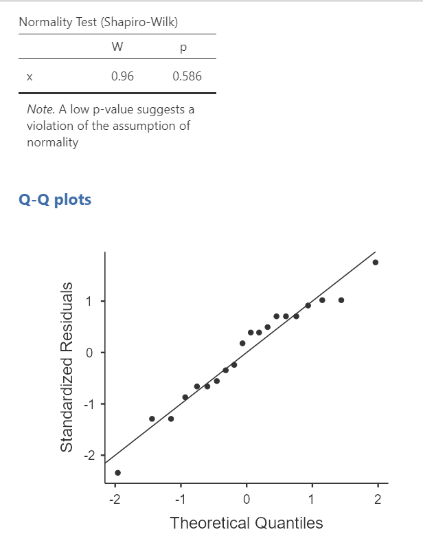
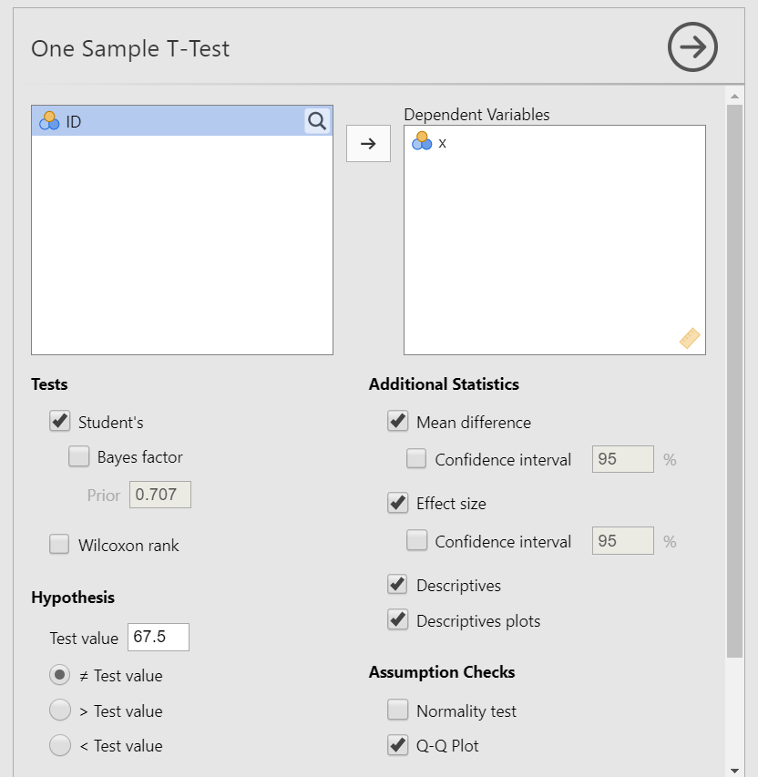
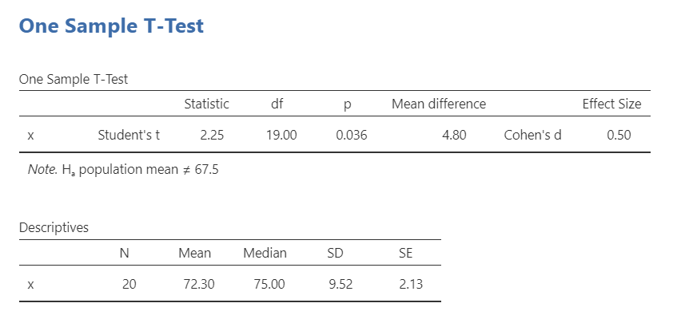
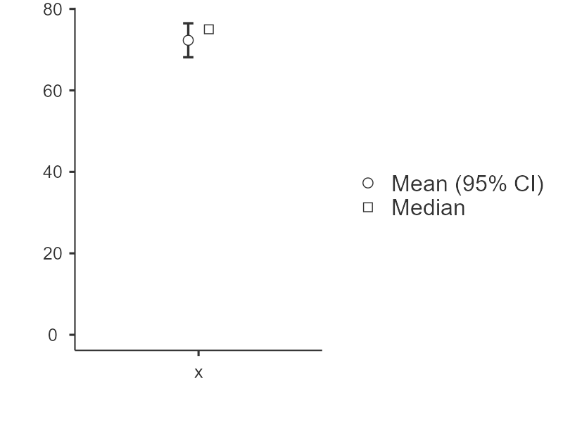
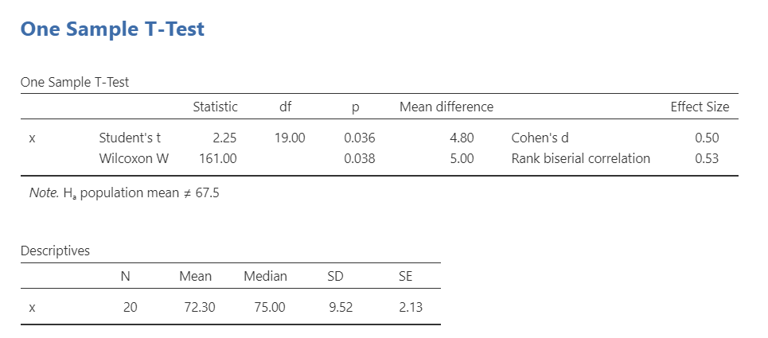

## 10. One sample t-test

The one-sample t-test is used to test the difference between our sample's mean on the dependent variable and the mean of the population.

There are three different types of alternative hypotheses we could have for the one sample t-test:

1.  **Two-tailed**

    -   $H_1$: The sample mean has a different mean than the population mean.
    -   $H_0$: There is no difference in means between the sample and population.

2.  **One-tailed**

    -   $H_1$: The sample has a greater mean than the population.
    -   $H_0$: The mean for the sample is less than or equal to the mean for the population.

3.  **One-tailed**

    -   $H_1$: The sample has a smaller mean than the population.
    -   $H_0$: The mean for the sample is greater than or equal to the mean for the population.

This is also the first time we'll be doing the full hypothesis testing procedures!

1.  Specify the hypotheses
2.  Look at the data
3.  Check assumptions
4.  Perform the test
5.  Interpret results

For this chapter, we're going to work with data from lsj-data. Open data from your Data Library in "lsj-data". Select and open "zeppo". This dataset is hypothetical data of 20 psychology students taking Dr. Zeppo's introductory statistics class. Dr. Zeppo wants to know if the psychology students tend to get the same grade as everyone else (*M* = 67.5) or whether they get a higher or lower grade. As students in a psychology course, we're going to assume psychology students get higher grades.

### Step 1: Look at the data

If you learn one thing through this course, it is that *you should always look at your data!!!* Descriptive and inferential statistics can sometimes hide weird things with your data, so it's incredibly important you look at it first.

#### Data set-up

To conduct the independent t-test, we first need to ensure our data is set-up properly in our dataset. This requires having two columns: one with our continuous dependent variable and one indicating which group the participant is in. Each row is a unique participant or unit of analysis.

Below is the first ten rows of our data from the zeppo dataset.

#### Describe the data

Once we confirm our data is setup correctly in jamovi, we should look at our data using descriptive statistics and graphs. First, our descriptive statistics are shown below. Our overall data consists of 20 cases and the students in our dataset have a mean grade of 72.30 (*SD* = 9.52). The minimum and maximum values look accurate; theoretically, student grades should range from 0-100. Lastly, the distribution of data looks possibly not normally distributed. Although we have a pretty small sample size, we can proceed with our analyses. First, though, we need to check our assumptions.

{width="523"}

#### Specify the hypotheses

For this chapter, we're going to work with data from lsj-data. Open data from your Data Library in "lsj-data". Select and open "zeppo". This dataset is hypothetical data of 20 psychology students taking Dr. Zeppo's introductory statistics class. Dr. Zeppo wants to know if the psychology students tend to get the same grade as everyone else (*M* = 67.5) or whether they get a higher or lower grade. As students in a psychology course, we're going to assume psychology students get higher grades.

First, it may be useful to understand what our dependent and independent variables are. Our dependent variable is the outcome variable, and in this case it's the grade students get in the course. Our independent variable that is presumed to "cause" the outcome, and in this case it's our sample of psychology students whom we're comparing to our population of all students.

Therefore our hypotheses can be written up as such:

-   $H_1$: Psychology students get higher grades than the population of Dr. Zeppo's students.
-   $H_0$: There is no difference in student grades between psychology students and the population of Dr. Zeppo's students.

Relatedly, we want to be clear about our alpha value. We'll stick with the norm of $\alpha$ = .05. Therefore, for our results to be statistically significant we want our *p*-value to be less than our $\alpha$ and so we want *p* \< .05.

### Step 2: Check assumptions

As a parametric test, the independent t-test has the same assumptions as other parametric tests (minus homogeneity of variance):

1.  The dependent variable is **normally distributed**

2.  The dependent variable is **interval or ratio** (i.e., continuous)

3.  Scores are **independent** between groups

We cannot test the second and third assumptions; rather, those are based on knowing your data.

However, we can and should test for the first assumption. Fortunately, the independent samples t-test in jamovi has two check boxes under "Assumption Checks" that lets us test for normality.

One thing to keep in mind in all statistical software is that we often check assumptions simultaneously to performing the statistical test. However, we should always check assumptions first before looking at and interpreting our results. Therefore, whereas the instructions for performing the test are below, we discuss checking assumptions here first to help ingrain the importance of always checking assumptions for interpreting results.

#### Testing normality

jamovi easily allows us to check for normality using all four methods we've learned about.

First, the Shapiro-Wilk test was not statistically significant (W = .96, *p* = .586); therefore, this indicates the data is normally distributed.

Second, the dots are fairly close to the diagonal line in the Q-Q plot.

")

Third, we can examine the z-scores of skew and kurtosis:

-   **Skew**: $-.53/.51 = -1.04$

-   **Kurtosis**: $.07/.99 = .07$

Remember that we divide the value by its standard error to determine the z-score. If the absolute value of it is below 1.96 then we assume it is normally distributed. Both skew and kurtosis meet the assumption of normality.

Fourth, we can examine the distribution of the data using a density curve. The curve in the violin plot shown above looks fairly bell-shaped so we can say we met the assumption.

Overall, all four tests lead us to conclude that we satisfy the assumption of normality.

### Step 3: Perform the test

#### Decide which statistical test you should be using

If you fail to meet the assumption of normality, and no transformation fixes the data, then you can use the [Wilcoxon W test].

If you meet the assumption of normality, then you can use the Student's t-test.

#### Decide which hypothesis you should be using

When you specified the hypotheses you should understand whether you had a directional (one-tailed) or non-directional (two-tailed) alternative hypothesis based on the research question.

If the alternative hypothesis is non-directional (two-tailed) then you choose `≠Test value`.

If the alternative hypothesis directional (one-tailed) then you choose `> Test value` if you think your sample has a higher average than the population or `< Test value` if you think your sample has a lower average than the population.

#### Perform the test

Now that we've satisfied the assumptions, we can perform the one sample t-test. Here are the steps for doing so in jamovi:

1.  Go to the Analyses tab, click the T-Tests button, and choose "One Sample T-Test".

2.  Move your dependent variable `x` to the Dependent Variables box.

3.  Under Tests, select `Student's` if you met the assumption of normality or `Wilcoxon rank` if you did not. We met the assumption, so we will select `Student's`.

4.  Under Hypothesis, input the population mean. In our case, it is `67.5` (this is the mean given to us by Dr. Zeppo). Also, select the hypothesis that matches your hypothesis. In our case, select `> Test value` because we believe psychology students have a higher mean than the test value (population mean).

5.  Under Additional Statistics, select `Mean difference`, `Effect size`, `Descriptives`, and (optionally) `Descriptives plots`.

6.  If you are using this test to check assumptions, under Assumption Checks, you can select both options: `Normality test` and `Q-Q plot`.

When you are done, your setup should look like this:

### Step 4: Interpret results

Once we are satisfied we have satisfied the assumptions for the independent t-test, we can interpret our results.

Our p-value is less than our alpha value of .05, so our results are statistically significant. Like most of the statistics we'll come across, the larger the t-statistic (or F-statistic, or chi-square statistic...), the smaller the p-value will be.

Because our results are statistically significant, we reject our null hypothesis that the population mean is less than or equal to the sample mean of psychology students.

However, remember what we've learned in the previous chapters! We rejected the null hypothesis, but there's always the chance that we've made a type 1 error.

#### Write up the results in APA style

When writing up the results of a statistical test, we should always include the following information:

1.  Description of your research question and/or hypotheses.
2.  Description of your data. If you fail to meet assumptions, you should specify that and describe what test you chose to perform as a result.
3.  The results of the inferential test, including what test was performed, the test value and degrees of freedom, p-value, and effect size.
4.  Interpretation of the results, including any other information as needed.

We can write up our results in APA something like this:

> Dr. Zeppo's psychology colleague hypothesized that his psychology students have a higher grade than the population of his students. Psychology students (*M* = 72.30, *SD* = 9.52, *n* = 20) had significantly higher grades than the population of Dr. Zeppo's students (*M* = 67.50), *t* (19) = 2.25, *p* = .046, *d* = .50.

Let's analyze that against the 4 things we need to report:

> **#1** Dr. Zeppo's psychology colleague hypothesized that his psychology students have a higher grade than the population of his students. **#4** Psychology students **#2** (*M* = 72.30, *SD* = 9.52, *n* = 20) **#4** had significantly higher grades than the population of Dr. Zeppo's students (*M* = 67.50), **#3** *t* (19) = 2.25, *p* = .046, *d* = .50.

Note that this is not the only way we can write up the results in APA format. The key is that we include all four pieces of information as specified above.

Also note that the M, SD, n, t, p, and d are all italicized! This is an important part of APA style to remember.

#### Visualize the results

By selecting `Descriptives plots` in the setup, you get the figure below. Personally, I don't think this is a very good plot. It's not very informative. It just provides the mean (circle), 95% confidence interval (blue bars), and the median.

Another default option in jamovi is via the Descriptives analysis. You can ask for the boxplot, violin plot, and data of your dependent variable split by your independent variable. This is a much better option. Not only does it show us our mean (black bars) and interquartile range (via the boxplot), but it also shows our distribution (violin plot) and data points (grey dots). This is much more informative. You can see this in the *Look at your data* section above. I would prefer to see the graph at the beginning of this chapter than the one that jamovi provides in your analysis.

### Additional information

#### Wilcoxon W test

If you fail to meet the assumption of normality, and no transformation fixes the data, then you can use the Wilcoxon W test.

The Wilcoxon W is not calculated based on the mean but rather the median. It has no assumptions about the distribution of data. Therefore, it is a non-parametric test. Here is what the output for the student's t-test and Wilcoxon W look like in jamovi:

To conduct this in jamovi, under Tests select `Wilcoxon W`. You will interpret the results similarly to the one sample t-test:

> Dr. Zeppo's psychology colleague hypothesized that his psychology students have a higher grade than the population of his students. Using a Wilcoxon W test, psychology students (*Mdn* = 75.00, *SD* = 9.52, *n* = 20) had a higher grade than the population of Dr. Zeppo's students (*M* = 67.5), *W* = 161, *p* = .038, $r_{bn}$ = .53.

Note that we no longer report the mean but rather the median. That is because Wilcoxon W is based on the median, not the mean score.

#### Positive and negative t values

Students often worry about positive or negative t-statistic values and are unsure how to interpret it. Positive or negative t-statistic values simply occur based on which group is listed first. Our t-statistic above is positive because we tested the difference between our sample and the population: (sample - population) = (72.3 - 67.5) = 4.80.

However, if our sample and population means were reversed, our mean difference would -4.80 and our t-statistic would be -2.25.

All that is to say, *your positive or negative t-statistic is arbitrary*. So do not fret!

One last note: this positive or negative t-statistic is only relevant for the t-test. You will not get negative values for the F-statistic or chi-square tests!

#### Your turn!

Open the `Sample_Dataset_2014.xlsx` file that we will be using for all Your Turn exercises. You can find the dataset here: [Sample_Dataset_2014.xlsx Download](https://github.com/danawanzer/stats-with-jamovi/blob/master/data/Sample_Dataset_2014.xlsx)

Perform one sample t-tests based on the following research questions. Think critically about whether you should be using a one-tailed or two-tailed hypothesis and check your assumptions so you know which test to use!

To get the most out of these exercises, try to first find out the answer on your own and then use the drop-down menus to check your answer.

1.  **Do the students in our dataset have a higher Writing score than the passing score (*M* = 70)?**

    -   Should you use a one-tailed or two-tailed hypothesis?

    -   Which statistic should you use based on your assumptions?

    -   Do the students in our dataset have a higher Writing score than the passing score?

2.  **Do the students in our dataset have the same national average height of college students (*M* = 68 inches)?**

    -   Should you use a one-tailed or two-tailed hypothesis?

    -   Which statistic should you use based on your assumptions?

    -   Do the students in our dataset have the same national average height of college students)?
