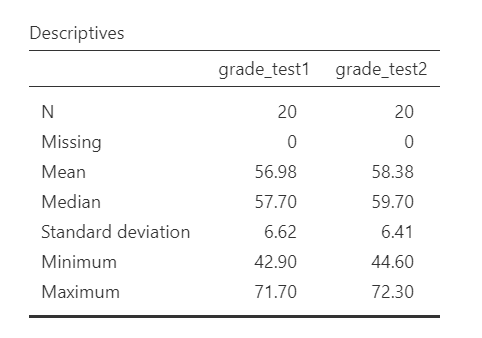
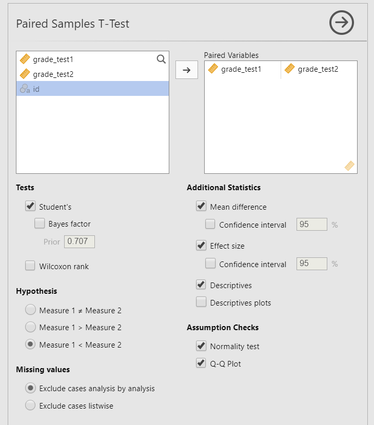
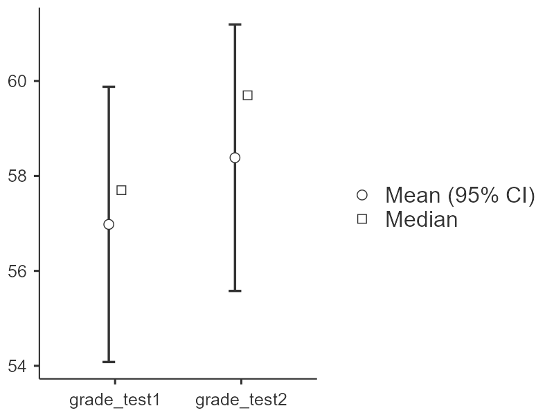
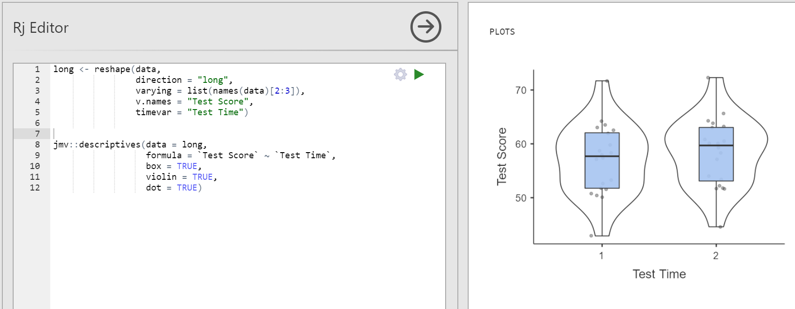
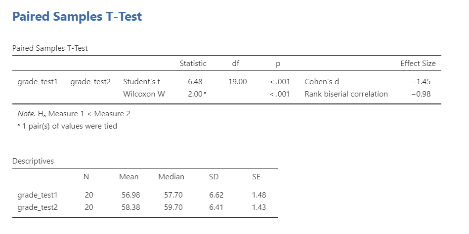

## 11. Dependent t-test


The dependent t-test is used to test the difference in our dependent variable between two categories in which participants are the *same* across categories. Our category variable is our independent variable. In other words, we use the dependent t-test when we have a research question with a **continuous dependent variable** and a **categorical independent variable with two categories in which the [same]{.underline} participants are in each category**.

The dependent t-test is also called a dependent samples t-test or paired samples t-test.

There are three different types of alternative hypotheses we could have for the dependent t-test:

1.  **Two-tailed**

    -   $H_1$: There is a difference in means between the two time points or conditions.
    -   $H_0$: There is no difference in means between the two time points or conditions.

2.  **One-tailed**

    -   $H_1$: The mean at time 1 or condition 1 is greater than the mean at time 2 or condition 2.
    -   $H_0$: The mean at time 1 or condition 1 is less than or equal to the mean at time 2 or condition 2.

3.  **One-tailed**

    -   $H_1$: The mean at time 1 or condition 1 is smaller than the mean at time 2 or condition 2.
    -   $H_0$: The mean at time 1 or condition 1 is greater than or equal to the mean at time 2 or condition 2.

### Step 1: Look at the data

For this chapter, we're going to work with data from lsj-data. Open data from your Data Library in "lsj-data". Select and open "Chico". This dataset is hypothetical data from Dr. Chico's class in which students took two tests: one early in the semester and one later in the semester. Dr. Chico thinks that the first test is a "wake up call" for students. When they realise how hard her class really is, they'll work harder for the second test and get a better mark. Is she right?

Here's a video walking through the dependent t-test.


```{=html}
<div class="vembedr">
<div>
<iframe src="https://www.youtube.com/embed/ywMPrS9Bo3Q" width="533" height="300" frameborder="0" allowfullscreen="" data-external="1"></iframe>
</div>
</div>
```

#### Data set-up

To conduct the dependent t-test, we first need to ensure our data is set-up properly in our dataset. This requires having two columns: one is our dependent variable score for the participant in one category and the other column is our dependent variable score for the participant in the other category. Each row is a unique participant or unit of analysis.


In the data above, what is your **independent variable**? What is your **dependent variable**?

#### Describe the data

Once we confirm our data is setup correctly in jamovi, we should look at our data using descriptive statistics and graphs. First, our descriptive statistics are shown below. Our overall data consists of 20 cases (students) and the average grade is 56.98 (*SD* = 6.62) at the first test and 58.38 (*SD* = 6.41) at the second test. We have no missing cases, and our minimum and maximum values look accurate; theoretically, student grades should range from 0-100. Lastly, the distribution of data looks fairly normally distributed, although I'm personally a little worried about our small sample size. Before we can proceed with our analyses, we'll need to check our assumptions.



#### Specify the hypotheses

Dr. Chico thinks that the first test is a "wake up call" for students. When they realise how hard her class really is, they'll work harder for the second test and get a better mark. That suggests Dr. Chico thinks students will have better scores on the second test compared to the first test. Therefore our hypotheses can be written up as such:

-   $H_1$: Students have higher scores on the second test compared to the first test.
-   $H_0$: Students have lower or the same scores on the second test compared to the first test.

From now on, we'll assume our $\alpha$ is .05 as default; however, remember that we should think critically about our alpha value when hypothesis testing!

### Step 2: Check assumptions

As a parametric test, the dependent t-test has the same assumptions as other parametric tests (minus homogeneity of variance because we are dealing with the same people across categories):

1.  The *differences in scores* in the dependent variable are **normally distributed**

2.  The dependent variable is **interval or ratio** (i.e., continuous)

3.  Scores are **independent** *across participants*

We cannot *test* the second and third assumptions; rather, those are based on knowing your data and research design.

However, we can and should test for the first assumption. Fortunately, the dependent samples t-test in jamovi has two check boxes under "Assumption Checks" that lets us test normality.

One thing to keep in mind in all statistical software is that we often check assumptions simultaneously to performing the statistical test. However, we should always check assumptions first before looking at and interpreting our results. Therefore, whereas the instructions for performing the test are below, we discuss checking assumptions here first to help ingrain the importance of always checking assumptions for interpreting results.

#### Testing normality

Notice how our dependent variable is really the difference in scores, and therefore that is what we are testing for normality. **First, you need to calculate a new variable that is the difference in scores.** Go to Compute and enter into the formulate box `Var1 - Var2` (in this case, `grade_test1-grade_test2`). Rename it to something meaningful to you. Then you are going to use that variable to test for normality.

We test for normality using the Shapiro-Wilk test and the Q-Q plot, as well as looking at the density/histogram plot and the skew/kurtosis (not shown here but still important to conduct!). The Shapiro-Wilk test was not statistically significant (W = .97, *p* = .678); therefore, this indicates the data is normally distributed. Furthermore, the lines are fairly close to the diagonal line in the Q-Q plot (although it's a bit hard to tell because our sample size is small). We can conclude that we satisfy the assumption of normality.


### Step 3: Perform the test

#### Decide which statistical test you should be using

If you violated the assumption of normality, and no transformation fixed your data, then you can perform the non-parametric version of the dependent t-test called the [Wilcoxon rank]. As a reminder, non-parametric tests do not make assumptions about the distribution of data because it deals with the *median* not the *mean*.

#### Decide which hypothesis you should be using

When you specified the hypotheses you should understand whether you had a directional (one-tailed) or non-directional (two-tailed) alternative hypothesis based on the research question.

If the alternative hypothesis is non-directional (two-tailed) then you choose `Measure 1 ≠ Measure 2`.

If the alternative hypothesis directional (one-tailed) then you choose `Measure 1 > Measure 2` or `Measure 1 < Measure 2` depending on which group you think has the higher average.

<div class="warning">
<p>Remember that the hypothesis you use is based on your alternative
hypothesis and research question! This is not based on what the data
looks like. It’s a function of the research question you have prior to
looking at the data.</p>
</div>

#### Perform the test

Now that we've satisfied the assumptions, we can perform the dependent t-test. Here are the steps for doing so in jamovi:

1.  Go to the Analyses tab, click the T-Tests button, and choose "Paired Samples T-Test".

2.  Move both measurements of your dependent variable. In this case, move `grade_test1` and `grade_test2` to the Paired Variables box.

3.  Under Tests, select the appropriate statistical test depending on which assumptions were met. In this case, we met the assumption of normality so we perform `Student's`.

4.  Under Hypothesis, select the hypothesis that matches your research question and alternative hypothesis. In this case, the answer is `Measure 1 < Measure 2`.

5.  Under Additional Statistics, select `Mean difference`, `Effect size`, `Descriptives`, and (optionally) `Descriptives plots`.

6.  Under Assumption Checks, select both options: `Normality test` and `Q-Q plot`. You'll check these assumptions first, which is discussed above.

When you are done, your setup should look like this:



### Step 4: Interpret results

Once we are satisfied we have satisfied the assumptions for the dependent t-test, we can interpret our results.


Our p-value is less than .05, so our results are statistically significant. Therefore, we reject the null hypothesis that there is no difference between the two groups.

#### A note about positive and negative t values

Students often worry about positive or negative t-statistic values and are unsure how to interpret it. Positive or negative t-statistic values simply occur based on which group is listed first. Our t-statistic above is negative because we tested the difference between grades on the first test (*M* = 56.98) compared to the second test (*M* = 58.38) and so Test1 - Test2 = -.1.40.

However, if we entered the tests into jamovin the reverse order (Test2 and then Test1), our mean difference would 1.40 and our t-statistic would be 6.48.

All that is to say, *your positive or negative t-statistic is arbitrary and is just a function of which group is listed first, which is also arbitrary*. So do not fret!

One last note: this positive or negative t-statistic is only relevant for the t-test. You will not get negative values for the F-statistic or chi-square tests!

#### Write up the results in APA style

When writing up the results of a statistical test, we should always include the following information:

1.  Description of your research question and/or hypotheses.
2.  Description of your data. If you fail to meet assumptions, you should specify that and describe what test you chose to perform as a result.
3.  The results of the inferential test, including what test was performed, the test value and degrees of freedom, p-value, and effect size.
4.  Interpretation of the results, including any other information as needed.

We can write up our results in APA something like this:

> Dr. Chico tested whether students performed better on the second test compared to the first test. The 20 students in performed better on the second test (*M* = 58.38, *SD* = 6.41) than they did on the first test (*M* = 56.98, *SD* = 6.62), *t*(19) = 6.48, *p* \< .001, *d* = 1.45.

Note that these are not the only way we can write up the results in APA format. The key is that we include all four pieces of information as specified above.

You can also better see where we are getting all the information from with the following image:


#### Visualize the results

By selecting `Descriptives plots` in the setup, you get the figure below. Personally, I don't think this is a very good plot. It's not very informative. It just provides the mean (circle), 95% confidence interval (blue bars), and the median.



Another option is to use the Descriptives plots available in jamovi, which we see above in the Look at the data section above. I wish there were a way to combine them into one graph, but unfortunately there isn't within jamovi. Instead, you'll have to go into the Rj editor and use R code to reshape the data from wide format to long format and then call the descriptives syntax to produce the plot. You *could* copy-paste the data into a new dataset, but I always try to avoid manual work when doing analyses because something *always* goes wrong.

Here's what this looks like in jamovi:



To make our lives a bit easier, here is the code in the Rj editor that you can copy-paste (that kind of copy-pasting I allow!) into your own jamovi. You'll need to edit things like the list of names in line 3, the name of your DV (line 4), the name of your IV (line 5), and re-specify those names in line 9. Then you push the play button (green triangle) at the top right to run the code and you should get output on the right like you see above.


```r
long <- reshape(data, 
                direction = "long", 
                varying = list(names(data)[2:3]),
                v.names = "Test Score",
                timevar = "Test Time")


jmv::descriptives(data = long,
                  formula = `Test Score` ~ `Test Time`,
                  box = TRUE,
                  violin = TRUE,
                  dot = TRUE)
```

### Wilcoxon rank

If you fail to meet the assumption of normality, then we perform the Wilcoxon rank test in stead. To conduct this in jamovi, under Tests select `Wilcoxon rank`. Here is the output for both the dependent t-test and the Wilcoxon rank test:



<div class="danger">
<p>Note that you never perform both tests simultaneously like I’m
showing here! You only select the correct test depending on which
assumptions were met. However, I’m showing both here so you can see the
comparisons.</p>
</div>

You will interpret the results similarly to the dependent t-test:

> Using Wilcoxon rank test, students' test scores were significantly higher at the second test (*Mdn* = 59.70) than at the first test (*Mdn* = 57.70), W = 2.00, *p* \< .001.

The note about tied values is not necessary to discuss. It is just telling us one participant had identical values for both test1 and test2 (student15). You can check this yourself in the dataset.

### Additional practice

Open the `Sample_Dataset_2014.xlsx` file that we will be using for all Your Turn exercises. You can find the dataset here: [Sample_Dataset_2014.xlsx Download](https://github.com/danawanzer/stats-with-jamovi/blob/master/data/Sample_Dataset_2014.xlsx)

Perform dependent t-tests based on the following research questions. Think critically about whether you should be using a one-tailed or two-tailed hypothesis and check your assumptions so you know which test to use!

To get the most out of these exercises, try to first find out the answer on your own and then use the drop-down menus to check your answer.

**Note**: Technically, none of our data is suitable for a dependent t-test in this dataset. We will pretend that the four test score variables (`English`, `Reading`, `Math`, and `Writing`) are really four measurements of the same underlying test. In reality, we would analyze this data using correlation.

1.  **Do students perform better on the English test than they do the Writing test?**

    -   Should you use a one-tailed or two-tailed hypothesis?

    -   Which statistic should you use based on your assumptions?

    -   Do students perform better on the English test than they do the Writing test?

2.  **Does students' English scores relate to their Reading scores?**

    -   Should you use a one-tailed or two-tailed hypothesis?

    -   Which statistic should you use based on your assumptions?

    -   Does students' English scores relate to their Reading scores?
