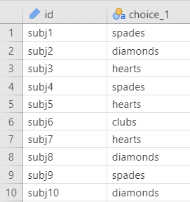
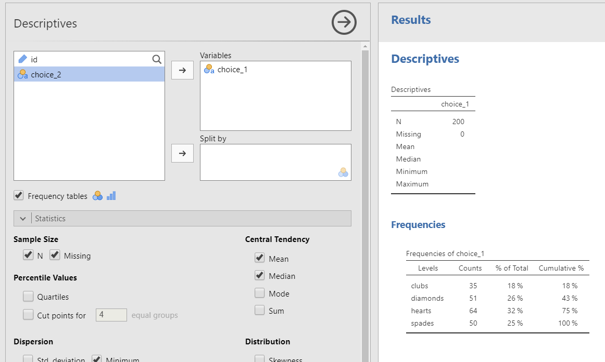
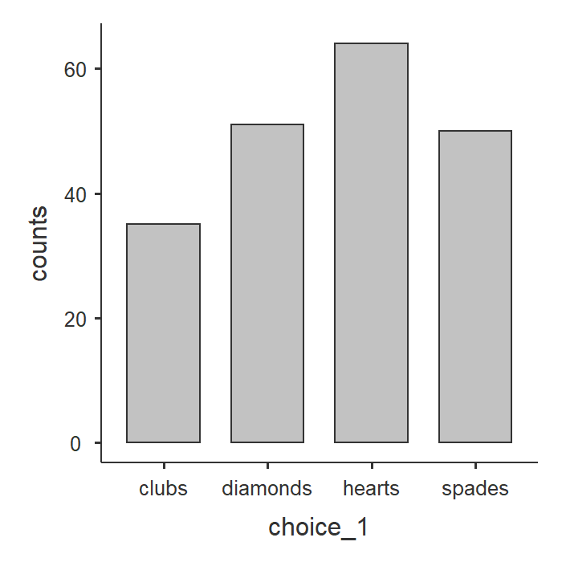
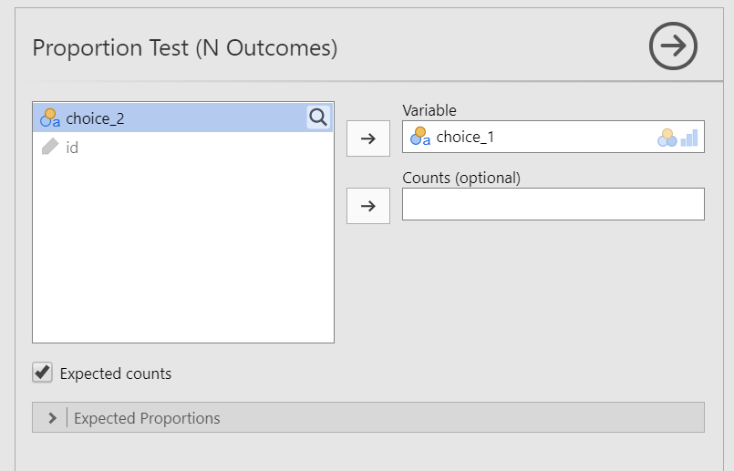
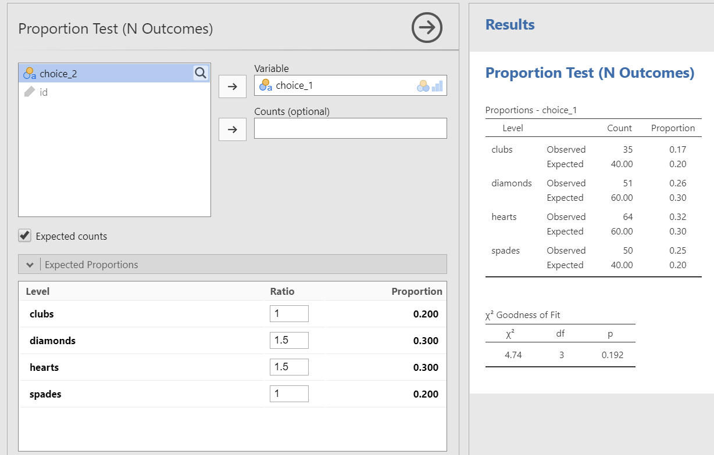
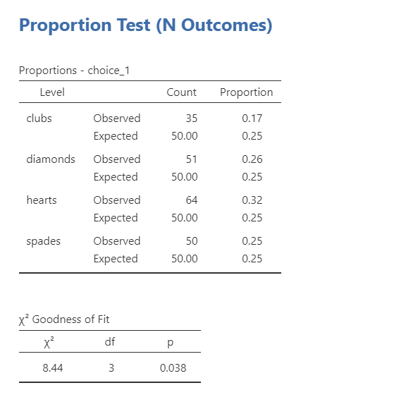
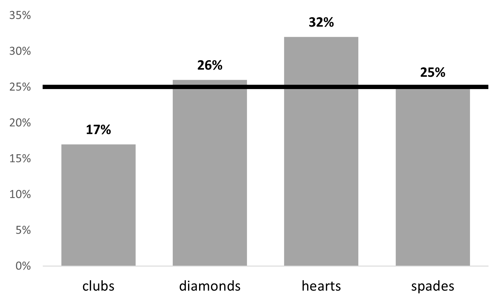

## 12. Chi-Square Goodness-of-Fit


The $\chi^2$ (chi-square) goodness-of-fit tests whether an observed frequency distribution of a nominal variable matches an expected frequency distribution.

Our general hypotheses for the chi-square goodness-of-fit test is as follows:

-   $H_0$: The observed frequencies match the expected frequencies. In other words, the frequencies of the categories of the independent variable are what we would expect.

-   $H_1$: At least one observed frequency doesn't match the expected frequency. In other words, the frequencies of at least one category of the independent variable are not what we would expect.

<div class="danger">
<p>Note that these are not how you should report your hypotheses! You
should specify your hypotheses in relation to the nature of your data.
For example, if we have a deck of cards and want to see if people don’t
choose cards randomly, the null hypothesis would be that there is a 25%
probability of getting each hearts, clubs, spades, and diamonds.</p>
</div>

There is no directionality for a chi-square test, so there is no such thing as a one-tailed or two-tailed hypothesis.

### Step 1: Look at the data

Let's run an example with data from lsj-data. Open data from your Data Library in "lsj-data". Select and open "randomness". This dataset has participants pull two cards from a deck. For now, we're just going to work with `choice_1`. We're interested in finding out if participants pull cards randomly from the deck.

Here's a video walking through the chi-square goodness of fit test example for this chapter.


```{=html}
<div class="vembedr">
<div>
<iframe src="https://www.youtube.com/embed/Pg1EA0eh2p0" width="533" height="300" frameborder="0" allowfullscreen="" data-external="1"></iframe>
</div>
</div>
```

#### Data set-up

Our data set-up for a chi-square goodness-of-fit test is pretty simple, We just need a single column with the nominal categories of the independent variable that each participant is in.



#### Describe your data

Once we confirm our data is setup correctly in jamovi, we should look at our data using descriptive statistics and graphs. First, our descriptive statistics are shown below. With nominal variables like `choice_1`, we should request Frequency tables, not descriptive statistics like the mean and median. The mean for `choice_1` would be, quite frankly, meaningless. What's the average card type? It can't exist. So we do frequencies instead.

Notice how jamovi is pretty smart here and knows not to give us the mean, median, minimum, and maximum. Check the box for Frequency tables to receive those. From our data, we see that most participants pulled a hearts card first (*n* = 64, 32%) followed by diamonds (*n* = 51, 26%), spades (*n* = 50, 25%), and finally clubs (*n* = 35, 18%).



A bar plot can visualize these descriptive statistics nicely.

{width="300"}

#### Specify the hypotheses

We're interested in finding out if participants pull cards randomly from a deck of cards. A typical deck of cards has 52 cards, 13 for each of the four suits (clubs, spades, hearts, diamonds). Because there are 4 suits, then 1/4 is 25% which is our expected frequency of pulling cards randomly from the deck.

-   $H_0$: Participants pull cards randomly from the deck. In other words, there is a 25% probability of pulling each hearts, clubs, spades, and diamonds.

-   $H_1$: Participants pull cards not at random from the deck. In other words, participants have a different probability than 25% of pulling at least one of the types of cards.

### Step 2: Check assumptions

The chi-square goodness-of-fit test has just one assumption: **Expected frequencies are sufficiently large**, which is usually greater than 5.

You test for this assumption by checking the "Expected counts" box. You will then see rows of expected counts in your contingency table. Look at the "expected" numbers and check that they are all 5 or greater.

### Step 3: Perform the test

To perform the chi-square goodness of fit test, do the following steps:

1.  Go to the Analyses tab, click the Frequencies button, and choose "One sample proportion tests - N outcomes".

2.  Move your variable into the Variable box. In this case, move `choice_1` into the Variable box.

3.  Select `Expected counts` so you can check for your assumption of expected frequencies.

When you are done, your setup should look like this:



#### Expected proportions: Different Expected Frequencies

As you will see in the output, jamovi automatically assumed equal proportions of frequencies (in this case 1/4 or 25% chance of pulling each card). However, there might be times when you want to test a different null hypothesis. Maybe we're testing the whether our sample frequencies match the population frequencies and those are uneven (e.g., whether our 40/60 gender split matches the 36/64 gender split in the population).

We can use the `Expected Proportions` in the setup to specify different expected frequencies. Note that this is not us checking the assumption of expected frequencies!

For example, in our current scenario maybe we think our deck is a little stacked in favor of red cards--or we think our participants are more likely to choose red cards than black cards. We can specify our expected proportions and then interpret the results, such as the example shown in the figure below. In this case, assuming a null distribution of a stacked deck for red cards, participants do not seem more likely to choose red cards based on the expected frequencies we provided.



### Step 4: Interpret results



The first table shows us our observed frequencies (our data) and expected frequencies (N/k = 200/4 = 50 which is 25% for each one, like we previously calculated).

The second table gives us our results. Our p-value is less than our alpha of .05 so we can reject the null hypothesis that the observed frequencies match our expected frequencies. The degrees of freedom (df) is the number of categories minus one (in this case, 4-1 = 3).

Note that the chi-square goodness of fit test does not provide us with any measures of effect size.

#### Write up the results in APA style

We can write up our results in APA something like this:

> Of the 200 participants in the experiment, 64 selected hearts for their first choice, 51 selected diamonds, 50 selected spades, and 35 selected clubs. A chi-square goodness-of-fit test was conducted to test whether the choice probabilities were identical for all four suits. The results were statistically significant ($\chi^2$ [3] = 8.44; *p* = .038), suggesting that people did not select suits purely at random. Participants chose the hearts (32%) more frequently than expected and the clubs (17%) less frequently than expected.

Note that I described the data in the first sentence, but I could have also described it in more detail in the last sentence as part of my interpretation or I could have even written up the results in a table! There are many ways to write up results in APA style, and what's important is you have the four pieces of information as described in the Writing Results chapter of this textbook.

#### Visualize the results

The bar plot we can get using Exploration - Descriptives (as shown above in [Describe your data]) does a decent job of visualizing the results. You can use the default bar plot in jamovi for your assignments.

If you want to take your visualizations up a notch, we can also do this fairly simply in Excel. Instead of counts, perhaps we care more about percentages, and adding a line for the expected frequency (25%). Here's an example, using instructions from [this tutorial](https://exceljet.net/chart/column-chart-with-target-line):

{width="500"}

### Additional practice

One additional practice you can conduct is performing the same analysis as above but with `choice_2`! However, if you want to see how `choice_1` relates to `choice_2` then we need to perform the chi-square test of independence, which is in the next chapter.

------------------------------------------------------------------------

Another additional practice is in our Sample Dataset. Open the `Sample_Dataset_2014.xlsx` file that we will be using for all Your Turn exercises. You can find the dataset here: [Sample_Dataset_2014.xlsx Download](https://github.com/danawanzer/stats-with-jamovi/blob/master/data/Sample_Dataset_2014.xlsx)

To get the most out of these exercises, try to first find out the answer on your own and then go to the appendix to check your answer.

1.  **Are there equal numbers of athletes and non-athletes?** (`Athlete` variable)

    -   Do you meet the assumptions?

    -   Are the observed frequencies similar to the expected frequencies?

    -   What is your chi-square value, rounded to two decimal places?

2.  **I happen to know the school this data comes from has 40% athletes and 60% non-athletes. Does our data match the school population?**

    -   Change your Expected Proportions ratio to .6 for non-athletes and .4 for athletes.

    -   Are the observed frequencies similar to the expected frequencies?

    -   What is your chi-square value, rounded to two decimal places?

3.  **Are there equal numbers of freshmen, sophomores, juniors, and seniors?** (`Rank` variable)

    -   Do you meet the assumptions?

    -   Are the observed frequencies similar to the expected frequencies?

    -   What is your chi-square value, rounded to two decimal places?
