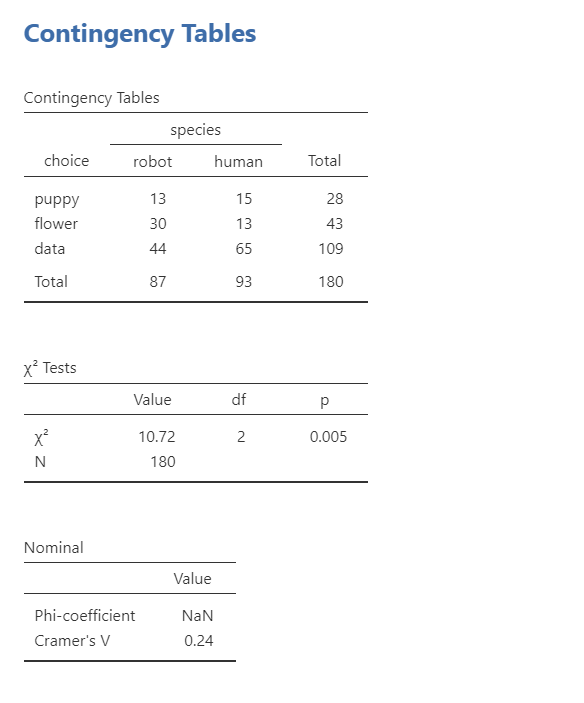

## Chi-Square Test of Independence


### Overview

The $\chi^2$ (chi-square) test of independence (or association) tests whether an observed frequency distribution of a nominal variable matches an expected frequency distribution, but unlike the goodness of fit test we are looking at the relationship, independence, or association between two variables.

Our basic hypotheses for the chi-square goodness-of-fit test is as follows:

-   $H_0$: The observed frequencies match the expected frequencies.

-   $H_1$: At least one observed frequency doesn't match the expected frequency.

However, these are *not* how you should report your hypotheses. You should specify your hypotheses in relation to the nature of your data. See below for an example.

### Specify your hypotheses

Let's run an example with data from lsj-data. Open data from your Data Library in "lsj-data". Select and open "chapek9". This dataset indicates the ID number of the participant, the species (robot or human), and their preference of the three things (puppy, flower, or data).

For this example, imagine we are watching a show about the planet *Chapek 9*. On this planet, for someone to gain access to their capital city they must prove they're a robot, not a human. In order to determine whether or not a visitor is human, the natives ask whether the visitor prefers puppies, flowers, or large, properly formatted data files.

-   $H_0$: Humans and robots have similar preferences.

-   $H_1$: Humans and robots have different preferences.

### Look at the data

#### Data set-up

Our data set-up for a chi-square test of independence is pretty simple, We just need two columns of nominal data, with one row per participant. Here's our data for our example we'll be working with, which you can find in the lsj-data called `chapek9`:

| ID  | species | choice |
|-----|---------|--------|
| 1   | robot   | flower |
| 2   | human   | data   |
| 3   | human   | data   |
| 4   | human   | data   |
| 5   | robot   | data   |
| 6   | human   | flower |
| 7   | human   | data   |
| 8   | robot   | data   |
| 9   | human   | puppy  |
| 10  | robot   | flower |

#### Describe the data

Once we confirm our data is setup correctly in jamovi, we should look at our data using descriptive statistics and graphs. First, our descriptive statistics are shown below. Remember that for nominal variables we should report frequency statistics, not means and medians and such. Bar plots continue to be a good way of visualizing the data.


#### Check assumptions

The chi-square test of independence has the following assumptions:

1.  **Expected frequencies are sufficiently large**, which is usually greater than 5. If you violate this assumption, you can use Fisher's exact test.

2.  Data are **independent** of one another, meaning each case contributes to only one cell of the table. If you violate this assumption, you may be able to use the McNemar test. This requires knowing how your data was collected. If it's a within-subjects design that should be answered using a chi-square, then most likely you want to use McNemar's test. If it's a between-subjects design that should be answered using a chi-square, then you most likely meet this assumption and can perform the chi-square test of independence.

### Perform the test

1.  From the 'Analyses' toolbar select 'Frequencies' - 'Independent Samples - $\chi^2$ test of association'.

2.  Move `choice` into rows and `species` into columns. Note that the placement in rows or columns doesn't really matter, but because we typically work with portrait pages I tend to prefer putting in rows whatever variable has more levels. In this case, choice has 3 levels and species only 2 so I like to put choice in rows and species in columns.

3.  Under the Statistics tab, select $\chi^2$ under Tests and `Phi and Cramer's V` under Nominal.

4.  Optionally, you can request under the Cells tab to show the expected counts and the row, column, and total percentages.

When you are done, your setup should look like this:


### Interpreting results



The first table shows us our observed frequencies. The second table gives us our results. Our p-value is less than .05 so we can reject the null hypothesis that the observed frequencies match our expected frequencies.

jamovi also gives us our Cramer's V value. Note that it does not provide Phi because we don't have a perfect square table (e.g., 2x2 or 3x3). These are measures of effect size for the chi-square. Cramer's V can be interpreted similar to a correlation (ranges from 0 to 1, with higher scores meaning stronger relationships between the variables).

#### Write up the results in APA style

We can write up our results in APA something like this:

> Pearson's $\chi^2$ test of independence showed a significant association between species and choice, $\chi^2$ (2) = 10.72, *p* = .005, Cramer's V = .24. Robots appeared to be more likely to say they prefer flowers and humans appeared to be more likely to say they prefer data. Robots and humans appeared to be equally likely to prefer puppies.

I would either write-up the observed frequencies above or, ideally, I would share the contingency table with my observed frequencies.

#### Visualize the results

This one is also a visualization that would likely do better in Excel than in jamovi. There are two that I think work well for this dataset and our research questions. The first is a clustered column chart:

{width="500"}

The second is a stacked bar chart with connected lines:

{width="500"}

### Video

Here's a video walking through the chi-square test of independence.


```r
knitr::include_url("https://www.youtube.com/watch?v=6a5soxXTfkw")
```

```
## PhantomJS not found. You can install it with webshot::install_phantomjs(). If it is installed, please make sure the phantomjs executable can be found via the PATH variable.
```

<div class="figure" style="text-align: center">
<iframe src="https://www.youtube.com/watch?v=6a5soxXTfkw" width="1\linewidth" height="400px"></iframe>
<p class="caption">(\#fig:unnamed-chunk-1)**CAPTION THIS FIGURE!!**</p>
</div>

### In case of violated assumptions

#### Fisher's exact test

If you violate the assumption that there your expected frequencies are sufficiently large and you have a 2x2 table, you can still perform the $\chi^2$ test of independence but instead of selecting $\chi^2$you'll select `Fisher's exact test`. You'll interpret your results exactly the same but specify you used Fisher's exact test.

### Additional information

#### Ordinal variable(s)

If either of your variables are ordinal, instead of selecting `Phi and Cramer's V` you should select `Gamma` or `Kendall's tau-b`. Which do you choose? `Kendall's tau-b` should only be chosen if you have a square table (e.g., 3x3, 4x4, 5x5) whereas `Gamma` can be done with any size table. `Kendall's tau-b` will be a slightly more conservative estimate compared to `Gamma`.

### Your turn!

Open the `Sample_Dataset_2014.xlsx` file that we will be using for all Your Turn exercises. You can find the dataset here: [Sample_Dataset_2014.xlsx Download](https://github.com/danawanzer/stats-with-jamovi/blob/master/data/Sample_Dataset_2014.xlsx)

To get the most out of these exercises, try to first find out the answer on your own and then use the drop-down menus to check your answer.

1.  **Is Athlete related to Gender?**

    -   Do you meet the assumptions?

    -   Which test should you perform?

    -   Are the observed frequencies similar to the expected frequencies?

    -   What is your chi-square value, rounded to two decimal places?

2.  **Is Gender related to Rank?**

    -   Do you meet the assumptions?

    -   Which test should you perform?

    -   Are the observed frequencies similar to the expected frequencies?

    -   What is your chi-square value, rounded to two decimal places?
