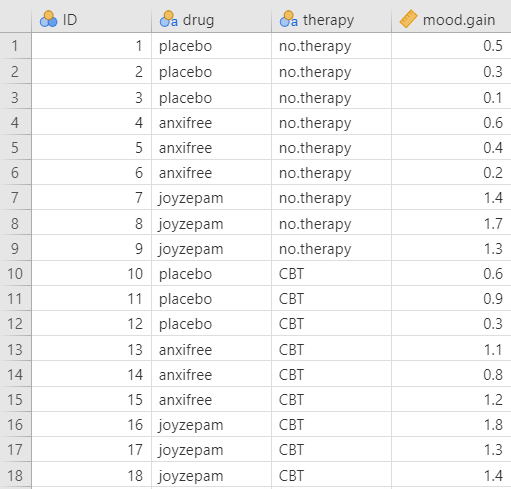

## 15. One-way ANOVA


The one-way analysis of variance (ANOVA) is used to test the difference in our dependent variable between [three or more]{.ul} different groups of observations. Our grouping variable is our independent variable. In other words, we use the one-way ANOVA when we have a research question with a **continuous dependent variable** and a **categorical independent variable with three or more categories in which different participants are in each category**.

The one-way ANOVA is also known as an independent factor ANOVA.

One thing to keep in mind is the one-way ANOVA is an omnibus statistic that tests against the null hypothesis that the three or more means are the same. It does not tell us where the mean differences are (e.g., that 1 \> 2); for that, we need planned contrasts or post-hoc procedures, which you'll learn about in the next chapter. Therefore, the null and alternative hypotheses for the one-way ANOVA are as follows:

-   $H_0$: There is **no difference** in means between the groups. In other words, the means for the three or more groups are the **same**.
-   $H_1$: There is **a difference** in means between the groups. In other words, at least one group has a significantly different mean compared to the other groups.

In this chapter, we're going to test this overall hypothesis of whether there is a difference. However, to find the difference, you need to conduct planned contrasts or use post-hoc procedures. This is covered in the next chapter.

#### Why not multiple t-tests?

Imagine we have three groups: fall, spring, and summer. We could just perform three separate t-tests: fall vs. spring, fall vs. summer, and spring vs. summer.

However, the reason we do not perform multiple t-tests is because multiple t-tests means an increased Type I error rate. If I had performed three separate t-tests, set my alpha (Type I error rate) at 5% for each test, and knew for a fact the effects do not actually exist, then each test has a probability of a Type I error rate of 5%. Because we are running three tests, our alpha rate actually becomes 1 - (.95^3^)= 1 - .857 = 14.3%! So now our *familywise* or *experimentwise* error rate is 14.3%, not the 5% we originally set alpha at.

With three groups, that's not so bad, but let's see what happens with more tests we perform:

-   **1 test**: 1 - (.95^1^)= 1 - .95 = **5%**
-   **2 tests**: 1 - (.95^2^)= 1 - .9025 = **9.8%**
-   **3 tests**: 1 - (.95^3^)= 1 - .857 = **14.3%**
-   **4 tests**: 1 - (.95^4^)= 1 - .814 = **18.6%**
-   **5 tests**: 1 - (.95^5^)= 1 - .774 = **22.6%**
-   **10 tests**: 1 - (.95^10^)= 1 - .598 = **40.1%**
-   **20 tests**: 1 - (.95^20^)= 1 - .358 = **64.1%**

Ouch! 10 tests would have a Type I error rate of 40%! That means that if we performed 10 statistical tests (assuming the effect does not exist), then 40% of the results could be statistically significant by chance alone and would be a false positive. That's not good!

Therefore, we use the one-way ANOVA as one test to see if there is a difference overall. We can also do things to control or limit our familywise error rate, which I'll get into later.

[This comic by xkcd](https://xkcd.com/882/) provides a great visualization and description for why we need to be super careful about making multiple comparisons.

#### Relationship between ANOVA and t-test

A fun little fact is that an ANOVA with two groups is identical to the t-test. That means the F and t statistics are directly related, and you will get the same p-value. For example, imagine you run a t-test and get a t-statistic of *t* (16) = -1.31, *p* = .210. If you ran it as a one-way ANOVA, you would get an F-statistic of *F* (1, 16) = 1.71, *p* = .210.

$F = t^2$

$t = \sqrt{F}$

Just a fun little bit of trivia! So if you accidentally do an F-test with two groups, no need to go back and redo the analyses (although you should if you are sharing your code for reproducibility). You can just convert your F to a t statistic easily!

### Step 1: Look at the data

For this chapter, we're going to work with example data from lsj-data. Open data from your Data Library in "lsj-data". Select and open "clinicaltrial" (not Clinical Trial 2). This dataset is hypothetical data of a clinical trial in which you are testing a new antidepressant drug called *Joyzepam*. In order to construct a fair test of the drug's effectiveness, the study involves three separate drugs to be administered. One is a placebo, and the other is an existing antidepressant / anti-anxiety drug called *Anxifree*. A collection of 18 participants with moderate to severe depression are recruited for your initial testing. Because the drugs are sometimes administered in conjunction with psychological therapy, your study includes 9 people undergoing cognitive behavioral therapy (CBT) and 9 who are not. Participants are randomly assigned (doubly blinded, of course) a treatment, such that there are 3 CBT people and 3 no-therapy people assigned to each of the 3 drugs. A psychologist assesses the mood of each person after a 3 month run with each drug, and the overall improvement in each person's mood is assessed on a scale ranging from -5 to +5.

Here's a video walking through the one-way ANOVA test.


```{=html}
<div class="vembedr">
<div>
<iframe src="https://www.youtube.com/embed/NBxLBXtvp8E" width="533" height="300" frameborder="0" allowfullscreen="" data-external="1"></iframe>
</div>
</div>
```

#### Data set-up

To conduct the one-way ANOVA, we first need to ensure our data is set-up properly in our dataset. This requires having two columns: one with our continuous dependent variable and one indicating which group the participant is in. Each row is a unique participant or unit of analysis.

Note that in this dataset we actually have two independent variables: `drug` and `therapy`. If we were looking at the effect of `therapy` on `mood.gain` (our DV) then we would only need to perform an independent samples t-test because there are only two groups (no.therapy and CBT). However, if we were looking at the effect of `drug` on `mood.gain`, which is our goal in this chapter, then we would perform a one-way ANOVA because there are three groups (placebo, anxifree, and joyzepam).



#### Describe the data

Once we confirm our data is setup correctly in jamovi, we should look at our data using descriptive statistics and graphs. First, our descriptive statistics are shown below. We see that there are 18 cases in our dataset (a bit small, but let's ignore that for now) with no missing data. The mean mood gain was .88 (*SD* = .53) with a minimum mood gain of .10 and maximum of 1.80. Furthermore, there are 6 people in each of our three conditions in the study so we have a *balanced* research design.


In addition, we may want to look at the distribution of mood gain across our three conditions. In the Descriptives analysis, we can choose to "split by" `drug` and then ask for a box plot with violin and data points like below. Visually, it seems like joyzepam might be leading to greater mood gain than the other two conditions, but we need to analyze it statistically to know for sure!


#### Specify the hypotheses

Our basic research question for the one-way ANOVA is whether there is a difference in mood between the three drugs. Therfore, our hypotheses for the one-way ANOVA could be written as such:

-   $H_0$: There is **no difference** in mood between the three drugs.
-   $H_1$: There is **a difference** in mood between the three drugs. *However, we'll need the next chapter to figure out where those differences might be.*

### Step 2: Check assumptions {#anova-assumptions}

As a parametric test, the one-way ANOVA has the same assumptions as other parametric tests:

1.  The dependent variable is **normally distributed**

2.  Variances in the two groups are roughly equal (i.e., **homogeneity of variances**)

3.  The dependent variable is **interval or ratio** (i.e., continuous)

4.  Scores are **independent** between groups

We cannot *test* the third and fourth assumptions; rather, those are based on knowing your data.

However, we can and should test for the first two assumptions. Fortunately, the one-way ANOVA in jamovi has three check boxes under "Assumption Checks" that lets us test for both assumptions.

#### ANOVA is (somewhat) robust to violations

Although we should meet the assumptions as much as possible, in general the F-statistic is *robust* to violations of normality and homogeneity of variance. This means that you can still run the one-way ANOVA if you violate the assumptions, but *only when group sizes and variances are equal or nearly equal*. If you have vastly different variances (such as 2:1 ratio or greater) or vastly different group sizes (such as a 2:1 ratio or greater), and especially if one group is really small (such as 10 or fewer cases), then your F-statistic is likely to be very wrong. For example, if your larger group has the larger variance, then your F-statistic is likely to be non-significant or smaller than it should be; however, if your larger group has smaller variance,then your F-statistic is likely to be significant or bigger than it should be!

#### Testing normality

We test for normality using the Shapiro-Wilk test and the Q-Q plot; we can also test it with skew/kurtosis and looking at the distribution of data. The Shapiro-Wilk test was not statistically significant (*W* = .96, *p* = .605); therefore, this indicates the data is normally distributed. Furthermore, the lines are fairly close to the diagonal line in the Q-Q plot. We can conclude that we satisfy the assumption of normality.


#### Testing homogeneity of variance

We test for homogeneity of variance using the Levene's test. The Levene's test was not statistically significant (*F* [2, 15] = 1.45, *p* = .266); therefore, this indicates our data satisfies the assumption of homogeneity of variance. However, I would add a caveat that we have a small sample of data (*N* = 18); we should have tried to collect more data.

### Step 3: Perform the test

#### Decide which statistical test you should be using

If you fail to meet one or both of the assumptions of normality (and no transformations fixed your data) and homogeneity of variances, jamovi has the alternative statistics easily built in. Here's what statistic you should choose based on satisfying assumptions:

+--------------------------------------------+-----------------------------------------------------+----------------------------------------------------------+
|                                            | **Normality: satisfied**                            | **Normality: not satisfied**                             |
+============================================+=====================================================+==========================================================+
| **Homogeneity of Variance: satisfied**     | one-way ANOVA (but using the ANOVA function)        | [Kruskal-Wallis test] (using the one-way ANOVA function) |
+--------------------------------------------+-----------------------------------------------------+----------------------------------------------------------+
| **Homogeneity of Variance: not satisfied** | [Welch's F-test] (using the one-way ANOVA function) | [Kruskal-Wallis test] (using the one-way ANOVA function) |
+--------------------------------------------+-----------------------------------------------------+----------------------------------------------------------+

#### A note on one-tailed vs. two-tailed tests in the ANOVA

Unlike a t-test, we can't have a one-tailed test with an ANOVA. Our planned contrasts or post-hoc tests can tell us where differences are, and we can provide directional hypotheses there if we so choose.

#### Perform the test

<div class="danger">
<p>Do not use the <code>One-Way ANOVA</code> analysis in jamovi! The
options there are too limited for our use. Instead, be sure you use the
<code>ANOVA</code> analysis!!!</p>
</div>

1.  To perform a one-way ANOVA in jamovi, go to the Analyses tab, click the **ANOVA** button, and choose "ANOVA".

2.  Move your dependent variable to the Dependent Variable box and your independent variable to the Fixed Factors box. In this case, move `mood.gain` to the Dependent Variable box and `drug` to the Fixed Factors box.

3.  Select $\omega^2$ (omega-squared) for your effect size.

4.  Ignore the Model drop-down menu. If you are doing more complicated ANOVAs you will need this. We will ignore it.

5.  In the Assumption Checks drop-down menu, select all three options: `Homogeneity test`, `Normality test`, and `Q-Q plot`.

6.  Ignore the Contrasts and Post Hoc Tests drop-down menus *for now*. See the next chapter for more information.

7.  In the Estimated Marginal Means drop-down menu, move your IV `drug` to the Marginal Means box and select `Marginal means plots`, `Marginal means tables`, and `Observed scores`, in addition to the pre-selected `Equal cell weights`.

When you are done, your setup should look like this:


### Step 4: Interpret results

Once we are satisfied we have satisfied the assumptions for the one-way ANOVA, we can interpret our results.


Our p-value is less than our alpha value of .05, so our results are statistically significant.

#### Write up the results in APA style

<div class="danger">
<p>This write-up is only sufficient if your results are not
statistically significant.</p>
<p>If your F-test is statistically significant, then you also need to
report the group differences as described in the next chapter!</p>
</div>

We can write up the results of the overall F-test in APA something like this (again, go to the next chapter to go over the group differences because our significant F-test means this write-up is not sufficient):

> There is a significant difference in mood gain across the three drug conditions, *F* (2, 15) = 18.61, *p* \< .001, $\omega^2$ = .66.

Sometimes, people like to put the statistics inside a parentheses. In that case, you need to change the parentheses around the degrees of freedom as brackets. Here's another example write-up of the results in APA style:

> There is a significant difference in mood gain across the three drug conditions (*F* [2, 15] = 18.61, *p* \< .001, $\omega^2$ = .66).

#### Visualize the results

You should visualize the results similarly to how you visualize the results for the independent samples t-test. The default graph in the estimated marginal means output for the ANOVA is not great in my opinion. Presenting the graph of the data in this case (see the graph under Look at the Data) is probably a better option.

### Welch's F-test

To conduct this in jamovi, you will need to use the "One-Way ANOVA" test, not the "ANOVA" test. The unfortunate thing about this test is that it strangely does not provide effect sizes.

In jamovi, under Variances select `Don't assume equal (Welch's)`. Move `mood.gain` to the Dependent Variable box and `drug` to your Grouping Variable box. You will interpret the results similarly to the one-way ANOVA:


> Using a Welch's F-test, there is a significant difference in mood gain across the three drug conditions, *F* (2, 9.49) = 26.32, *p* \< .001.

### Kruskal-Wallis test

To perform the Kruskal-Wallis test in jamovi, you will need to select under the ANOVA button "One-Way ANOVA, Kruskal Wallis" towards the bottom of the list of options. Move `mood.gain` to the Dependent Variables box and `drug` to the Grouping Variable box. Select Effect size; if you need post hoc comparisons select DSCF pairwise comparisons (see next chapter on finding group differences). You will interpret the results similarly to the one-way ANOVA:


> Using a Kruskal-Wallis test, there is a significant difference in mood gain across the three drug conditions, $\chi^2$ (2) = 12.08, *p* = .002, $\epsilon^2$ = .71.

Notice how in this case all three results converge and show there is a statistically significant difference in the results! The problem is... differences in which groups? See the next chapter!

### Additional practice

Open the `Sample_Dataset_2014.xlsx` file that we will be using for all Your Turn exercises. You can find the dataset here: [Sample_Dataset_2014.xlsx Download](https://github.com/danawanzer/stats-with-jamovi/blob/master/data/Sample_Dataset_2014.xlsx)

Perform one-way ANOVAs based on the following research questions. Check your assumptions and ensure you are using the correct tests.

To get the most out of these exercises, try to first find out the answer on your own and then use the drop-down menus to check your answer.

1.  **Does students differ on English scores by rank (i.e., freshmen, sophomore, junior, senior)?**

    -   Do you satisfy the assumption of normality?

    -   Do you satisfy the assumption of homogeneity of variance?

    -   Which statistic should you use?

    -   Do students differ on English scores by rank?

2.  **Does smoking status (Smoking: Nonsmoker = 0, Past smoker = 1, Current smoker = 2) relate to sprint time?**

    -   Do you satisfy the assumption of normality?

    -   Do you satisfy the assumption of homogeneity of variance?

    -   Which statistic should you use?

    -   Does smoking status relate to sprint time?
