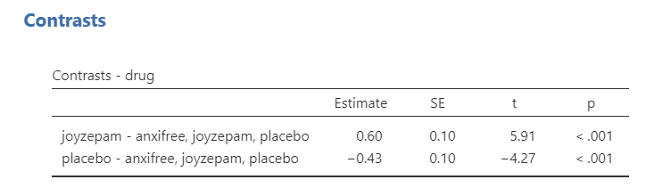
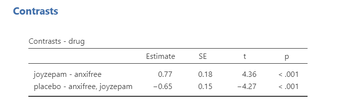
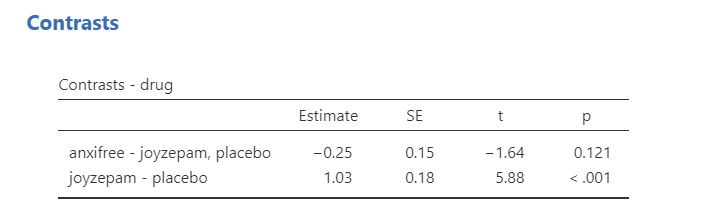
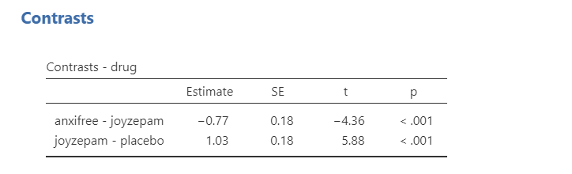
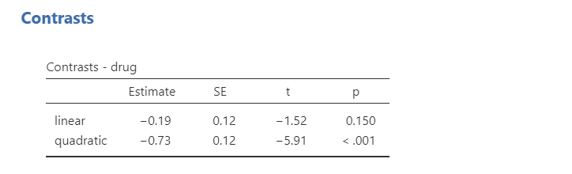

## Finding Group Differences

Often, we're not interested in just *whether* there is a difference (which the F-statistic can tell us), but *where* the differences are between groups (which the F-statistic cannot tell us). For that, we use either [planned contrasts]{.ul} when you have specific hypotheses you want to test or [post-hoc comparisons]{.ul} when you have no specific hypotheses.

**Note**: You [do not]{.ul} perform contrasts or post hoc comparisons if your overall $F$ statistic is not statistically significant. You do not interpret group differences if you fail to reject the null hypothesis that there are no group differences!

### Planned Contrasts

If you have before-analysis hypotheses of group differences in your data, you will use planned contrasts. You can find the planned contrasts in the ANOVA (but not the one-way ANOVA) setup as a drop-down menu. Note that while I show all six contrasts that jamovi provides, you do not normally do multiple contrasts. These are just shown for illustrative purposes:

1.  **Deviation**: compares the effect of each category (except the first category) to the overall experimental effect. The order of categories is alphabetical or numerical order. Notice how anxifree is considered the first category.

(\#fig:unnamed-chunk-1)Contrasts - Deviation

2.  **Simple**: Each category is compared to the first category. The order of categories is alphabetical or numerical order. Notice how anxifree is considered the first category.

(\#fig:unnamed-chunk-2)Contrasts - Simple

3.  **Difference**: Each category (except the first) is compared to the mean effect of all previous categories.

(\#fig:unnamed-chunk-3)Contrasts - Difference

4.  **Helmert**: Each category (except the last) is compared to the mean effect of all subsequent categories.

(\#fig:unnamed-chunk-4)Contrasts - Helmert

5.  **Repeated**: Each category is compared to the last category.

(\#fig:unnamed-chunk-5)Contrasts - Repeated

6.  **Polynomial**: Tests trends in the data. It will examine the *n-1*^th^ degree based on the number of groups. In this case, because we have 3 groups it is testing both a linear (^1^) and quadratic (^2^) trend. If we had 5 groups, it would test a linear (^1^), quadratic (^2^), cubic (^3^), and quartic (^4^) trend. Note that your factor levels must be ordinal for a polynomial contrast to make sense.

(\#fig:unnamed-chunk-6)Contrasts - Polynomial

**Test yourself!** Which contrast would make [most sense]{.ul} to test given that we want to know how our drug compares to the other two drugs? <select class='solveme' data-answer='["repeated"]'> <option></option> <option>deviation</option> <option>simple</option> <option>difference</option> <option>helmert</option> <option>repeated</option> <option>polynomial</option></select>

#### Write up planned contrasts in APA style

Here's some example write-ups of the above results.

> There is a significant difference in mood gain across the three drug conditions, *F* (2, 15) = 18.61, *p* \< .001. Repeated contrasts showed that *Joyzepam* (*M* = 1.48, *SD* = .21) outperformed both *Anxifree* (*M* = .72, *SD* = .39; *p* \< .001) and the placebo condition (*M* = .45, *SD* = .28; *p* \< .001).
>
> (Note how this example makes no sense because our data is not ordinal) There is a significant difference in mood gain across the three drug conditions, *F* (2, 15) = 18.61, *p* \< .001. There was not a significant linear trend across the drug conditions (*p* = .150).

### Post hoc comparisons

Often, we do not have any *a priori* (or planned) predictions or hypotheses about our group differences. In this case, we use post hoc procedures. These procedures do [pairwise comparisons]{.ul} among all of our groups, like t-tests across each of our groups. As we noted on the first page of this handout, this can be highly problematic for our Type I error rate! Therefore, we must perform corrections to control our familywise error rate.

jamovi currently supports five types of post-hoc tests; I generally only use Tukey or Bonferonni:

1.  **No correction**: This doesn't correct for a Type I error at all. Don't use this! I won't even show it. It's bad. Never use it. NEVER. You are warned!
2.  **Tukey**: This is the post hoc test I use most often. It controls the Type I error rate well, but isn't as conservative of a control as the Bonferonni.
3.  **Scheffe**: Honestly, I've never used it. I am not sure how it's calculated.
4.  **Bonferroni**: This is the most conservative test. It's good if you only have a small number of comparisons to make or if you *really* want to control your Type I error rate. If you have a lot of them to test , then you should use something else.
5.  **Holm**: Honestly, I've never used it. I am not sure how it's calculated.

Games-Howell for when you have unequal variances and Tukey for when you have equal variances. They will each calculate your p-values slightly differently but in a way to control for our Type I error rate as best it can. They are interpreted very similarly, so we will proceed with the Tukey's post hoc comparisons because we satisfied the assumption of equal variances.

To request post hoc tests from the one-way ANOVA, open the collapsed menu at the bottom of the setup menu. Select `Tukey (equal variances` under Post-Hoc Test and select `Mean difference`, `Report significance`, and `Flag significant comparisons` under Statistics. Optionally, you can request the `Test results (t and df)` although this is not necessary.

Below shows the post hoc test results for our one-way ANOVA. Notice the differences in p-values across the four post hoc tests and how all other values are the same. Notice how the Bonferroni is most conservative (i.e., has the largest p-values) and the Holm's is the least conservative (i.e., has the smallest p-values). Keep in mind you do not normally ask for multiple post hoc comparisons. Just pick one! Normally, I just pick Tukey's.

(\#fig:unnamed-chunk-7)Post hoc test results in jamovi

#### Write up post hoc results in APA style

The way we would write up each of the post hoc comparisons is very similar. Given that I usually use Tukey, here is a write-up for those results:

> There is a significant difference in mood gain across the three drug conditions, *F* (2, 15) = 18.61, *p* \< .001. Post hoc comparisons using Tukey's HSD revealed that our drug *Joyzepam* (*M* = 1.48, *SD* = .21) outperformed both *Anxifree* (*M* = .72, *SD* = .39; *p* = .002) and the placebo condition (*M* = .45, *SD* = .28; *p* \< .001); there were no differences between *Anxifree* and the placebo condition (*p* = .312).

Writing up results in APA style is both a science and an art. There's a science to what you need to report. For example, you always report the statistics exactly the same: *F* (df~WG~, df~BG~) = X.XX, *p* = .XXX. You also always report the group means (*M*) and standard deviations (*SD*), although you can report them in-text like I did above or in a descriptives table like you can ask from jamovi.

However, there's also an art to it. Notice how I wrote that up in a way to summarize the findings as succinctly as possible. I could have said there was a difference between *anxifree* and *joyzepam* and a difference between *joyzepam* and the placebo, but that's a lot more words and isn't written in a way to focus on what I'm hoping to see: that my drug *joyzepam* performed better than the competitor *anxifree* and a placebo condition.

This is where you need to think creatively and be very critical in checking that what you say makes sense. Read your write-ups carefully! Have someone else read it. Can they understand what you mean?

### In case of violated assumptions

If you are using Welch's F-test using the One-Way ANOVA in jamovi, you should select under Post-Hoc Tests `Games-Howell (unequal variances)`. These will be interpreted similarly to the post hoc comparisons above.

If you are using the Kruskal-Wallis test, you will select the check-box for `DSCF pairwise comparisons`. This stands for the Dwass-Steel-Critchlow-Fligner test. All you need to know is that they, too, are interpreted similarly to the post hoc comparisons above.

Unfortunately, you cannot perform contrasts with either the Welch's F-test or Kruskal-Wallis test.

### Your turn!

Open the `Sample_Dataset_2014.xlsx` file that we will be using for all Your Turn exercises. You can find the dataset here: [Sample_Dataset_2014.xlsx Download](https://github.com/danawanzer/stats-with-jamovi/blob/master/data/Sample_Dataset_2014.xlsx)

Perform one-way ANOVAs based on the following research questions. Check your assumptions and ensure you are using the correct tests.

To get the most out of these exercises, try to first find out the answer on your own and then use the drop-down menus to check your answer. 

**Note**: These are the same questions as in the one-way ANOVA chapter, but now you focus on the group differences.

1.  **Does students differ on English scores by rank (i.e., freshmen, sophomore, junior, senior)?**

    -   Should you perform a planned contrast or post hoc comparison? <select class='solveme' data-answer='["post hoc"]'> <option></option> <option>planned contrast</option> <option>post hoc</option></select>

    -   What are the results of the post hoc comparison? <select class='solveme' data-answer='["N/A - Don&apos;t perform"]'> <option></option> <option>N/A - Don't perform</option> <option>Freshmen had higher English scores than sophomores, juniors, and seniors</option> <option>Freshmen and sophomores had higher English scores than juniors and seniors</option></select>

2.  **Does smoking status (Smoking: Nonsmoker = 0, Past smoker = 1, Current smoker = 2) relate to sprint time?**

    -   Should you perform a planned contrast or post hoc comparison? <select class='solveme' data-answer='["post hoc"]'> <option></option> <option>planned contrast</option> <option>post hoc</option></select>

    -   What are the results of the post hoc comparison? <select class='solveme' data-answer='["Nonsmokers had significantly faster sprint times than current smokers"]'> <option></option> <option>N/A - Don't perform</option> <option>Nonsmokers had significantly faster sprint times than current smokers</option> <option>Nonsmokers and past smokers had significantly faster spring times than current smokers</option> <option>Nonsmokers had significantly faster sprint times than both past and current smokers</option></select>
