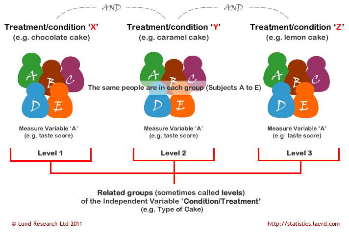
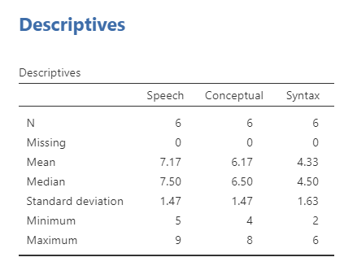
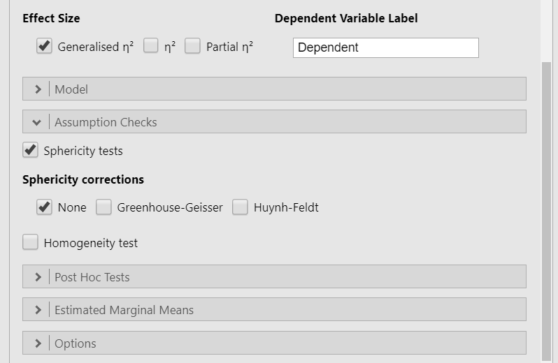
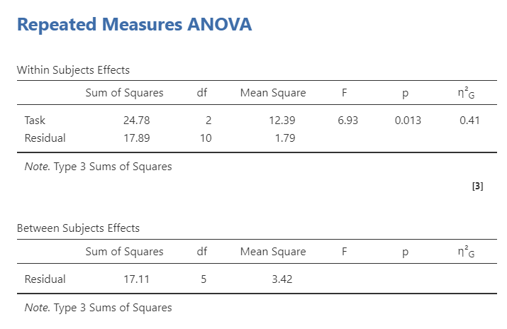
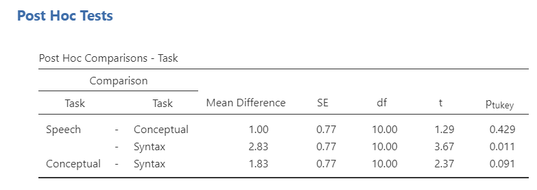
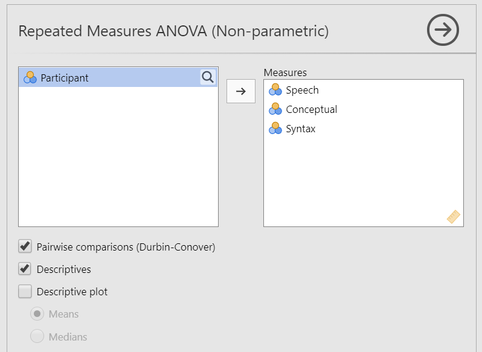
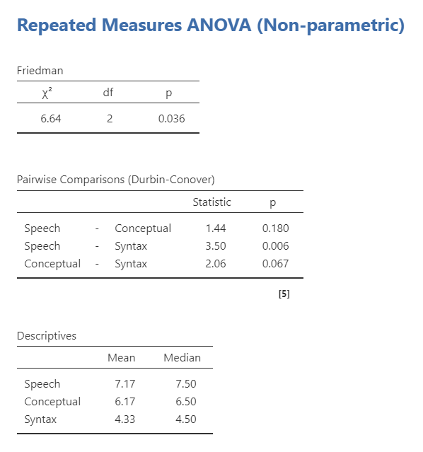

## 17. Repeated Measures ANOVA


The repeated measures analysis of variance (ANOVA) is used to test the difference in our dependent variable between [three or more]{.underline} groups of observations in which all participants participate in all groups or levels. Our grouping variable is our independent variable. In other words, we use the repeated measures ANOVA when we have a research question with a **continuous dependent variable** and a **categorical independent variable with three or more categories in which the [same]{.underline} participants are in each category**.

The repeated measures ANOVA is also sometimes called the one-way related ANOVA.

There are two ways we could have the repeated measures ANOVA. Perhaps the same group of participants are measured in the same dependent variable at three or more time points. In this case, our independent variable is time and our dependent variable is whatever is measured at each time point.


The other way we might have the repeated measures ANOVA is if all our participants participate in all conditions of our study. In this case, our independent variable is the treatment or condition and the dependent variable is whatever is measured in each treatment or condition.



### Step 1: Look at the data

Let's run an example with data from lsj-data. Open data from your Data Library in "lsj-data". Select and open "broca".

This dataset is hypothetical data in which six patients suffering from Broca's Aphasia (a language deficit commonly experienced following a stroke) complete three word recognition tasks. On the first (speech production) task, patients were required to repeat single words read out aloud by the researcher. On the second (conceptual) task, designed to test word comprehension, patients were required to match a series of pictures with their correct name. On the third (syntax) task, designed to test knowledge of correct word order, patients were asked to reorder syntactically incorrect sentences. Each patient completed all three tasks. The order in which patients attempted the tasks was counterbalanced between participants. Each task consisted of a series of 10 attempts. The number of attempts successfully completed by each patient are provided in the dataset.

Here's a video walking through the repeated measures ANOVA test.


```{=html}
<div class="vembedr">
<div>
<iframe src="https://www.youtube.com/embed/Fl6S9IBC1q0" width="533" height="300" frameborder="0" allowfullscreen="" data-external="1"></iframe>
</div>
</div>
```

#### Data set-up

To conduct the repeated measures ANOVA, we first need to ensure our data is set-up properly in our dataset. This requires multiple columns, one for each condition or time measurement, with the values indicating the measurement of the DV for that condition or time. Each row is a unique participant or unit of analysis.

So for our broca dataset, we have our Participant column indicating their participant number and then one column for each of the three word recognition tasks (speech, conceptual, syntax), with their scores on the knowledge test indicating the dependent variable for each condition.


In the data above, what is your **independent variable**? What is your **dependent variable**?

#### Describe the data

Once we confirm our data is setup correctly in jamovi, we should look at our data using descriptive statistics and graphs. First, our descriptive statistics are shown below. We see that there are only six cases total (oof, really small data set!) and the average test score on each of the three conditions. It appears participants did best on the speech condition, but we'll need to run our repeated measures ANOVA to know for sure. Note that I am describing the continuous DV split by the categorical IV here because of how our data is set up in jamovi.



#### Specify your hypotheses

In this scenario, we want to see if there is a difference in word recognition across the three tasks. Just like the one-way ANOVA, we have fairly simple hypotheses for the basic repeated measures ANOVA:

-   $H_0$: There is **no difference** in word recognition across the three tasks.
-   $H_1$: There is **a difference** in word recognition across the three tasks.

### Step 2: Check Assumptions

As a parametric test, the repeated measures ANOVA has the same assumptions as other parametric tests:

1.  The dependent variable is **normally distributed**

2.  Variances in the two groups are roughly equal (i.e., **homogeneity of variances**); in repeated measures ANOVA this is called the assumption of **sphericity**

3.  The dependent variable is **interval or ratio** (i.e., continuous)

4.  ~~Scores are **independent** between groups~~ (this assumption is not relevant because all participants participate in all conditions)

We cannot *test* the third and fourth assumptions; rather, those are based on knowing your data.

However, we can and should test for the first two assumptions. Fortunately, the repated measures ANOVA in jamovi has check boxes under "Assumption Checks" that lets us test for both assumptions.

#### Testing normality

<div class="info">
<p>Note that the way we test normality is different than what we’ve
learned before!</p>
</div>

We cannot test normality using all four methods we previously learned about because in this case we are checking normality of the residuals. You don't need to know what that means yet (we'll discuss it more when we go over regression).

To check normality for the repeated measures ANOVA, we have to go run the repeated measures ANOVA in jamovi. To test normality, under 'Assumption Checks' we select Q-Q plot. It is currently the only option we have available for testing normality in the repeated measures ANOVA.

#### Testing sphericity

The sphericity assumption is essentially the repeated measures ANOVA equivalent of homogeneity of variances. Sphericity means there is equality of variances of the *differences* between treatment levels. For example, if there are three groups, then the difference in all three pairs of differences (1-2, 1-3, 2-3) need to have approximately equal variances. You only need to care about sphericity when there are at least three conditions, which is why we did not talk about this with the dependent t-test.

Fortunately, like the other assumption checks, testing for sphericity is as simple as a checkbox in jamovi. Check the box `Sphericity tests` under the Assumption Checks drop-down menu. That produces the following output:


Mauchly's test of sphericity tests the null hypothesis that the variances of the differences between the conditions are equal. Therefore, just like with our previous assumption checks, if Mauchly's test is non-significant (i.e., *p* \> .05, as is the case in this analysis) then it is reasonable to conclude that the variances of the differences are not significantly different. This means we satisfy the assumption of sphericity and can conclude that the variances of the differences are roughly equal.

If Mauchly's test had been statistically significant (*p* \< .05), then we would conclude that the assumption had *not* been met. In that case, we would apply a correction to the *F*-value obtained in the repeated measures ANOVA:

-   If sphericity is not violated, then only select the None option.
-   If sphericity is violated and if the Greenhouse-Geisser value in the "Tests of Sphericity" table is \> .75 then you should select the Huynh-Feldt correction and de-select the None option.
-   If sphericity is violated and if the Greenhouse-Geisser value is \< .75, then you should select the Greenhouse-Geisser correction and de-select the None option.

You can select these corrections in the Assumption Checks drop-down menu.

### Step 3: Perform the test

#### Decide which statistical test you should be using

Here's what statistic you should choose based on satisfying assumptions:

|                               | **Normality: satisfied**                                       | **Normality: not satisfied**       |
|------------------|------------------------------------|------------------|
| **Sphericity: satisfied**     | Repeated measures ANOVA                                        | [Friedman's test](#friedmans-test) |
| **Sphericity: not satisfied** | Repeated measures ANOVA with one of the sphericity corrections | [Friedman's test](#friedmans-test) |

#### Perform the test

We have already discussed what to do if you violate the assumption of sphericity above; you select one of the two sphericity corrections based on the values of the sphericity tests.

If you violate the assumption of normality or if the dependent variable is ordinal, then you can use the Friedman test. You can select this using the Repeated Measures ANOVA - Friedman option under the ANOVA analysis.

1.  To perform a repeated measures ANOVA in jamovi, go to the Analyses tab, click the ANOVA button, and choose "Repeated Measures ANOVA".

2.  Under "Repeated Measures Factors" name your independent variable where it says `RM Factor 1` and rename the levels to match the repeated measurements. In this case you can name the factor "Task". Rename the three levels of Task: Speech, Conceptual, and Syntax.

3.  Under "Repeated Measures Cells" move the given variable into the correct level. For example, you'll move Speech to the Speech cell.

4.  Select Generalised $\eta^2$ as your measure of effect size.

5.  Rename your Dependent Variable Label to match what is being measured across all conditions or time points. In this case, in the three conditions we are measuring their scores on the word recognition task. I will just call this "Word recognition score."

6.  In the Assumption Checks drop-down menu, select `Sphericity tests` and `Q-Q Plots`. You'll note that if you violate the assumption of sphericity, there are two corrections provided (see [testing sphericity]). Uncheck "none" if you fail to meet the assumption so you only perform one test.

7.  In the Post Hoc Tests drop-down menu, select `Tukey`. Remember that we only interpret these if the overall *F* is statistically significant.

8.  In the Estimated Marginal Means drop-down menu, move Task to the Marginal Means box, select `Marginal means tables`, and select `Observed scores` . Uncheck `Equal cell weights`.

When you are done, your setup should look like this:




### Step 4: Interpret results

Once we are satisfied we have satisfied the assumptions for the repeated measures, we can interpret our results.



You'll notice that jamovi provides you both a Within Subjects Effects table and Between Subjects Effects table. However, we only have a within-subjects effect (Task). Why did it give us a between-subjects table? With the repeated-measures ANOVA (which only has within-subjects IVs), this is just our $SS_{BG}$. However, because we don't have one, it's not calculating anything. We can ignore it. It is only useful if we are conducting a mixed factorial ANOVA with both between-subjects and within-subjects effects (see chapter 9.4 on the factorial ANOVA).

Therefore, the Within Subjects Effects table is of most use to us. We can see that the overall effect of Task is statistically significant (*p* = .013). Furthermore, the degrees of freedom are similar to the one-way ANOVA in which the within-subjects df is the number of conditions minus one (k-1); however, the residual df is (n-1)(k-1) or in this case (6-1)(3-1) = 5\*2 = 10.

Since the overall effect is significant, we can look at our Post Hoc Tests results:



The Tukey post hoc differences show that there was a significant difference between speech and syntax (*p* = .011), but not between conceptual and both speech and syntax. Last, we can look at the Estimated Marginal Means - Task table to see the group means for reporting purposes. This shows us that participants recognized significantly more words in the speech task than in the syntax task.

#### Write up the results in APA style

We can write this up in APA style similar to the one-way ANOVA.

> A repeated measures ANOVA was performed examining how three tasks affected word recognition in patients suffering from Broca's Aphasia. Task significantly affected word recall, *F* (2, 10) = 6.93, *p* = .013, $\eta^2_G$ = .41. Tukey's post hoc difference tests indicated that participants recognized significantly more words in the speech task (*M* = 7.17, *SE* = .62) than participants in the syntax task (*M* = 4.33, *SE* = .62; *p* = .011). There were no differences between the conceptual task (*M* = 6.17, *SE* = .62) and both the speech and syntax tasks.

Note that the post hoc tests give the pooled standard error (SE) instead of the standard deviation (SD). The SE is the SD of the overall effect of condition (which is why we call it pooled) divided by the square root of the sample size.

#### Visualize the results

Under 'Estimated Marginal Means" move your repeated measures factor to the Term 1 box. Select `Marginal means plots` under Output and check the box for `Observed scores`. Here's the resulting output from our scenario.


### Friedman's test {#friedmans-test}

Friedman's test can only examine one within-subjects variable (i.e., we can't have a non-parametric repeated measures factorial ANOVA), so you will move all three conditions (Speech, Conceptual, and Syntax) to the Measures box. Select `Pairwise comparisons (Durbin-Conover` for post hoc comparisons and `Descriptives` for the Means and Medians. Optionally, you can select to plot either the Means or Medians. The setup is shown below.



Once you've set-up the analysis, you can interpret the results. Overall, we continue to see a statistically significant result and that there is only a significant difference between speech and syntax.



We can write up the results similarly as before except using the median because as a non-parametric test it is analyzing the median and not the mean:

> Friedman's test was performed examining how three tasks affected word recognition in patients suffering from Broca's Aphasia. Task significantly affected word recall, $\chi^2$ (2) = 6.64, *p* = .036. Pairwise comparisons using Durbin-Conover indicated that participants recognized significantly more words in the speech task (*M* = 7.17, *Mdn* = 7.50) than participants in the syntax task (*M* = 4.33, *Mdn* = 6.50; *p* = .006). There were no differences between the conceptual task (*M* = 6.17, *Mdn* = 6.50) and both the speech and syntax tasks.

### Additional practice

Open the `Sample_Dataset_2014.xlsx` file that we will be using for all Your Turn exercises. You can find the dataset here: [Sample_Dataset_2014.xlsx Download](https://github.com/danawanzer/stats-with-jamovi/blob/master/data/Sample_Dataset_2014.xlsx)

Perform a repeated measures ANOVA based on the following research questions. Check your assumptions and ensure you are using the correct tests.

To get the most out of these exercises, try to first find out the answer on your own and then use the drop-down menus to check your answer.

1.  **Does students differ on their test scores (English, Reading, Math, Writing)?**

    -   Based on your understanding of the nature of the test scores, which statistic should you use?

    -   Should you apply a sphericity correction? If so, which one?

    -   Do students differ on their test scores?

    -   Should you perform a planned contrast or post hoc comparison?

    -   What are the results of the post hoc comparison?
