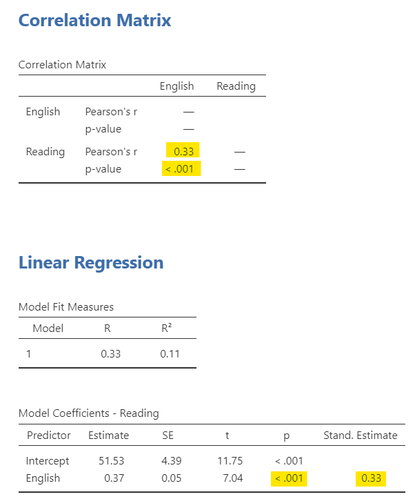
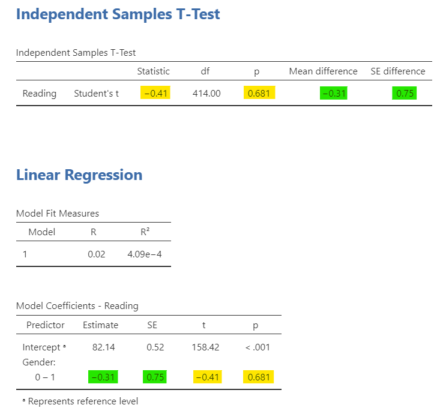
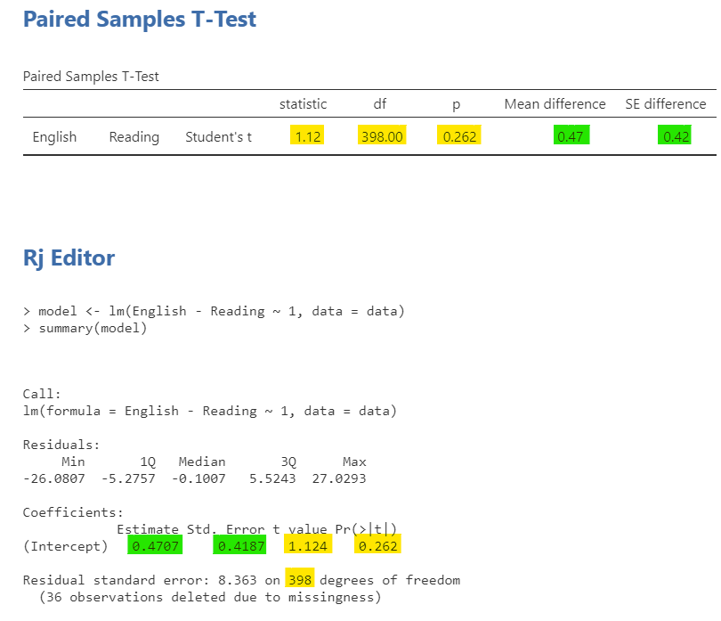
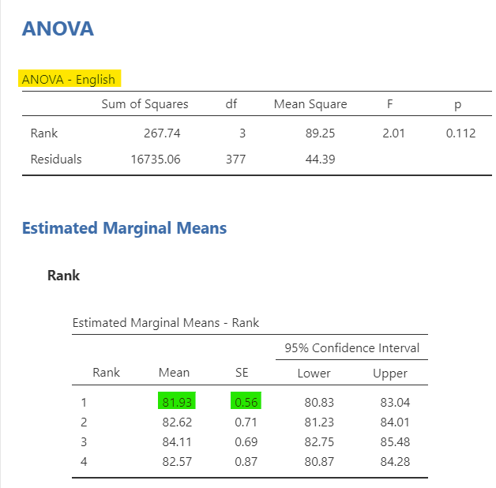
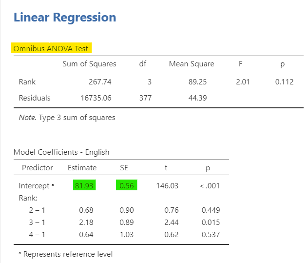

## 22. General Linear Model


```
## Warning: package 'viridis' was built under R version 4.0.5
```

```
## Warning: package 'viridisLite' was built under R version 4.0.5
```

The regression is a General Linear Model (GLM). Everything we've learned up to this point is also a general linear model. Pretty much everything we've learned in this class *could* be performed as simple a regression. You may wonder why we have not just taught regression and none of the others. There are some who are indeed proponents of that! However, I believe teaching "simpler" statistics like the t-test and correlation first is easiest to understand. Most of the statistics you will perform from here on out---including in your careers---will be what we have already learned (i.e., t-test, ANOVA, chi-square, correlation). However, I present this information so you may begin to see how all of this is related.

If you'd like to learn more about this, there's a fantastic online book on the subject called [Common statistical tests are linear models (or: how to teach stats)](https://lindeloev.github.io/tests-as-linear/)

Note that for all these examples I am using the Sample_Dataset_2014.sav dataset and I am only presenting the relevant output. I am also only going to cover the correlation, t-tests, and one-way ANOVA because they are the simplest to compare. You can run these yourself! You can find the dataset here: [Sample_Dataset_2014.xlsx Download](https://github.com/danawanzer/stats-with-jamovi/blob/master/data/Sample_Dataset_2014.xlsx)

### Correlation as a regression

Imagine we want to see how English and Reading are related. We would do a Pearson correlation, as seen on the top. However, we could also run a simple regression with English predicting Reading or vice versa, as seen on the bottom.

Notice how the Beta coefficient in the regression output is the *standardized coefficient* and that the correlation is the *standardized covariance*. Therefore, their values (and p-values) match identically!



### Independent t-test as a regression

Next let's look at how gender is related to reading scores. First, our t-statistic and p-value match directly from the independent t-test to the linear regression coefficient. Second, our unstandardized estimate in the regression *is exactly the mean difference between the two genders*!



### Dependent t-test as a regression

The dependent t-test can't be performed as a regression in the base jamovi, but it can if we run it in the Rj editor using the stats package. The regression formula for a dependent t-test is $y_1 -y_0 = 1$ and jamovi doesn't like it if there are not IVs, just an intercept. However, the stats package doesn't mind! Notice that our t-statistic, df, and p-value are exactly the same, and that the intercept estimate and SE match the mean difference in the paired samples t-test.



### One-way ANOVA as a regression

The one-way ANOVA is the same as regression, too. Let's examine how rank (an ordinal variable from 1-4) relates to English scores. In the linear regression, we asked for the ANOVA test under Model Coefficients; notice how it directly matches the ANOVA table.

Although I did not directly ask for them, the estimated marginal means for the linear regression match that of the one-way ANOVA. However, I want to call attention to how the coefficients directly match. The intercept is the average English score when Rank = 1 (freshman). However, the estimate for 2 -- 1 is .68, but 81.93 + .68 = 82.61; it's not exact due to rounding errors, but it matches the mean for group 2 because in the linear equation if you set that value to 1 you are saying the other values are 0 so the group membership is Rank = 2 (sophomore). You can do this for all the groups and see how they match.

<div class="figure" style="text-align: center">

<p class="caption">(\#fig:unnamed-chunk-1)One-way ANOVA as a regression</p>
</div>
