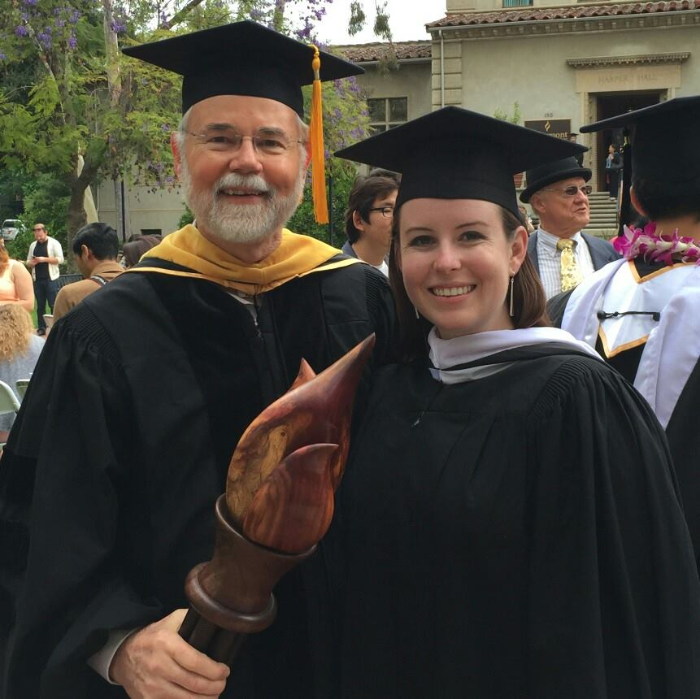

# Updated website {.unnumbered}

:::{.info data-latex=""}
This website is no longer maintained. Please use the updated version here: [https://danalinnell.github.io/statistics-with-jamovi/](https://danalinnell.github.io/statistics-with-jamovi/)

The website was updated due to (a) a name change and (b) GitHub does not allow changing usernames. Additionally, this gave me the opportunity to do a major overhaul of the structure of the book. 
:::

# Welcome {.unnumbered}

This is the website for PSYC 290 and PSYC 790 at the University of Wisconsin-Stout, taught by Dr. Dana Wanzer. These resources are aimed at teaching you how to use jamovi and null hypothesis significance testing (NHST) to answer research questions.

This website is **free to use** and is licensed under a Creative Commons BY-SA (CC BY-SA) license version 4.0. This means you are free to **share** (i.e., copy and redistribute the material in any medium or format) and **adapt** (i.e., remix, transform, and build upon the material for any purpose, even commercially), provided that you **attribute** these resources by citing me, indicating if changes were made and you **share alike** (i.e., if you adapt, you must distribute your contributes under the same license as the original).

Many of the data examples come from "[Learning statistics with jamovi: A tutorial for psychology students and other beginners](http://www.learnstatswithjamovi.com)" by Danielle J. Navarro and David R. Foxcroft, version 0.70.

**Dedication:** This book is dedicated to my graduate statistics professor Dr. Dale Berger, who gave us a similar set of resources when he taught statistics at Claremont Graduate University. I still have my binder of handouts, homework assignments, and notes and they have been instrumental in my career. Thank you for showing me the joy of statistics.

